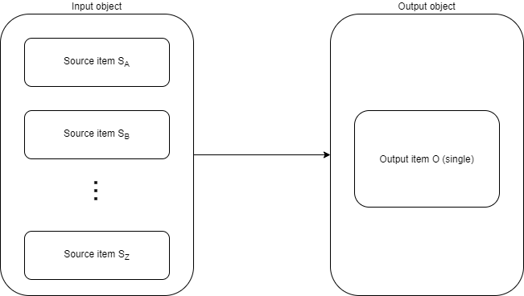
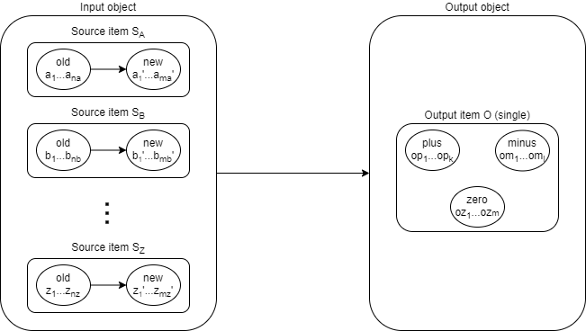
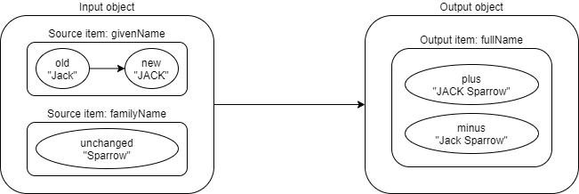
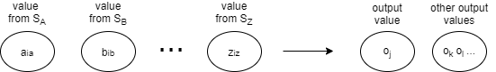
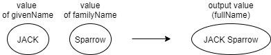
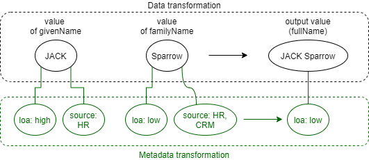
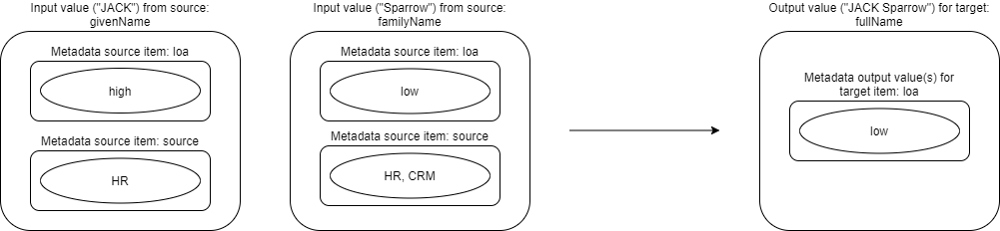
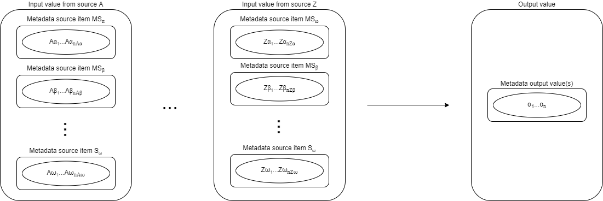

= Metadata mapping model

See also:

* xref:/midpoint/reference/expressions/expressions/[Expression] for background information on expression evaluation,
* xref:../../plain/expressions/[Processing expressions] for information on processing "simple" data expressions,
* xref:../../plain/mappings/[Processing mappings] for information on processing "simple" data mappings.

== Data mapping

Data mappings transform source item(s) - e.g. S~A~, S~B~, ..., S~Z~ - to output (target) item - e.g. O - in the
context of a single object.

Each source has some old and new values. Let us denote them a~1~, a~2~, ..., a~na~ ->
a~1~', a~2~', ... , a~ma~' for source S~A~, and similarly for other sources.

The output consists of plus, minus and zero set of values, denoted
op~1~, op~2~, ..., op~k~ for plus, om~1~, om~2~, ..., om~l~ for minus, and oz~1~, oz~2~, ..., oz~m~ for zero set.

So the above picture can be augmented with the values like this:

An example:

NOTE: Why is there only one source object? In fact, with the advent of
xref:/midpoint/reference/synchronization/linked-objects/[linked objects] one can imagine a mapping that would
operate on a set of all objects connected to the focus via particular link type. See
xref:../multi-object-mappings/[Multi-objects mappings].

If we use combinatorial evaluation (this is the case for most of the time) the values are constructed like this:

i.e. output value o~j~ (or, sometimes, more values e.g. o~k~, o~l~, ...) are computed from values
a~ia~, b~ib~, ..., z~iz~ from sources S~A~, ..., S~Z~, respectively, taking a combination of i~a~, ..., i~z~-th
value from respective value sets of these sources. (It is also possible that the set of output values
for an input combination is empty.)

An example:

== Metadata mapping

Here we have to start thinking of metadata.

We need to compute metadata for each of the output values produced. For simplification, we can assume that
if a mapping produces more than one output value for a given combination of input values, all of them will
get the same metadata. Therefore, we can restrict our thinking to metadata for single output value.

From the metadata point of view it is not important if the (data) values are being added or kept unmodified by
the mapping. The only thing we look at is that we want to skip computing metadata for values that go
into the output minus set. footnote:[Even this is questionable. Consider e.g. assigned focus mappings
for an assignment that is being deleted. We have to review such a situation eventually.]

Metadata for given value are organized into _items_ just like ordinary data in objects are. Standard data
mappings reference their sources and target as items. It is natural for metadata mappings to do the same.
In this way we could have partial mappings for (e.g.) level of assurance item, confidentiality item,
creation time item, and so on. These mappings can be applied independently (and selectively, if needed),
just like ordinary mappings are applied to data objects.

There are some differences, though.

1. While for standard data mapping we have exactly one input object, for metadata mappings we have
multiple input metadata collections. For each input data value there is separate metadata.
(Represented as a set of metadata items. Technically, metadata is represented by prism container value.)

2. At the metadata level we have no deltas. An input value (kept unchanged or being added) has its own
metadata, and this metadata is immutable. It was attached to the value when the value was created, and
will never be changed. (As the value itself does not change. It can be created or deleted, but never changed.)
footnote:[What about container value e.g. assignment modifications? Can we view that as value deletion and
creation operations?] footnote:[Also interesting is the following use case: _Have information about
provisioning targets for data. Know where the data are provisioned to or where they were provisioned
in the past._ This would probably require modifications of metadata in the opposite direction, i.e.
going from outputs to source values.]

== Metadata mapping model

So, we have a situation where we combine input values a, b, ..., z from sources S~A~, S~B~, ..., S~Z~ into
an output value. (For example, S~A~ = `givenName`, S~B~ = `familyName`, output = `fullName`).

A _metadata mapping_  has _sources_ and _output_ just like ordinary data mapping. However, sources do not reference
S~A~, S~B~, ..., S~Z~. They are orthogonal to data mapping sources. Metadata mapping sources reference
metadata items, like level of assurance, confidentiality, value origin, creation time, and so on.
Each source corresponds to a single _metadata item_, just like mapping source corresponds
to a single object item. Also, the output corresponds to a single metadata item; just like in mappings.

So, for example, our metadata mapping can have two sources: `loa` (level of assurance) and `source` (source system)
and one output `loa` (resulting level of assurance). The rule could be simple: take the lowest level of assurance
of all inputs. However, if `source` is `socialLogin` then override the computation and use `loa` of `unknown`.
(This example is weird. It is here only to demonstrate metadata mapping with two sources.)

----
<metadataMapping>
    <source>
        <path>loa</path>
    </source>
    <source>
        <path>source</path>
    </source>
    <expression> ... </expression>
    <target>
        <path>loa</path>
    </target>
</metadataMapping>
----

Example evaluation:

(Again, normally single `familyName` value would not have two sources. Here it has just for illustration purposes.)

Looking at metadata evaluation only:

And, if we slightly generalize this picture, we get the following:

Note that sources are marked S~A~, S~B~, ..., S~Z~, whereas metadata sources are orthogonal. For the lack
of invention let's mark them MS~&#945;~, MS~&#946;~, ..., MS~&#969;~. Input values for metadata transformation
are then given by the matrix (shown here as table):

.Metadata-data source matrix
[[metadata-data-matrix]]
[%header]
[cols="10,10,10,4,10"]
|===
| Data/metadata source          | Source A | Source B | ... | Source Z
| MS &#945; | A&#945;~1~, A&#945;~2~, ... | B&#945;~1~, B&#945;~2~, ...  | ... | Z&#945;~1~, Z&#945;~2~, ...
| MS &#946; | A&#946;~1~, A&#946;~2~, ... | B&#946;~1~, B&#946;~2~, ...  | ... | Z&#946;~1~, Z&#946;~2~, ...
| ... | ... | ... | ... | ...
| MS &#969; | A&#969;~1~, A&#969;~2~, ... | B&#969;~1~, B&#969;~2~, ...  | ... | Z&#969;~1~, Z&#969;~2~, ...
|===

Imagine we want to compute output values using a Groovy (or JavaScript, Python, etc.) script. What variables
will the script expect?

=== General case (detailed information)

If the script would like to consider the whole situation, it would need to obtain the whole matrix. For example,
it would need to know that

* value of `JACK` for data source `givenName` has `loa` of `high` and `source` of `HR`,
* value of `Sparrow` for data source `familyName` has `loa` of `low` and `source` of `HR` and `CRM`.

This information is simply accessible from the data values (`JACK`, `Sparrow`) if they are represented
as `PrismValue` objects - via `valueMetadata()` or similar method.

=== Simplified case (summarization on metadata source items)

However, often we want simply gather all values for specified metadata item and process them as set.
Referring to our example, we would like to know that:

* `loa` = { `high`, `low` }
* `source` = { `HR`, `CRM` }

The mapping would then look like this:

----
<expression>
    
</expression>
----

We assume that `custom.minLoa` is a function that takes a collection of LoA values
and returns the lowest one of them.

In the notation of <<metadata-data-matrix>> we can define the variables as:

* &#945; = { A&#945;~1~, A&#945;~2~, ... , B&#945;~1~, B&#945;~2~, ..., Z&#945;~1~, Z&#945;~2~, ... }
* &#946; = { A&#946;~1~, A&#946;~2~, ... , B&#946;~1~, B&#946;~2~, ..., Z&#946;~1~, Z&#946;~2~, ... }
* ...
* &#969; = { A&#969;~1~, A&#969;~2~, ... , B&#969;~1~, B&#969;~2~, ..., Z&#969;~1~, Z&#969;~2~, ... }

for metadata sources &#945;, &#946;, ..., &#969;.

=== Combinatorial evaluation?

Does it make sense to think about combinatorial evaluation of metadata values? I.e. something like:

* `JACK` - loa `high` - source `HR` - Sparrow - loa `low` - source `HR` -> `o1`
* `JACK` - loa `high` - source `HR` - Sparrow - loa `low` - source `CRM` -> `o2`

and then using `o1` and `o2` as a set of output values for resulting level of assurance?

Again, referring to <<metadata-data-matrix>> we would create script inputs as:

* A&#945; = A&#945;~iA&#945;~
* A&#946; = A&#946;~iA&#946;~
* ...
* A&#969; = A&#969;~iA&#969;~
* B&#945; = B&#945;~iB&#945;~
* B&#946; = B&#946;~iB&#946;~
* ...
* B&#969; = B&#969;~iB&#969;~
* ...
* Z&#945; = Z&#945;~iZ&#945;~
* Z&#946; = Z&#946;~iZ&#946;~
* ...
* Z&#969; = Z&#969;~iZ&#969;~

For all possible combinations of indices i~A&#945;~, i~A&#946;~, ..., i~Z&#969;~.

In our example, A = `givenName` with `JACK` value, B = `familyName` with `Sparrow` value,
&#945; = `loa`, &#946; = `source`, so

* A&#945; (givenName/loa) &#8712; { `high` }
* A&#946; (givenName/source) &#8712; { `HR` }
* B&#945; (familyName/loa) &#8712; { `low` }
* B&#946; (familyName/source) &#8712; { `HR`, `CRM` }

So, is this important and worth implementing?
Maybe. Let us just remember this option to eventually implement it when needed.
