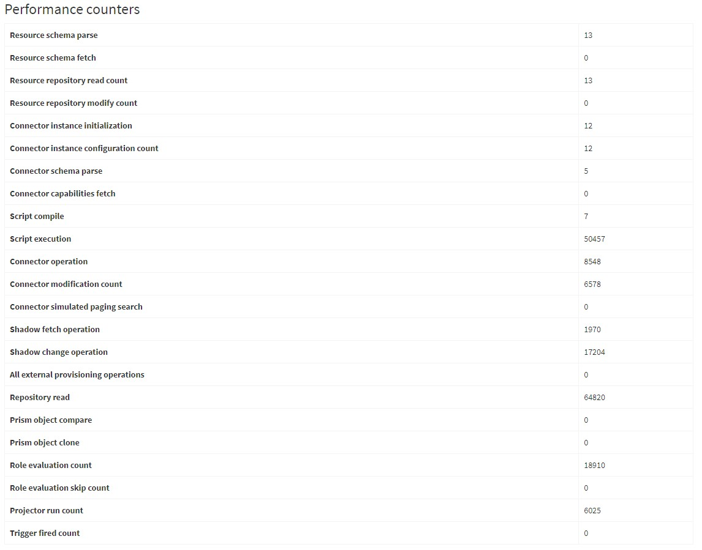
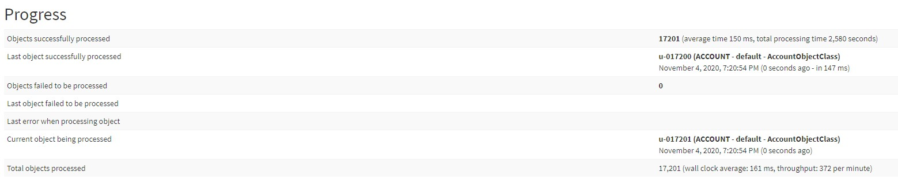
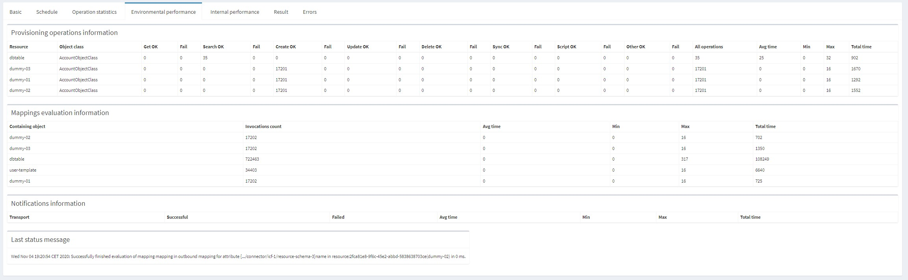
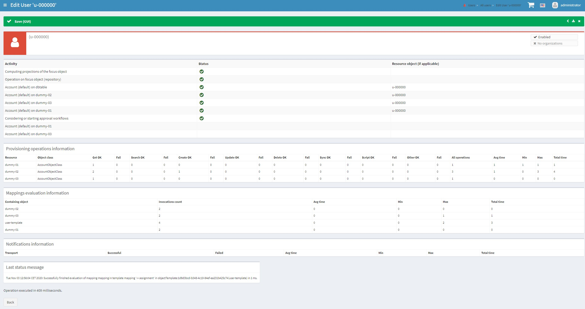
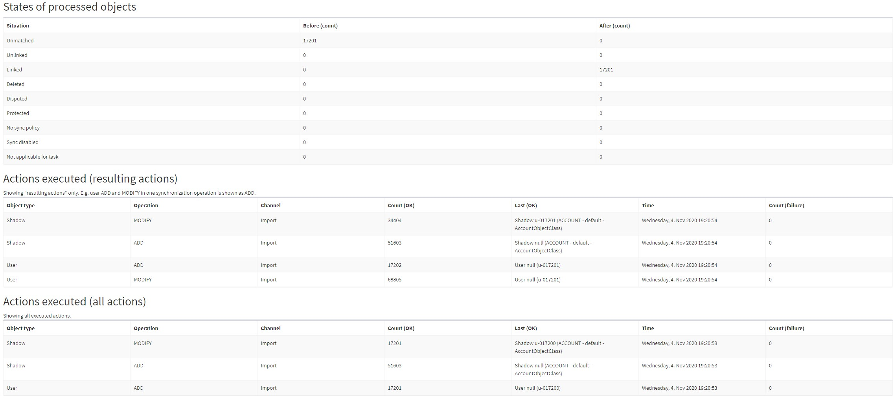

= Performance and state monitoring
:page-toc: top

Here we summarize existing mechanisms for performance and state monitoring of running midPoint,
either in production or during tests.
The goal is to create an "inventory" before making improvements and new features in this area.

Note that this is not a report from a design meeting - at least not yet.
It is just a "thinking aloud" thing.

== Lower-level performance information

[%header]
[cols="20,40a,20,30,5,5,30"]
|===
| Feature
| Description
| Primary use
| Output
| G footnote:[Is this information summarized globally i.e. for the whole node?]
| T footnote:[Is this information summarized per thread,visible e.g. for the task?]
| Notes

| Repository performance information
|
The link:https://github.com/Evolveum/midpoint/blob/master/repo/repo-api/src/main/java/com/evolveum/midpoint/repo/api/perf/PerformanceMonitor.java[`PerformanceMonitor`]
keeps repo operations invocation/retries counts, and time spent/wasted.
Categorized by the operation and optionally by object type.
Individual invocations can be logged into special file.
|
In operation.
Partially in selected tests.
|
Per-thread information is stored in task (visible e.g. via task GUI).
Global information is visible in "Internal configuration" -> "Performance", and also logged on system exit.
| Y | Y
|
-

| Operations performance information
|
The link:https://github.com/Evolveum/midpoint/blob/master/infra/util/src/main/java/com/evolveum/midpoint/util/statistics/OperationInvocationRecord.java[`OperationInvocationRecord`]
holds information about wall-clock and CPU time spent in given operation invocation.
It is called from
link:https://github.com/Evolveum/midpoint/blob/master/infra/schema/src/main/java/com/evolveum/midpoint/schema/result/OperationResult.java[`OperationResult`] and
- if enabled - also from
link:https://github.com/Evolveum/midpoint/blob/master/infra/util/src/main/java/com/evolveum/midpoint/util/aspect/MidpointInterceptor.java[`MidpointInterceptor`] (injected by Spring AOP).
Individual invocations can be logged via `PROFILING` logger.
OperationResult-based info can be stored into a trace file and analyzed afterwards.
|
In operation.
Partially in selected tests.
|
Per-thread information is stored in task (visible e.g. via task GUI).
Global information is visible in "Internal configuration" -> "Performance".
| Y | Y
|
-

| Cache performance information
|
The link:https://github.com/Evolveum/midpoint/blob/master/infra/util/src/main/java/com/evolveum/midpoint/util/caching/CachePerformanceCollector.java[`CachePerformanceCollector`]
holds information about effectiveness of individual caches.
These can be configured to be qualified by object type.
|
In operation.
Partially in selected tests.
|
Per-thread information is stored in task (visible e.g. via task GUI).
Global information is visible in "Internal configuration" -> "Performance".
| Y | Y
|
-

| Buckets performance information
|
The link:https://github.com/Evolveum/midpoint/blob/master/repo/task-quartz-impl/src/main/java/com/evolveum/midpoint/task/quartzimpl/statistics/Statistics.java[`Statistics`]
object (embedded in a task) collects information on bucket operations execution: count, time spent, wasted and waited time.
This information is important because wrongly tuned bucketing is often a performance killer.
|
In operation.
|
Stored in a task (visible e.g. via task GUI).
| - | Y
|
-

| Profiling model inspector
|
Clockwork, projector, and repository cache send notifications
to link:https://github.com/Evolveum/midpoint/blob/master/model/model-common/src/main/java/com/evolveum/midpoint/model/common/util/ProfilingModelInspector.java[`ProfilingModelInspector`]
that collects basic performance statistics: duration of components' execution, and the total time spent
in mapping evaluation and repository.
|
In tests.
It can be also enabled in operation.
footnote:[Via "Internals configuration" -> "Internal configuration" tab -> "Model profiling" checkbox.]
|
Log record after each model operation.
| - | -
|
Statistics provided by this component are a subset of the ones available in traced operation result.
However, the potential of this mechanism is greater than giving performance counters.

| Performance counters and traces
|
The link:https://github.com/Evolveum/midpoint/blob/master/infra/schema/src/main/java/com/evolveum/midpoint/schema/internals/InternalMonitor.java[`InternalMonitor`]
class keeps number of invocations for expensive operations in the system.
It is also able to trace (via log) individual invocations of defined operations.
|
Used in tests to make sure selected operations are not executed more frequently than expected.
The counters are visible also in operation; and individual tracing can be requested as well.
footnote:[Via "Internals configuration" -> "Counters" and "Traces" tabs.]
|
Counters contain the number of invocations.
A trace log record contains operation name, parameters (optional), invocation count, and place in code where it was executed.
Sometimes also timing information.
| Y | -
|
Prism operations require link:https://github.com/Evolveum/midpoint/blob/master/infra/prism-api/src/main/java/com/evolveum/midpoint/prism/util/PrismMonitor.java[`PrismMonitor`]
to be set.
This is usually not available during midPoint operation.

| Test query listener
|
https://github.com/Evolveum/midpoint/blob/master/repo/repo-sql-impl-test/src/main/java/com/evolveum/midpoint/repo/sql/testing/TestQueryListener.java[`TestQueryListener`]
is plugged into SQL execution path via proxied data source defined in
link:https://github.com/Evolveum/midpoint/blob/master/repo/repo-sql-impl-test/src/main/resources/ctx-repository-test.xml[`ctx-repository-test`].
It collects information on statements (including batched ones) and provides information about SQL statements counts.
It can also dump the statements.
|
In tests.
|
Its `dump` method outputs counts and SQL commands to specified `PrintStream`.
| - | Y
|
-

| Test statement inspector
|
https://github.com/Evolveum/midpoint/blob/master/repo/repo-sql-impl-test/src/main/java/com/evolveum/midpoint/repo/sql/testing/TestStatementInspector.java[`TestStatementInspector`]
does almost the same at the level of Hibernate.
|
In tests.
|
Its `dump` method outputs counts and SQL commands to `System.out`.
| - | Y
|
-

| Test performance collection (existing)
|
There are numerous ad-hoc ways how to measure and display performance of individual tests.
Each of them is limited to a single test class or a few related ones.
E.g. link:https://github.com/Evolveum/midpoint/blob/master/infra/schema/src/test/java/com/evolveum/midpoint/schema/performance/AbstractSchemaPerformanceTest.java[`AbstractSchemaPerformanceTest`]
and many others.
|
In tests.
|
Usually console/log.
| - | -
|
-

| Test performance collection (new)
|
We are currently working on systematic collection of performance information from tests.
Its key feature is the ability of long-term archival.
See xref:../testing-design.adoc[Testing design] document and
https://github.com/Evolveum/midpoint/blob/master/tools/test-ng/src/main/java/com/evolveum/midpoint/tools/testng/TestMonitor.java[TestMonitor] class.
|
In tests.
|
Console/log and files, with optional storage in a database.
| ? | ?
|
-

|===

== Higher-level performance information

This part contains monitoring data that is more relevant for end users.

[%header]
[cols="20,40a,20,30,5,5,30"]
|===
| Feature
| Description
| Primary use
| Output
| G
| T
| Notes

|
Task iteration information
|
The link:https://github.com/Evolveum/midpoint/blob/master/repo/task-quartz-impl/src/main/java/com/evolveum/midpoint/task/quartzimpl/statistics/Statistics.java[`Statistics`]
object (embedded in a task) collects information on objects processed by a task that iterates over a set of objects.
|
In operation.
|
Task GUI.
| - | Y
| -

|
Environmental performance
|
The link:https://github.com/Evolveum/midpoint/blob/master/repo/task-quartz-impl/src/main/java/com/evolveum/midpoint/task/quartzimpl/statistics/Statistics.java[`Statistics`]
object (embedded in a task) collects information on environment-related performance of the task: provisioning
operations, mapping evaluation, and notifications delivery.
|
In operation.
|
Task or operation progress GUI.
| - | Y
| This information is less technical and less detailed than operation execution information.
On the other hand, it contains some contextual data, like the object class information (for provisioning)
or containing object (for mappings).

| GUI progress reporting
|
Several components engaged in the operation execution (clockwork, projector, change executor, workflow hook,
notification code) provide information on the operation status by calling `onProgressAchieved` method
of `ProgressListener` interface.
Besides the model context this method consumes also specific `ProgressInformation` object.
|
This mechanism is tailored to provide state information of the operation to GUI users.
|
List of expected or executed user-visible activities (projection, focus change execution, projections changes execution,
approval, notifications), along with their outcome status.
However, the client is free to display any other information available from model context
or the task, like provisioning, mapping evaluation, or notification statistics.
| - | -
|
Quite old (2014), deserves updating.
More state than performance information.

|===

== Others (not directly related to performance)

=== Task: states of processed objects

Synchronization service provides information on resource object states (unmatched, unlinked, linked, ...)
before and after model operation.
This is collected in `Statistics` object and available in task GUI.

=== Task: actions executed

Change executor supplies information on actions executed on objects (add, update, delete).
This is collected in `Statistics` object and available in task GUI.

=== Cache usage (cache size)

https://github.com/Evolveum/midpoint/blob/master/repo/repo-api/src/main/java/com/evolveum/midpoint/repo/api/Cache.java[`Cache`]
objects implement `getStateInformation` method that provides information on the cache size.
It can be displayed in midPoint GUI ("Internals configuration" -> "Cache management").

=== Log collection feature

When using tracing, it is possible to request collection of log entries.
These are correlated to individual operation results and can be analyzed afterwards.
See https://github.com/Evolveum/midpoint/blob/master/infra/util/src/main/java/com/evolveum/midpoint/util/logging/TracingAppender.java[`TracingAppender`].

== Sample output

=== Repository performance information

----
Repository performance information

+-------------------+-------+------------+-----------+-----------------+-----+-----+------+-----------+----------+---------+------------------+-----+-----+-----+----------+
| Operation         | Count | Count/iter | Count/sec | Total time (ms) | Min | Max |  Avg | Time/iter | Time/sec | Retries | Wasted time (ms) | Min | Max | Avg | Wasted % |
+-------------------+-------+------------+-----------+-----------------+-----+-----+------+-----------+----------+---------+------------------+-----+-----+-----+----------+
| addObject         | 2,891 |        5.0 |      27.8 |          10,462 |   0 |  46 |  3.6 |      18.1 |    100.6 |         |                  |     |     |     |          |
| audit             | 1,154 |        2.0 |      11.1 |          14,348 |   0 |  78 | 12.4 |      24.9 |    138.0 |         |                  |     |     |     |          |
| fetchExtItems     |    25 |        0.0 |       0.2 |              32 |   0 |  16 |  1.3 |       0.1 |      0.3 |         |                  |     |     |     |          |
| getObject         | 8,092 |       14.0 |      77.8 |          10,397 |   0 |  44 |  1.3 |      18.0 |    100.0 |         |                  |     |     |     |          |
| getVersion        |     5 |        0.0 |       0.0 |               0 |   0 |   0 |  0.0 |       0.0 |      0.0 |         |                  |     |     |     |          |
| modifyObject      | 6,386 |       11.1 |      61.4 |          29,745 |   0 |  35 |  4.7 |      51.6 |    286.0 |         |                  |     |     |     |          |
| searchObjects     | 1,154 |        2.0 |      11.1 |             926 |   0 |  62 |  0.8 |       1.6 |      8.9 |         |                  |     |     |     |          |
| searchShadowOwner |   577 |        1.0 |       5.5 |             454 |   0 |  16 |  0.8 |       0.8 |      4.4 |         |                  |     |     |     |          |
+-------------------+-------+------------+-----------+-----------------+-----+-----+------+-----------+----------+---------+------------------+-----+-----+-----+----------+
----

=== Operations performance information

----
Methods performance information

+--------------------------------------------------------------------------------------------------------------------------------+---------+------------+-----------+-----------------+-------+----------+----------+-----------+
| Operation                                                                                                                      |   Count | Count/iter | Count/sec | Total time (ms) |   Min |      Max |      Avg | Time/iter |
+--------------------------------------------------------------------------------------------------------------------------------+---------+------------+-----------+-----------------+-------+----------+----------+-----------+
| com.evolveum.midpoint.schema.result.searchResult                                                                               |   5,235 |        1.0 |       5.6 |       855,496.0 | 136.7 |  1,620.0 |    163.4 |     163.4 |
| com.evolveum.midpoint.provisioning.api.ProvisioningService.searchObjectsIterative                                              |      11 |        0.0 |       0.0 |       819,876.5 |  57.1 | 90,998.0 | 74,534.2 |     156.6 |
| com.evolveum.midpoint.provisioning.ucf.api.ConnectorInstance.search                                                            |      11 |        0.0 |       0.0 |       819,853.5 |  37.8 | 90,997.2 | 74,532.1 |     156.6 |
| org.identityconnectors.framework.api.ConnectorFacade.search                                                                    |      11 |        0.0 |       0.0 |       819,834.0 |  22.2 | 90,995.2 | 74,530.4 |     156.6 |
| com.evolveum.midpoint.model.impl.sync.SynchronizationServiceImpl.notifyChange                                                  |  10,472 |        2.0 |      11.2 |       811,090.0 |   2.3 |  1,391.3 |     77.5 |     154.9 |
| com.evolveum.midpoint.model.impl.sync.SynchronizeAccountResultHandler.handle                                                   |   5,236 |        1.0 |       5.6 |       796,990.8 | 129.5 |  1,391.6 |    152.2 |     152.2 |
| com.evolveum.midpoint.model.impl.lens.Clockwork.run                                                                            |   5,236 |        1.0 |       5.6 |       766,730.3 | 124.6 |  1,385.3 |    146.4 |     146.4 |
| com.evolveum.midpoint.model.impl.lens.Clockwork.click                                                                          |  26,180 |        5.0 |      28.1 |       765,851.4 |   0.1 |  1,062.9 |     29.3 |     146.3 |
| com.evolveum.midpoint.model.impl.lens.Clockwork.execution                                                                      |  10,472 |        2.0 |      11.2 |       402,729.9 |   0.1 |  1,031.0 |     38.5 |      76.9 |
| com.evolveum.midpoint.model.impl.lens.ChangeExecutor.execute                                                                   |  10,472 |        2.0 |      11.2 |       402,677.5 |   0.1 |  1,031.0 |     38.5 |      76.9 |
| com.evolveum.midpoint.repo.api.RepositoryService.modifyObject                                                                  |  57,887 |       11.1 |      62.1 |       253,306.0 |   2.2 |    159.2 |      4.4 |      48.4 |
| com.evolveum.midpoint.repo.cache.RepositoryCache.modifyObject                                                                  |  57,596 |       11.0 |      61.8 |       250,944.9 |   2.3 |    159.3 |      4.4 |      47.9 |
| com.evolveum.midpoint.model.impl.lens.projector.Projector.project                                                              |  10,472 |        2.0 |      11.2 |       211,914.6 |  13.0 |  1,016.9 |     20.2 |      40.5 |
| com.evolveum.midpoint.repo.cache.RepositoryCache.getObject                                                                     | 183,264 |       35.0 |     196.6 |       169,088.1 |   0.0 |    222.1 |      0.9 |      32.3 |
| com.evolveum.midpoint.model.impl.lens.projector.Projector.focus                                                                |  10,472 |        2.0 |      11.2 |       146,195.5 |   7.2 |    979.8 |     14.0 |      27.9 |
| com.evolveum.midpoint.model.impl.lens.ChangeExecutor.updateSituationInShadow                                                   |  20,944 |        4.0 |      22.5 |       143,803.0 |   5.2 |    232.1 |      6.9 |      27.5 |
| com.evolveum.midpoint.model.impl.lens.ChangeExecutor.executeDelta                                                              |  26,180 |        5.0 |      28.1 |       128,662.2 |   3.2 |    181.9 |      4.9 |      24.6 |
| com.evolveum.midpoint.model.impl.util.AuditHelper.audit                                                                        |  10,472 |        2.0 |      11.2 |       126,197.2 |   1.0 |    269.0 |     12.1 |      24.1 |
| com.evolveum.midpoint.provisioning.api.ProvisioningService.modifyObject                                                        |  26,180 |        5.0 |      28.1 |       122,326.6 |   3.6 |    145.8 |      4.7 |      23.4 |
| com.evolveum.midpoint.model.impl.lens.ChangeExecutor.linkShadow                                                                |  20,944 |        4.0 |      22.5 |       121,406.5 |   4.6 |    103.9 |      5.8 |      23.2 |
| com.evolveum.midpoint.model.impl.lens.ChangeExecutor.execute.projection.ShadowType                                             |  20,944 |        4.0 |      22.5 |       101,934.6 |   3.2 |    182.0 |      4.9 |      19.5 |
| com.evolveum.midpoint.repo.cache.RepositoryCache.addObject                                                                     |  26,233 |        5.0 |      28.1 |        92,762.7 |   1.9 |    175.0 |      3.5 |      17.7 |
| com.evolveum.midpoint.repo.api.RepositoryService.addObject                                                                     |  26,233 |        5.0 |      28.1 |        90,926.9 |   1.8 |    174.9 |      3.5 |      17.4 |
| com.evolveum.midpoint.provisioning.api.ProvisioningService.getObject                                                           |  57,620 |       11.0 |      61.8 |        90,448.2 |   0.0 |    272.8 |      1.6 |      17.3 |
| com.evolveum.midpoint.repo.api.RepositoryService.getObject                                                                     |  73,401 |       14.0 |      78.8 |        90,233.0 |   0.4 |    220.0 |      1.2 |      17.2 |
| com.evolveum.midpoint.model.impl.lens.projector.Projector.inbound                                                              |  10,472 |        2.0 |      11.2 |        84,779.1 |   3.1 |    369.4 |      8.1 |      16.2 |
| com.evolveum.midpoint.provisioning.api.ProvisioningService.addObject                                                           |  15,708 |        3.0 |      16.9 |        57,017.9 |   2.7 |    175.5 |      3.6 |      10.9 |
| com.evolveum.midpoint.model.impl.lens.projector.Projector.assignments                                                          |  10,472 |        2.0 |      11.2 |        49,660.5 |   3.5 |    596.1 |      4.7 |       9.5 |
| com.evolveum.midpoint.model.impl.lens.projector.focus.AssignmentProcessor.processAssignments                                   |  10,472 |        2.0 |      11.2 |        49,609.1 |   3.5 |    596.0 |      4.7 |       9.5 |
| com.evolveum.midpoint.model.impl.lens.projector.Projector.load                                                                 |  10,472 |        2.0 |      11.2 |        47,207.8 |   1.6 |    229.2 |      4.5 |       9.0 |
| com.evolveum.midpoint.model.impl.lens.projector.ContextLoader.load                                                             |  10,472 |        2.0 |      11.2 |        47,150.9 |   1.6 |    229.2 |      4.5 |       9.0 |
| com.evolveum.midpoint.model.impl.lens.assignments.PathSegmentEvaluation.evaluate                                               |  94,248 |       18.0 |     101.1 |        42,191.6 |   0.0 |    113.6 |      0.4 |       8.1 |
| com.evolveum.midpoint.model.impl.lens.projector.focus.AssignmentTripleEvaluator.evaluateAssignment                             |  20,944 |        4.0 |      22.5 |        40,221.5 |   0.1 |    113.6 |      1.9 |       7.7 |
| com.evolveum.midpoint.model.impl.lens.assignments.AssignmentEvaluator.evaluate                                                 |  20,944 |        4.0 |      22.5 |        39,857.1 |   0.1 |    113.6 |      1.9 |       7.6 |
| com.evolveum.midpoint.model.impl.lens.projector.ContextLoader.loadProjection                                                   |  26,180 |        5.0 |      28.1 |        36,214.2 |   0.0 |    222.3 |      1.4 |       6.9 |
| com.evolveum.midpoint.model.common.mapping.MappingImpl.evaluate                                                                | 246,092 |       47.0 |     264.0 |        35,077.0 |   0.0 |    308.5 |      0.1 |       6.7 |
| com.evolveum.midpoint.model.impl.lens.ChangeExecutor.execute.focus.UserType                                                    |  10,472 |        2.0 |      11.2 |        34,453.1 |   0.1 |    132.0 |      3.3 |       6.6 |
| com.evolveum.midpoint.model.common.mapping.MappingImpl.evaluatePrepared                                                        | 246,092 |       47.0 |     264.0 |        19,412.7 |   0.0 |    308.2 |      0.1 |       3.7 |
| com.evolveum.midpoint.model.impl.lens.projector.ContextLoader.determineFocusContext                                            |  36,652 |        7.0 |      39.3 |        15,998.3 |   0.0 |     43.6 |      0.4 |       3.1 |
| com.evolveum.midpoint.model.impl.lens.projector.Projector.projection                                                           |  41,888 |        8.0 |      44.9 |        15,198.8 |   0.0 |     13.3 |      0.4 |       2.9 |
| com.evolveum.midpoint.model.impl.lens.projector.Projector.projectProjection                                                    |  20,944 |        4.0 |      22.5 |        15,057.9 |   0.4 |     13.3 |      0.7 |       2.9 |
| com.evolveum.midpoint.notifications.api.NotificationManager.processEvent                                                       |  47,124 |        9.0 |      50.6 |        14,262.6 |   0.2 |     41.0 |      0.3 |       2.7 |
| com.evolveum.midpoint.model.common.mapping.MappingImpl.prepare                                                                 | 246,092 |       47.0 |     264.0 |        13,806.2 |   0.0 |    116.6 |      0.1 |       2.6 |
| com.evolveum.midpoint.notifications.impl.AccountOperationListener.notifySuccess                                                |  41,888 |        8.0 |      44.9 |        13,613.1 |   0.2 |     41.0 |      0.3 |       2.6 |
| com.evolveum.midpoint.model.impl.lens.projector.Projector.projectionValues                                                     |  20,944 |        4.0 |      22.5 |        11,694.4 |   0.3 |     11.5 |      0.6 |       2.2 |
| com.evolveum.midpoint.model.impl.lens.projector.ProjectionValuesProcessor.iteration                                            |  20,944 |        4.0 |      22.5 |        10,919.8 |   0.2 |     11.4 |      0.5 |       2.1 |
| com.evolveum.midpoint.model.impl.sync.SynchronizationServiceImpl.setupSituation                                                |   5,236 |        1.0 |       5.6 |         8,545.8 |   0.8 |     38.4 |      1.6 |       1.6 |
| com.evolveum.midpoint.repo.cache.RepositoryCache.searchObjects                                                                 |  10,472 |        2.0 |      11.2 |         7,949.5 |   0.3 |     56.1 |      0.8 |       1.5 |
| com.evolveum.midpoint.repo.api.RepositoryService.searchObjects                                                                 |  10,472 |        2.0 |      11.2 |         7,518.1 |   0.3 |     56.0 |      0.7 |       1.4 |
| com.evolveum.midpoint.model.common.expression.evaluator.transformation.AbstractValueTransformationExpressionEvaluator.evaluate | 115,192 |       22.0 |     123.6 |         6,790.6 |   0.0 |    304.1 |      0.1 |       1.3 |
| com.evolveum.midpoint.task.quartzimpl.tracing.TracerImpl.storeTrace                                                            |      53 |        0.0 |       0.1 |         6,729.3 | 112.4 |    274.6 |    127.0 |       1.3 |
| com.evolveum.midpoint.model.impl.lens.projector.Projector.objectTemplateBeforeAssignments                                      |  10,472 |        2.0 |      11.2 |         5,176.4 |   0.2 |     11.9 |      0.5 |       1.0 |
| com.evolveum.midpoint.provisioning.impl.ResourceObjectConverter.addResourceObject                                              |  15,708 |        3.0 |      16.9 |         4,021.5 |   0.2 |      6.3 |      0.3 |       0.8 |
| com.evolveum.midpoint.model.impl.lens.projector.focus.AssignmentProcessor.processProjections                                   |  10,472 |        2.0 |      11.2 |         3,279.8 |   0.1 |    578.0 |      0.3 |       0.6 |
| com.evolveum.midpoint.repo.cache.RepositoryCache.searchShadowOwner                                                             |   5,236 |        1.0 |       5.6 |         3,273.5 |   0.3 |     23.5 |      0.6 |       0.6 |
| com.evolveum.midpoint.repo.api.RepositoryService.searchShadowOwner                                                             |   5,236 |        1.0 |       5.6 |         3,207.2 |   0.3 |     23.5 |      0.6 |       0.6 |
| com.evolveum.midpoint.model.impl.lens.construction.PlainResourceObjectConstruction.evaluate                                    |  20,944 |        4.0 |      22.5 |         2,930.0 |   0.0 |      7.1 |      0.1 |       0.6 |
| com.evolveum.midpoint.model.impl.lens.construction.EvaluatedResourceObjectConstructionImpl.evaluate                            |  52,360 |       10.0 |      56.2 |         2,872.0 |   0.0 |      7.0 |      0.1 |       0.5 |
| com.evolveum.midpoint.model.impl.lens.projector.ConsolidationProcessor.consolidateValues                                       |  20,944 |        4.0 |      22.5 |         2,729.7 |   0.1 |      6.6 |      0.1 |       0.5 |
| com.evolveum.midpoint.provisioning.ucf.api.ConnectorInstance.addObject                                                         |  15,708 |        3.0 |      16.9 |         2,591.6 |   0.1 |      5.8 |      0.2 |       0.5 |
| com.evolveum.midpoint.model.impl.lens.projector.focus.consolidation.DeltaSetTripleMapConsolidation.consolidate                 |  20,944 |        4.0 |      22.5 |         2,545.0 |   0.0 |      7.1 |      0.1 |       0.5 |
| com.evolveum.midpoint.model.impl.lens.construction.AssignedResourceObjectConstruction.evaluate                                 |  31,416 |        6.0 |      33.7 |         2,209.0 |   0.0 |    280.7 |      0.1 |       0.4 |
| org.identityconnectors.framework.api.ConnectorFacade.create                                                                    |  15,708 |        3.0 |      16.9 |         2,032.9 |   0.1 |      4.8 |      0.1 |       0.4 |
| com.evolveum.midpoint.model.impl.lens.projector.Projector.activation                                                           |  10,472 |        2.0 |      11.2 |         1,651.0 |   0.0 |      7.5 |      0.2 |       0.3 |
| com.evolveum.midpoint.repo.cache.RepositoryCache.invalidateCacheEntries                                                        |  83,829 |       16.0 |      89.9 |         1,606.5 |   0.0 |      1.7 |      0.0 |       0.3 |
| com.evolveum.midpoint.notifications.impl.NotificationHook.invoke                                                               |  20,944 |        4.0 |      22.5 |         1,563.8 |   0.0 |      4.4 |      0.1 |       0.3 |
| com.evolveum.midpoint.model.common.expression.evaluator.transformation.ValueTupleTransformation.evaluate                       | 104,720 |       20.0 |     112.4 |         1,333.2 |   0.0 |    289.4 |      0.0 |       0.3 |
| com.evolveum.midpoint.model.impl.lens.IvwoConsolidator.consolidateToDelta                                                      | 282,744 |       54.0 |     303.4 |         1,280.2 |   0.0 |      2.6 |      0.0 |       0.2 |
| com.evolveum.midpoint.model.impl.lens.projector.Projector.objectTemplateAfterProjections                                       |  10,472 |        2.0 |      11.2 |         1,110.5 |   0.0 |      1.0 |      0.1 |       0.2 |
| com.evolveum.midpoint.model.impl.lens.projector.Projector.objectTemplateAfterAssignments                                       |  10,472 |        2.0 |      11.2 |         1,096.7 |   0.0 |      4.2 |      0.1 |       0.2 |
| com.evolveum.midpoint.model.impl.lens.projector.Projector.projectionLifecycle                                                  |  20,944 |        4.0 |      22.5 |         1,028.5 |   0.0 |      0.7 |      0.0 |       0.2 |
| com.evolveum.midpoint.model.impl.lens.projector.Projector.focusActivation                                                      |  31,416 |        6.0 |      33.7 |         1,001.4 |   0.0 |      5.4 |      0.0 |       0.2 |
| com.evolveum.midpoint.model.impl.lens.projector.Projector.assignmentsMembershipAndDelegate                                     |  10,472 |        2.0 |      11.2 |           970.1 |   0.0 |      0.7 |      0.1 |       0.2 |
| com.evolveum.midpoint.model.impl.lens.projector.ActivationProcessor.projectionActivation                                       |  41,888 |        8.0 |      44.9 |           858.4 |   0.0 |      5.7 |      0.0 |       0.2 |
| com.evolveum.midpoint.model.common.expression.script.ScriptExpression.evaluate                                                 | 104,720 |       20.0 |     112.4 |           855.4 |   0.0 |    288.6 |      0.0 |       0.2 |
| com.evolveum.midpoint.provisioning.impl.ResourceManager.completeResource                                                       |       4 |        0.0 |       0.0 |           800.2 | 134.4 |    272.0 |    200.0 |       0.2 |
| com.evolveum.midpoint.model.impl.lens.projector.focus.AssignmentProcessor.evaluateFocusMappings                                |  10,472 |        2.0 |      11.2 |           790.8 |   0.0 |      4.4 |      0.1 |       0.2 |
| com.evolveum.midpoint.provisioning.impl.ProvisioningContext.getConnectorInstance                                               |  47,136 |        9.0 |      50.6 |           655.6 |   0.0 |      2.9 |      0.0 |       0.1 |
| com.evolveum.midpoint.model.impl.lens.projector.Projector.projectionValuesPostRecon                                            |  20,944 |        4.0 |      22.5 |           614.2 |   0.0 |      1.3 |      0.0 |       0.1 |
| com.evolveum.midpoint.model.impl.lens.projector.Projector.projectionReconciliation                                             |  20,944 |        4.0 |      22.5 |           570.6 |   0.0 |      1.8 |      0.0 |       0.1 |
| com.evolveum.midpoint.model.impl.lens.projector.Projector.projectionCredentials                                                |  20,944 |        4.0 |      22.5 |           553.8 |   0.0 |      0.8 |      0.0 |       0.1 |
| com.evolveum.midpoint.repo.cache.RepositoryCache.getVersion                                                                    | 100,339 |       19.2 |     107.7 |           489.4 |   0.0 |      1.0 |      0.0 |       0.1 |
| com.evolveum.midpoint.model.impl.lens.projector.ConsolidationProcessor.consolidateItem                                         |  31,416 |        6.0 |      33.7 |           346.1 |   0.0 |      0.8 |      0.0 |       0.1 |
| com.evolveum.midpoint.model.common.expression.evaluator.transformation.SingleShotEvaluation.evaluateExpression                 |  15,708 |        3.0 |      16.9 |           327.9 |   0.0 |      0.6 |      0.0 |       0.1 |
| com.evolveum.midpoint.provisioning.ucf.impl.connid.ConnIdConvertor.convertToResourceObject                                     |   5,236 |        1.0 |       5.6 |           321.0 |   0.0 |      7.5 |      0.1 |       0.1 |
| com.evolveum.midpoint.model.impl.util.AuditHelper.resolveName                                                                  |  41,888 |        8.0 |      44.9 |           242.2 |   0.0 |      0.3 |      0.0 |       0.0 |
| com.evolveum.midpoint.wf.impl.hook.WfHook.invoke                                                                               |  20,944 |        4.0 |      22.5 |           215.6 |   0.0 |      0.2 |      0.0 |       0.0 |
| com.evolveum.midpoint.model.impl.lens.projector.Projector.focusCredentials                                                     |  10,472 |        2.0 |      11.2 |           210.2 |   0.0 |      1.4 |      0.0 |       0.0 |
| com.evolveum.midpoint.provisioning.impl.AccessChecker.accessCheck                                                              |  47,124 |        9.0 |      50.6 |           208.8 |   0.0 |      0.1 |      0.0 |       0.0 |
| com.evolveum.midpoint.model.impl.lens.projector.focus.AssignmentProcessor.distributeConstructions                              |  10,472 |        2.0 |      11.2 |           200.1 |   0.0 |      4.4 |      0.0 |       0.0 |
| com.evolveum.midpoint.model.impl.lens.projector.Projector.focusPolicyRules                                                     |  10,472 |        2.0 |      11.2 |           126.6 |   0.0 |      0.8 |      0.0 |       0.0 |
| com.evolveum.midpoint.model.impl.lens.projector.Projector.assignmentsOrg                                                       |  10,472 |        2.0 |      11.2 |            73.1 |   0.0 |      0.1 |      0.0 |       0.0 |
| com.evolveum.midpoint.model.impl.lens.Clockwork.authorizeRequest                                                               |   5,236 |        1.0 |       5.6 |            72.7 |   0.0 |      0.2 |      0.0 |       0.0 |
| com.evolveum.midpoint.task.quartzimpl.TaskManagerQuartzImpl.getTaskPlain                                                       |      13 |        0.0 |       0.0 |            59.0 |   4.0 |      6.5 |      4.5 |       0.0 |
| com.evolveum.midpoint.model.impl.lens.projector.Projector.assignmentsConflicts                                                 |  10,472 |        2.0 |      11.2 |            51.4 |   0.0 |      0.1 |      0.0 |       0.0 |
| com.evolveum.midpoint.model.impl.lens.projector.DependencyProcessor.sortProjectionsToWaves                                     |  10,472 |        2.0 |      11.2 |            46.1 |   0.0 |      0.2 |      0.0 |       0.0 |
| com.evolveum.midpoint.model.impl.lens.projector.policy.PolicyRuleEnforcer.execute                                              |   5,236 |        1.0 |       5.6 |            44.8 |   0.0 |      0.4 |      0.0 |       0.0 |
| com.evolveum.midpoint.repo.api.RepositoryService.getVersion                                                                    |      59 |        0.0 |       0.1 |            38.7 |   0.4 |      1.0 |      0.7 |       0.0 |
| com.evolveum.midpoint.model.impl.lens.projector.focus.PruningOperation.execute                                                 |  10,472 |        2.0 |      11.2 |            33.5 |   0.0 |      0.1 |      0.0 |       0.0 |
| com.evolveum.midpoint.task.api.TaskManager.createTaskInstance                                                                  |      13 |        0.0 |       0.0 |            18.1 |   1.1 |      2.2 |      1.4 |       0.0 |
| com.evolveum.midpoint.model.impl.lens.projector.Projector.focusLifecycle                                                       |  10,472 |        2.0 |      11.2 |            16.2 |   0.0 |      0.1 |      0.0 |       0.0 |
| com.evolveum.midpoint.wf.impl.processors.primary.PrimaryChangeProcessor.previewOrProcessModelInvocation                        |   5,236 |        1.0 |       5.6 |            16.1 |   0.0 |      0.1 |      0.0 |       0.0 |
| com.evolveum.midpoint.model.common.stringpolicy.ObjectValuePolicyEvaluator.validateValue                                       |  15,708 |        3.0 |      16.9 |            14.5 |   0.0 |      0.1 |      0.0 |       0.0 |
| com.evolveum.midpoint.common.operation.import.accountsFromResource.statistics                                                  |      11 |        0.0 |       0.0 |             0.0 |   0.0 |      0.0 |      0.0 |       0.0 |
+--------------------------------------------------------------------------------------------------------------------------------+---------+------------+-----------+-----------------+-------+----------+----------+-----------+
----

=== Cache performance information

----
Cache performance information

+------------------------------------------------------------+---------+--------+-----------+--------+---------+----------+---------+----------+---------------+-------+
| Cache                                                      |    Hits | Hits % | Weak hits | Weak % |  Misses | Misses % |  Passes | Passes % | Not available | N/A % |
+------------------------------------------------------------+---------+--------+-----------+--------+---------+----------+---------+----------+---------------+-------+
| com.evolveum.midpoint.provisioning.impl.ResourceCache      | 149,197 | 100.0% |         0 |   0.0% |       4 |     0.0% |       0 |     0.0% |             0 |  0.0% |
| com.evolveum.midpoint.repo.cache.global.GlobalObjectCache  |  39,146 |  26.2% |         2 |   0.0% |     106 |     0.1% | 109,900 |    73.7% |             0 |  0.0% |
| com.evolveum.midpoint.repo.cache.global.GlobalQueryCache   |       0 |   0.0% |         0 |   0.0% |       0 |     0.0% |  15,700 |   100.0% |             0 |  0.0% |
| com.evolveum.midpoint.repo.cache.global.GlobalVersionCache |  31,670 |  99.7% |         0 |   0.0% |      85 |     0.3% |       0 |     0.0% |             0 |  0.0% |
| com.evolveum.midpoint.repo.cache.local.LocalObjectCache    | 125,600 |  45.7% |         0 |   0.0% | 117,753 |    42.9% |  31,400 |    11.4% |             1 |  0.0% |
| com.evolveum.midpoint.repo.cache.local.LocalQueryCache     |       0 |   0.0% |         0 |   0.0% |   7,850 |    50.0% |   7,850 |    50.0% |             0 |  0.0% |
| com.evolveum.midpoint.repo.cache.local.LocalVersionCache   | 118,665 |  78.9% |         0 |   0.0% |  31,705 |    21.1% |       0 |     0.0% |            50 |  0.0% |
+------------------------------------------------------------+---------+--------+-----------+--------+---------+----------+---------+----------+---------------+-------+
----

=== Model profiling

----
Clockwork: 303 ms
  INITIAL: 66 ms
    projector: 57 ms
      load: 5 ms
      focus: 14 ms
      inbound: 3 ms
      focusActivation: 0 ms
      objectTemplateBeforeAssignments: 1 ms
      assignments: 0 ms
      assignmentsOrg: 0 ms
      assignmentsMembershipAndDelegate: 0 ms
      assignmentsConflicts: 0 ms
      focusLifecycle: 0 ms
      objectTemplateAfterAssignments: 0 ms
      focusCredentials: 0 ms
      focusPolicyRules: 1 ms
      projection account(no ID, type 'default', resource:10000000-0000-0000-0000-000000000004(Dummy Resource)): 24 ms
      projectionValues account(no ID, type 'default', resource:10000000-0000-0000-0000-000000000004(Dummy Resource)): 14 ms
      projectionCredentials account(no ID, type 'default', resource:10000000-0000-0000-0000-000000000004(Dummy Resource)): 4 ms
      projectionReconciliation account(no ID, type 'default', resource:10000000-0000-0000-0000-000000000004(Dummy Resource)): 1 ms
      projectionValuesPostRecon account(no ID, type 'default', resource:10000000-0000-0000-0000-000000000004(Dummy Resource)): 2 ms
      projectionLifecycle account(no ID, type 'default', resource:10000000-0000-0000-0000-000000000004(Dummy Resource)): 2 ms
      objectTemplateAfterProjections: 1 ms
  PRIMARY: 3 ms
  SECONDARY: 194 ms
    projector: 33 ms
      execution: 0 ms
      load: 7 ms
      focus: 18 ms
      inbound: 13 ms
      focusActivation: 0 ms
      objectTemplateBeforeAssignments: 0 ms
      assignments: 0 ms
      assignmentsOrg: 0 ms
      assignmentsMembershipAndDelegate: 1 ms
      assignmentsConflicts: 0 ms
      focusLifecycle: 0 ms
      objectTemplateAfterAssignments: 0 ms
      focusCredentials: 0 ms
      focusPolicyRules: 2 ms
      projection account(no ID, type 'default', resource:10000000-0000-0000-0000-000000000004(Dummy Resource)): 1 ms
      objectTemplateAfterProjections: 0 ms
  FINAL: 40 ms
totalOperationTime: 311 ms
totalMappingTime: 1 ms
totalRepoTime: 111 ms
----

=== Performance counters and traces

Note that Prism object compare and Prism object clone are zero because of missing `PrismMonitor` in running midPoint.

----
2020-11-04 10:02:21,747 [] [pool-3-thread-25] INFO (com.evolveum.midpoint.schema.internals.InternalMonitor): MONITOR connectorOperation(getObject) (8549)
2020-11-04 10:02:21,766 [MODEL] [pool-3-thread-25] INFO (com.evolveum.midpoint.schema.internals.InternalMonitor): MONITOR shadowFetchOperationCount[shadowFetchOperations]() (1971)
2020-11-04 10:02:21,767 [] [pool-3-thread-25] INFO (com.evolveum.midpoint.schema.internals.InternalMonitor): MONITOR connectorOperation(getObject) (8550)
2020-11-04 10:02:21,769 [MODEL] [pool-3-thread-25] INFO (com.evolveum.midpoint.schema.internals.InternalMonitor): MONITOR shadowFetchOperationCount[shadowFetchOperations]() (1972)
2020-11-04 10:02:21,770 [] [pool-3-thread-25] INFO (com.evolveum.midpoint.schema.internals.InternalMonitor): MONITOR connectorOperation(getObject) (8551)
2020-11-04 10:02:21,771 [MODEL] [pool-3-thread-25] INFO (com.evolveum.midpoint.schema.internals.InternalMonitor): MONITOR shadowFetchOperationCount[shadowFetchOperations]() (1973)
2020-11-04 10:02:21,771 [] [pool-3-thread-25] INFO (com.evolveum.midpoint.schema.internals.InternalMonitor): MONITOR connectorOperation(getObject) (8552)
2020-11-04 10:02:21,772 [MODEL] [pool-3-thread-25] INFO (com.evolveum.midpoint.schema.internals.InternalMonitor): MONITOR shadowFetchOperationCount[shadowFetchOperations]() (1974)
2020-11-04 10:02:21,773 [] [pool-3-thread-25] INFO (com.evolveum.midpoint.schema.internals.InternalMonitor): MONITOR connectorOperation(getObject) (8553)
2020-11-04 10:02:21,775 [MODEL] [pool-3-thread-25] INFO (com.evolveum.midpoint.schema.internals.InternalMonitor): MONITOR shadowFetchOperationCount[shadowFetchOperations]() (1975)
2020-11-04 10:02:21,775 [] [pool-3-thread-25] INFO (com.evolveum.midpoint.schema.internals.InternalMonitor): MONITOR connectorOperation(getObject) (8554)
2020-11-04 10:02:21,776 [MODEL] [pool-3-thread-25] INFO (com.evolveum.midpoint.schema.internals.InternalMonitor): MONITOR shadowFetchOperationCount[shadowFetchOperations]() (1976)
2020-11-04 10:02:21,776 [] [pool-3-thread-25] INFO (com.evolveum.midpoint.schema.internals.InternalMonitor): MONITOR connectorOperation(getObject) (8555)
2020-11-04 10:02:21,777 [MODEL] [pool-3-thread-25] INFO (com.evolveum.midpoint.schema.internals.InternalMonitor): MONITOR shadowFetchOperationCount[shadowFetchOperations]() (1977)
2020-11-04 10:02:21,778 [] [pool-3-thread-25] INFO (com.evolveum.midpoint.schema.internals.InternalMonitor): MONITOR connectorOperation(getObject) (8556)
2020-11-04 10:02:21,779 [MODEL] [pool-3-thread-25] INFO (com.evolveum.midpoint.schema.internals.InternalMonitor): MONITOR shadowFetchOperationCount[shadowFetchOperations]() (1978)
2020-11-04 10:02:21,845 [MODEL] [pool-3-thread-25] INFO (com.evolveum.midpoint.schema.internals.InternalMonitor): MONITOR roleEvaluation(role:aa7ef9a6-9661-4c55-82cb-b108a13b4dc5(role-dummy)) (20687)
2020-11-04 10:02:21,873 [MODEL] [pool-3-thread-25] INFO (com.evolveum.midpoint.schema.internals.InternalMonitor): MONITOR roleEvaluation(role:aa7ef9a6-9661-4c55-82cb-b108a13b4dc5(role-dummy)) (20688)
----

=== Task progress

=== Environmental performance

=== GUI progress reporting

=== Task: object states and actions executed

=== Cache usage

----
  Cache                                                                            |    Size | Sec. size
===================================================================================+=========+===========
  com.evolveum.midpoint.task.quartzimpl.cluster.NodeRegistrar                      |       1 |
-----------------------------------------------------------------------------------+---------+-----------
  com.evolveum.midpoint.model.common.SystemObjectCache                             |       1 |
-----------------------------------------------------------------------------------+---------+-----------
  com.evolveum.midpoint.provisioning.impl.ResourceCache                            |       4 |
-----------------------------------------------------------------------------------+---------+-----------
  com.evolveum.midpoint.provisioning.impl.ConnectorManager.connectorInstanceCache  |       4 |
-----------------------------------------------------------------------------------+---------+-----------
  com.evolveum.midpoint.provisioning.impl.ConnectorManager.connectorTypeCache      |       2 |
-----------------------------------------------------------------------------------+---------+-----------
  com.evolveum.midpoint.repo.common.expression.ExpressionFactory                   |      30 |
-----------------------------------------------------------------------------------+---------+-----------
  com.evolveum.midpoint.model.common.ArchetypeManager                              |       8 |
-----------------------------------------------------------------------------------+---------+-----------
  com.evolveum.midpoint.model.impl.expr.triggerSetter.TriggerCreatorGlobalState    |       0 |
-----------------------------------------------------------------------------------+---------+-----------
  com.evolveum.midpoint.model.common.expression.script.ScriptExpressionFactory     |       0 |
-----------------------------------------------------------------------------------+---------+-----------
  com.evolveum.midpoint.repo.cache.local.LocalObjectCache                          |       3 |
-----------------------------------------------------------------------------------+---------+-----------
  com.evolveum.midpoint.repo.cache.local.LocalVersionCache                         |       3 |
-----------------------------------------------------------------------------------+---------+-----------
  com.evolveum.midpoint.repo.cache.local.LocalQueryCache                           |       1 |
-----------------------------------------------------------------------------------+---------+-----------
  com.evolveum.midpoint.repo.cache.global.GlobalObjectCache                        |       6 |
  - ObjectTemplateType                                                             |       1 |
  - SecurityPolicyType                                                             |       1 |
  - RoleType                                                                       |       1 |
  - ArchetypeType                                                                  |       2 |
  - SystemConfigurationType                                                        |       1 |
-----------------------------------------------------------------------------------+---------+-----------
  com.evolveum.midpoint.repo.cache.global.GlobalVersionCache                       |      10 |
  - ObjectTemplateType                                                             |       1 |
  - SecurityPolicyType                                                             |       1 |
  - RoleType                                                                       |       1 |
  - ArchetypeType                                                                  |       2 |
  - SystemConfigurationType                                                        |       1 |
  - ResourceType                                                                   |       4 |
-----------------------------------------------------------------------------------+---------+-----------
  com.evolveum.midpoint.repo.cache.global.GlobalQueryCache                         |       0 |
-----------------------------------------------------------------------------------+---------+-----------
----
