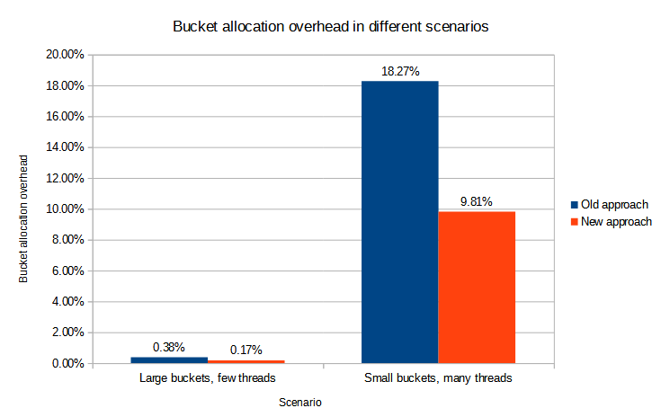

= Improving bucket management

== Overview

Bucket management is necessary to divide the work of a task among its workers. It comprises
the following actions:

1. obtaining a new bucket,
2. marking a bucket as complete,
3. checking that no buckets can be obtained.

The first one has been traditionally the major source of contention. However, the second one
produces contention as well, although (in the past) on a smaller scale.

== Traditional approach to bucket management

The traditional approach (present since the beginning of bucketed tasks in 3.8) is based on the
get + compute delta + modify-with-precondition + retry approach:

1. get the coordinator task object that carries the work state,
2. compute deltas (e.g. aimed at creating a new bucket or buckets),
3. modify the task object with a precondition that the relevant parts (e.g. the buckets list) have not been changed,
4. if the precondition failed, wait a random time, and retry the cycle.

Actually, there are two independent retry mechanisms in play here:

1. retrying at the level of the work state manager, as described in point 4 above,
2. implicit retrying of the repository service, present in point 3 (and partially in point 1) above.

The latter mechanism is related to how the repository ensures correct execution
of individual deltas in the presence of concurrent modifications. For the majority of midPoint
use cases, this implicit repository transaction serialization is sufficient. Unfortunately, for
bucket allocation it is not, and therefore the additional collision detection and resolution
method described above has been devised and implemented.

== Proposed approach

The new approach is based on so called dynamic updates, where deltas to be executed are computed
within the database transaction, under the standard repository collision resolution mechanism.
So the process looks like this:

1. start a DB transaction,
2. get task object,
3. compute deltas (e.g. aimed at creating a new bucket),
4. modify task object,
5. commit the transaction, and retry if there was a conflict.

All of this is executed in the repository service, using new experimental method called
link:https://github.com/Evolveum/midpoint/blob/75dab94d3fa25654df149cb8fdbbd01ee9f4b39a/repo/repo-api/src/main/java/com/evolveum/midpoint/repo/api/RepositoryService.java#L274-L301[`modifyObjectDynamically`].
The delta computation is done using a functional parameter provided by the caller,
i.e. work state manager in this case.

There is no need for any extra collision detection and resolution. The serialization is fully
ensured by the database (conflict detection) and the repository (retrying the operation).

Preliminary experiments show approximately 50% reduction of the bucketing overhead incurred,
for both well-configured and slightly misconfigured scenarios. See below.

== Method of measurement

In order to compare old vs. new approach, the following scenario was set up:

* recomputation of 1000 users,
* processing of each user takes approximately 400-500 milliseconds, depending on actual load,
* processing itself is very simple (and the delay is ensured by wait instruction),
as the main goal is to test bucket management mechanism, separately from any load induced by
real processing.

Two scenarios were tested:

1. Well-configured, low-contention scenario: Large buckets, few threads. We used 16 buckets, i.e. 62.5 users
per bucket in average. There were 4 worker tasks.

2. Slightly misconfigured, high-contention scenario: Small buckets, many threads. We used 256 buckets, i.e.
3.9 users per bucket in average. There were 30 worker tasks.

The machine itself had 12 physical cores, providing 24 logical CPUs in total. As the database, locally-run
PostgreSQL 13.2 was used.

First we measured the results using default bucketing configuration. This implied a random delay
of up to 5000 milliseconds when allocating the first bucket per worker task. However, after tests were
run, the observation was that we can improve results for both old and new approach when this delay is
turned off. Therefore, all the final test results are provided with this updated configuration.

We measured the time needed to allocate new buckets, marking buckets as complete, and checking that
new buckets are not available. We explicitly excluded 20 second safety wait incurred by so called
scavenger tasks that is implemented to allow for completion of any mis-allocated buckets. For real
executions this should not play any significant role.

The bucket management time was then compared with the total wall clock time (again, excluding the
final safety wait time), and the percentage - normalized to a single thread - was computed.

Each test was run five times, and the numbers were averaged.

== Measurement results

The measured overhead is summarized in the following table.

[cols="2,1,1,1"]
[%header]
|===
| Scenario | Old approach | New approach | Improvement
| Large buckets, few threads | 0.38% | 0.17% | 55.26%
| Small buckets, many threads | 18.27% | 9.81% | 46.31%
|===

Detailed information is in the attached link:comparison.ods[spreadsheet file] as well as the extracted relevant
test results (link:detailed-results-old.txt[old], link:detailed-results-new.txt[new]).footnote:[Note that the collision
information collected is not directly comparable between old and new solution. It is because previously the collisions
referred to collisions encountered in the outer retry mechanism (i.e. at the level of the work state manager),
whereas collisions encountered in the repository are visible only in repository-level performance dumps.
In the new approach, however, collision information for bucket allocation refers directly to repository-level
collisions.]

== Conclusion

It looks like the new approach reduces the bucketing overhead for both standard and slightly misconfigured
scenarios by approximately 50%. Even for the latter scenario the improved overhead is below 10%, which
is most probably acceptable.

The experimental `modifyObjectDynamically` method might be useful to deal with such
high-contention scenarios. Besides buckets, multi-node thresholds are the next candidate
for its use.
