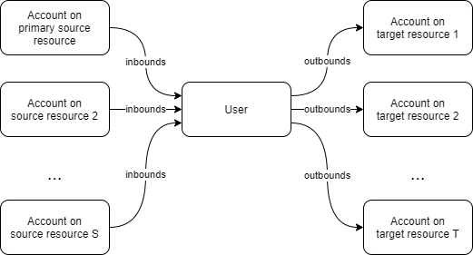

= System Performance Testing
:page-toc: top

This is a description of a preliminary version of the system performance testing code.

== Testing Scenarios

There is a single source resource (an in-memory dummy resource) that hosts a defined number of accounts.
For each one, a user object is created, and it - in turn - creates an account on each of target resources.

All of this is done in various synchronization tasks.

=== Scenario Parameters

In order to pinpoint potential performance issues, as well as to match various real-life situations,
this basic structure is translated into a set of specific scenarios, described by a couple of _parameters_.

==== Extension Schema

There are the following variations related to the extension schema. They are controlled by setting
`schema` Java system property to an appropriate value described below.

[%autowidth]
|===
| Value | Description

| `basic` | 10 multi-valued and 100 single-valued string extension properties. None of them is indexed.
| `indexed` | The same properties but this time they are indexed by the repository.
| `big` | 10 multi-valued and 1000 single-valued string extension properties, not indexed.
Among them, only first 100 are really used.
| `big-global` | The same number of properties, but defined as global level, not specifically
as a user extension.
|===

NOTE: The idea was that the large amount of schema-defined properties (even if they are not used)
can negatively influence the performance. However, first tests indicate that it is not the case.
So it looks like `big` and `big-global` values are of not much use.

==== Source Data Processing

At source, we have a variable number of attributes, with a variable amount of content
(for multi-valued ones). Also, a different sets of mappings are available. This
aspect is controlled by setting `source` Java system property, with these values:

[%autowidth]
|===
| Value | # of inbound mappings | Single-value attributes | Multi-value attributes | # of values for each

| `ms2-5` | 2 | 1 | 1 | 5
| `ms20-5` | 20 | 10 | 10 | 5
| `ms110-5` | 110 | 100 | 10 | 5
| `ms110-20` | 110 | 100 | 10 | 20
| `ms110-100` | 110 | 100 | 10 | 100
| `ms110-1000` | 110 | 100 | 10 | 1000
|===

==== Size of User Population

The number of accounts at source resource (and, therefore, the users) is controlled by
setting `population` Java system property, with these values:

[%autowidth]
[%header]
|===
| Value | # of accounts
| `10` | 10
| `100` | 100
| `1k` | 1,000
| `10k` | 10,000
| `100k` | 100,000
| `1m` | 1,000,000
|===

==== Threading

In order to provide an adequate performance, it is possible to fine-tune the number of threads
and tasks. The setting of `threading` Java system property is applied to all the tasks present
in the test (import, recomputation, and so on).

[%autowidth]
[%header]
|===
| Value | # of tasks | # of threads (total)
| `1t` | 1 | 1
| `4t` | 1 | 4
| `6t` | 1 | 6
| `8t` | 1 | 8
| `12t` | 1 | 12
| `16t` | 1 | 16
| `40t-4n` | 4 | 40
|===

NOTE: The multi-task variant `40t-4n` is not implemented yet.

==== Other

There will be parameters to define the number of target resources (currently there are no such resources).
Also, number of assignments, template mappings, policy rules, and so on will be configurable.

Finally, there are some generic properties:

[%autowidth]
[%header]
|===
| Property | Meaning | Default value
| `taskTimeout` | Timeout for individual tasks (in milliseconds) | 1800000 (i.e. 30 minutes)
|===

=== General Scenario Execution

Currently, the scenario contains three execution tests:

[%autowidth]
[%header]
|===
| Test | Description
| `test100Import` | Imports users into clean repository.
| `test110ImportAgain` | Imports users again. No changes are there. This is similar to e.g. reconciliation with no changes.
| `test120RecomputeUsers` | Recomputes users with no changes.
|===

The number of tests will be gradually extended.

== How to Run

The midPoint code has to be compiled (once) and then the test can be run repeatedly, with the same
or different parameters.

Compilation looks like this:

====
mvn clean install -DskipTests -pl :story -am
====

And the execution then looks like this:

====
mvn clean integration-test -pl :story -o -Pextratest -Dit.test=TestSystemPerformance -Dconfig=/.../postgresql-42.properties -Dpopulation=10k -Dthreading=6t -Dschema=basic -Dsource=ms2-5
mvn integration-test -pl :story -o -Pextratest -Dit.test=TestSystemPerformance -Dconfig=/.../postgresql-42.properties -Dpopulation=10k -Dthreading=6t -Dschema=basic -Dsource=ms2-5
mvn integration-test -pl :story -o -Pextratest -Dit.test=TestSystemPerformance -Dconfig=/.../postgresql-42.properties -Dpopulation=10k -Dthreading=6t -Dschema=basic -Dsource=ms2-5

mvn integration-test -pl :story -o -Pextratest -Dit.test=TestSystemPerformance -Dconfig=/.../postgresql-42.properties -Dpopulation=10k -Dthreading=6t -Dschema=basic -Dsource=ms110-5
mvn integration-test -pl :story -o -Pextratest -Dit.test=TestSystemPerformance -Dconfig=/.../postgresql-42.properties -Dpopulation=10k -Dthreading=6t -Dschema=basic -Dsource=ms110-5
mvn integration-test -pl :story -o -Pextratest -Dit.test=TestSystemPerformance -Dconfig=/.../postgresql-42.properties -Dpopulation=10k -Dthreading=6t -Dschema=basic -Dsource=ms110-5

mvn integration-test -pl :story -o -Pextratest -Dit.test=TestSystemPerformance -Dconfig=/.../postgresql-42.properties -Dpopulation=10k -Dthreading=6t -Dschema=basic -Dsource=ms110-20
mvn integration-test -pl :story -o -Pextratest -Dit.test=TestSystemPerformance -Dconfig=/.../postgresql-42.properties -Dpopulation=10k -Dthreading=6t -Dschema=basic -Dsource=ms110-20
mvn integration-test -pl :story -o -Pextratest -Dit.test=TestSystemPerformance -Dconfig=/.../postgresql-42.properties -Dpopulation=10k -Dthreading=6t -Dschema=basic -Dsource=ms110-20

mvn integration-test -pl :story -o -Pextratest -Dit.test=TestSystemPerformance -Dconfig=/.../postgresql-42.properties -Dpopulation=100 -Dthreading=6t -Dschema=basic -Dsource=ms110-100
mvn integration-test -pl :story -o -Pextratest -Dit.test=TestSystemPerformance -Dconfig=/.../postgresql-42.properties -Dpopulation=100 -Dthreading=6t -Dschema=basic -Dsource=ms110-100
mvn integration-test -pl :story -o -Pextratest -Dit.test=TestSystemPerformance -Dconfig=/.../postgresql-42.properties -Dpopulation=100 -Dthreading=6t -Dschema=basic -Dsource=ms110-100

...
====

Note that the first command cleans the `target` directory in the `story` module. The other ones should not contain
`clean` maven goal, as to preserve the content.

The `-Dconfig=...` should point to a testing repository configuration.

The other `-Dx=y` flags define individual test parameters.

The number of threads should be slightly less than the number of virtual CPUs or physical CPU threads available.
E.g. on 4 core/8 threads machine we can use threading of `6t`, whereas on 8 core/16 threads iron we can use
`12t`.

== Results

The test provides four files for each test run:

[%autowidth]
[%header]
|===
| File | Description
| `TIMESTAMP-summary.txt` | Summary information about the measured performance in a given run.
| `TIMESTAMP-progress.csv` | Snapshot of the task progress during the course of the execution.
It can be analyzed to see e.g. if there are any slowdowns as the repository is being filled in
with the data.
| `TIMESTAMP-report-xxx.txt` | Standard `TestMonitor`-based report to be automatically processed
by our analysis tools.
| `TIMESTAMP-details.txt` | Selected details (e.g. task statistics dumps) to be manually inspected,
if needed.
|===

Note that also `test.log` contains dumps of tasks during the course of tests executions, so this file
is worth keeping, if possible.
