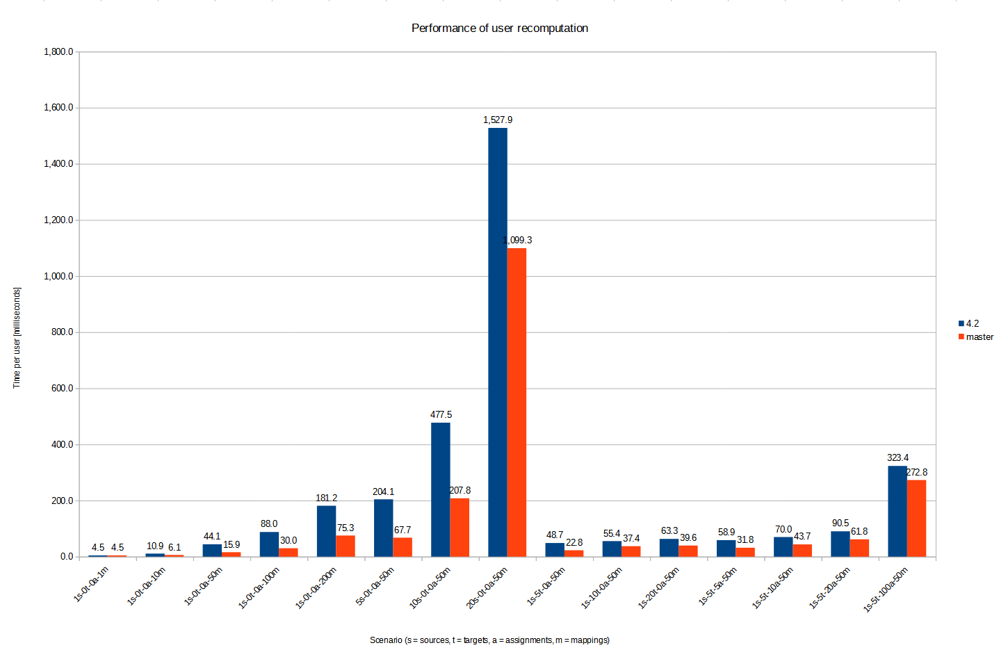
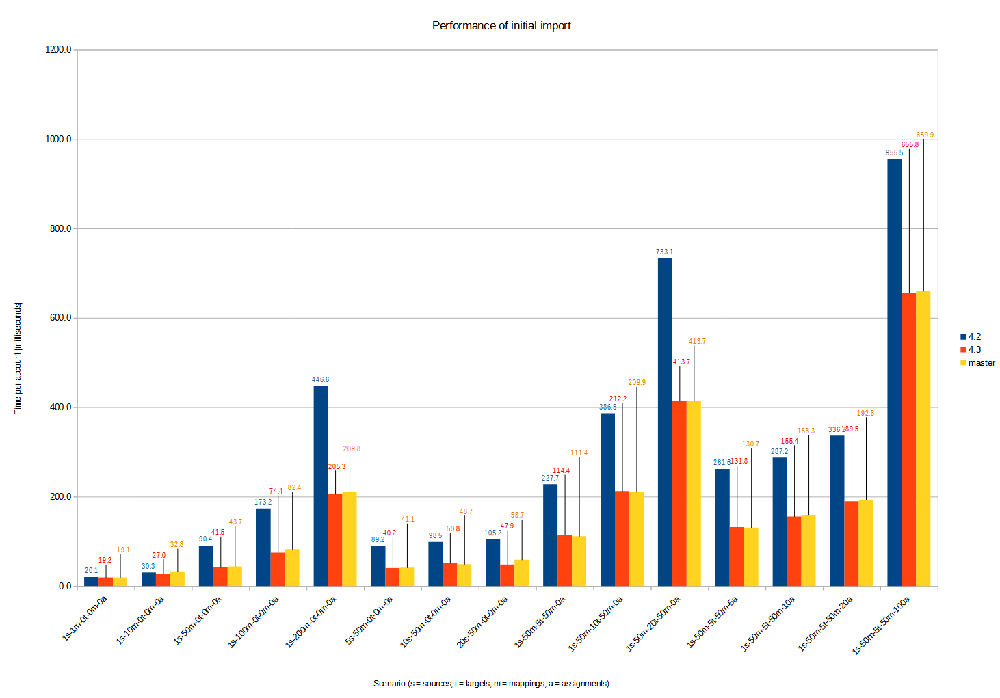
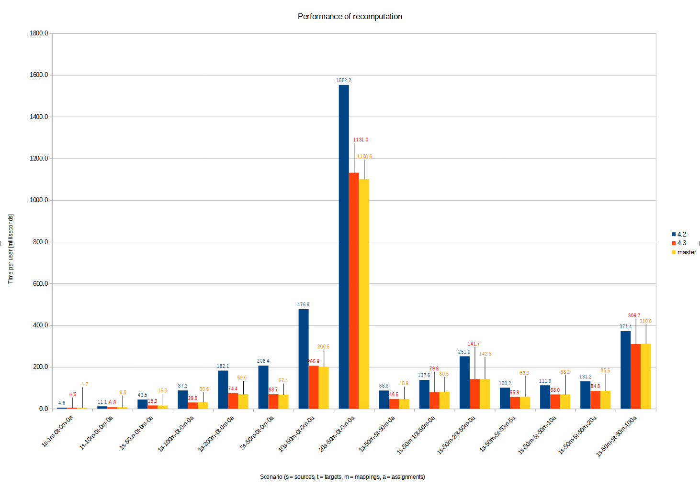

= System Performance Testing
:page-toc: top

This is a description of a preliminary version of the system performance testing scenario.

== Testing Scenario Overview

=== Source and Target Resources

There is a set of `S` source and `T` target resources. Each identity (midPoint user) has one account
on each source and one account on each target resource. The number of resources is configurable:
`S` ≥ 1, `T` ≥ 0.

=== Data Structures and Mappings

One of goals of this scenario is to test the performance of mapping evaluation. Therefore, we evaluate
a set of `SM~single~` ≥ 0 mappings of dummy single-valued attributes/properties, and a set of `SM~multi~` ≥ 0
mappings of dummy multi-valued attributes/properties, each of which has `V` ≥ 1 distinct values for each account.
(`SM` stands for _source mapping_ here. If `SM~single~` = `SM~multi~`, we can simply speak of `SM`.)

In order to avoid values being overwritten, single-valued mappings are present only on the first source resource.
We call it the _primary_ source. Multi-valued properties are evaluated separately per resource: each value is prefixed
by the identifier of the resource on which it originates, and the mapping has an appropriate range defined. See below.

Similarly, target (outbound) mappings are defined as well. We can define their number using `TM~single~`, `TM~multi~`
(or simply `TM`) parameters. Note that unlike single-valued inbound mappings, which are present only on
primary source resource, both single- and multi-valued outbound mappings are present equally on all
target resources.

The following picture shows a situation with two sources (`S` = 2), single target (`T` = 1), 100 single-valued
inbound mappings (on primary source) and 100 multi-valued outbound mappings (on both sources), and 100 + 100
mappings on the target resource (`SM` = `TM` = 100).

Note that besides dummy attributes/properties there are some other ones: obvious `name`, and custom
`roles` and `membership`. They will be described later.

For simplicity, the accounts (users) names are unified. They are in the form of `u-00000001`.
The number of accounts on each resource is driven by parameter `U` ≥ 1.

The dummy mappings look like this:

Inbound single-valued:
// [source,xml]
----
<attribute>
    <ref>ri:a-single-0000</ref>
    <inbound>
        <expression>
            
        </expression>
        <target>
            <path>extension/p-single-0000</path>
        </target>
    </inbound>
</attribute>
----

Inbound multi-valued:
// [source,xml]
----
<attribute>
    <ref>ri:a-multi-0047</ref>
    <inbound>
        <expression>
            
        </expression>
        <target>
            <path>extension/p-multi-0047</path>
            <set>
                <condition>
                    
                </condition>
            </set>
        </target>
    </inbound>
</attribute>
----

Outbound mappings are similar. For example, multi-valued ones are like this:

// [source,xml]
----
<attribute>
    <ref>ri:a-multi-0000</ref>
    <outbound>
        <source>
            <name>data</name>
            <path>extension/p-multi-0000</path>
        </source>
        <expression>
            
        </expression>
    </outbound>
</attribute>
----

=== Extension Schema

As seen above, the extension schema contains definitions for `p-single-xxxx` and `p-multi-xxxx` properties.
These can be indexed or not, depending on the configuration.

=== Roles

There is a two-level structure of roles:

1. User is assigned _business_ roles (based on the value of `role` attribute on the primary source).
An example: `business-0014`.
2. Each business role induces `I` ≥ 0 _technical_ roles, e.g. `technical-0001`
3. Each technical role is bound to a single target resource (e.g. `target-000`) and is
projected into a group object on that resource with the name like `technical-0001`. It induces:

a. membership in the particular group,
b. a record in the `membership` attribute, containing the name of both business and technical role,
e.g. `business-0014-technical-0001`.

The number of user assignments is driven by parameter `A` ≥ 0.
(Actually, both `I` and `A` can be also numeric intervals, to provide some randomness in the scenario.
Then we can speak of `A~min~`, `A~max~`, `I~min~`, and `I~max~`.)

The technical role looks like this:

// [source,xml]
----
<role oid="022c720a-3e94-409a-80f3-808d17f2d49a"
      xmlns="http://midpoint.evolveum.com/xml/ns/public/common/common-3"
      xmlns:ri="http://midpoint.evolveum.com/xml/ns/public/resource/instance-3">

<name>technical-0000</name>
    <assignment>
        <construction>
            <resourceRef oid="f8574dcf-4541-46cb-97cb-9e0c9cdb8f99" /> <!-- target-000 -->
            <kind>entitlement</kind>
            <intent>group</intent>
        </construction>
    </assignment>

    <identifier>g-0000</identifier>

    <inducement>
        <construction>
            <resourceRef oid="f8574dcf-4541-46cb-97cb-9e0c9cdb8f99" /> <!-- target-000 -->
            <attribute>
                <ref>ri:membership</ref>
                <outbound>
                    <expression>
                        
                    </expression>
                </outbound>
            </attribute>
            <association>
                <ref>ri:group</ref>
                <outbound>
                    <expression>
                        <associationFromLink>
                            <projectionDiscriminator>
                                <kind>entitlement</kind>
                                <intent>group</intent>
                            </projectionDiscriminator>
                        </associationFromLink>
                    </expression>
                </outbound>
            </association>
        </construction>
    </inducement>
</role>
----

=== Scenario Execution (Tasks)

The scenario runs in four stages:

[%autowidth]
[%header]
|===
| Number | Name | Description
| 1
| Initial import
| Initial import of accounts from sources, starting from the primary one.

| 2
| No-op imports
| Repeated imports of accounts from sources. They are called "no-op" because nothing changes
on sources, so there should be no changes in repository nor on targets (except for e.g. some metadata).

| 3
| Source reconciliation
| Reconciliation of each source resource in turn. Again, without any changes on sources.

| 4
| User recomputation
| Recomputation of all imported users. Still with no changes.
|===

The execution of stages 2-4 is there to model situations when there are large reconciliation/recomputation
tasks scheduled to ensure the eventual consistency of the system. In the future we might add some changes
on sources to check the performance also in this case.

== Technical Scenario Parameters

The conceptual parameters like `S`, `T`, `SM`, `TM`, `U`, `A` (and others) are driven
by Java system properties described here.

=== Sources and Inbound Mappings

Sources are defined using the following system properties:

[%autowidth]
[%header]
|===
| Property | Description | Symbolic name | Default value
| `sources.resources`
| Number of source resources.
| `S`
| 1

| `sources.accounts`
| Number of accounts on each resource. (This corresponds to the number of imported midPoint users.)
| `U`
| 10

| `sources.single-mappings`
| Number of inbound mappings for single-valued dummy attributes -> properties.
| `SM~single~`
| 1

| `sources.multi-mappings`
| Number of inbound mappings for multi-valued dummy attributes -> properties.
| `SM~multi~`
| 1

| `sources.multi-attr-values`
| Number of values for each multi-valued dummy attribute.
| `V`
| 5
|===

=== Targets and Outbound Mappings

Targets are defined using the following system properties:

[%autowidth]
[%header]
|===
| Property | Description | Symbolic name | Default value
| `targets.resources`
| Number of target resources.
| `T`
| 0

| `targets.single-mappings`
| Number of outbound mappings for single-valued dummy properties -> attributes.
| `TM~single~`
| 0

| `targets.multi-mappings`
| Number of outbound mappings for multi-valued dummy properties -> attributes.
| `TM~multi~`
| 0
|===

=== Roles

Roles and their assignments are defined using the following system properties:

[%autowidth]
[%header]
|===
| Property | Description | Symbolic name | Default value

| `roles.business.count`
| Number of generated business roles.
|
| 2

| `roles.technical.count`
| Number of generated technical roles.
|
| 2

| `roles.assignments.count`
| Fixed number of business role assignments per user.
If specified, then `A~min~` = `A~max~` = `A`.
| `A`
|

| `roles.assignments.min`
| Minimal number of business role assignments per user.
| `A~min~`
| 1

| `roles.assignments.max`
| Maximal number of business role assignments per user.
| `A~max~`
| `A~min~`

| `roles.inducements.count`
| Fixed number of business -> technical role inducements per business role.
If specified, then `I~min~` = `I~max~` = `I`.
| `I`
|

| `roles.inducements.min`
| Minimal number of inducements per business role.
| `I~min~`
| 1

| `roles.inducements.max`
| Maximal  number of inducements per business role.
| `I~max~`
| `I~min~`

|===

=== Extension Schema

The extension schema is a basic prerequisite for the testing scenario to work, because extension properties
used by mappings are defined in it. The schema itself is governed by the following Java properties:

[%autowidth]
|===
| Property | Description | Default value

| `schema.single-valued-properties`
| Number of single valued properties, i.e. `p-single-xxxx` in the schema.
Please make sure the number is high enough to cover the needs of inbound/outbound mappings.
| 100

| `schema.multi-valued-properties`
| Number of multi valued properties, i.e. `p-multi-xxxx` in the schema.
Please make sure the number is high enough to cover the needs of inbound/outbound mappings.
| 10

| `schema.indexed-percentage`
| Percentage of properties that should be indexed. Use an integer value between 0 and 100.
E.g. if 25, then properties 0003, 0007, 0011, 0015, etc are indexed, while the others are not.
If 50, then properties 0001, 0003, 0005, 0007, etc are indexed.
| 0

|===

=== Tasks

Tasks are driven by the following Java properties:

[%autowidth]
|===
| Property | Description | Default value

| `import.threads`
| Number of worker threads for the import tasks.
| 0 (i.e. single-threaded execution)

| `import.no-op-runs`
| Number of "no-op" runs of each of the import tasks.
| 1

| `reconciliation.threads`
| Number of worker threads for the source reconciliation tasks.
| 0 (i.e. single-threaded execution)

| `reconciliation.runs`
| Number of runs of each of the reconciliation tasks.
| 1

| `recomputation.threads`
| Number of worker threads for the recomputation task.
| 0 (i.e. single-threaded execution)

| `taskTimeout` footnote:[Will be changed to `tasks.timeout` soon.]

| Timeout for individual tasks (in milliseconds)
| 1800000 (i.e. 30 minutes)
|===

NOTE: Currently, it looks like the number of threads should be slightly less than the number
of logical or virtual CPUs. However, this depends. Generally, one should try to find the number
such that the throughput is maximized.

NOTE: Multi-node tasks are not supported yet by this scenario.

=== Other Properties

[%autowidth]
[%header]
|===
| Property | Meaning | Default value
| `label` | Custom label to be used for the scenario.
| Computed string in the form of (e.g.) `1s-50m-0t-0m-0a`, reflecting `S`, `SM`, `T`, `TM`, and `A`, respectively.
Special variants are present for `SM~single~` ≠ `SM~multi~` and `TM~single~` ≠ `TM~multi~`.
|===

=== Other Aspects

In the future we plan to other features, like template mappings, policy rules,
organizational structure, and so on.

== How to Run

The midPoint code has to be compiled (once) and then the test can be run repeatedly, with the same
or different parameters.

Compilation looks like this:

// [source,bash]
----
mvn clean install -DskipTests -pl :story -am
----

And the execution then looks like this:

// [source,bash]
----
#
# Single source, increasing number of mappings: 1, 10, 50, 100, 200 (both single and multi)
# Number of accounts is decreasing from 2000 to 500.
#
mvn clean integration-test -pl :story -o -Pextratest -Dit.test=TestSystemPerformance -Dconfig=/.../postgresql.properties \
 -Dsources.accounts=2000 -Dsources.resources=1 -Dsources.single-mappings=1 -Dsources.multi-mappings=1 -Dsources.multi-attr-values=5 \
 -Dtargets.resources=0 \
 -Droles.business.count=0 -Droles.technical.count=0 -Droles.assignments.count=0 -Droles.inducements.count=0 \
 -Dschema.single-valued-properties=10 -Dschema.multi-valued-properties=10 \
 -Dimport.threads=6 -Dreconciliation.runs=0 -Drecomputation.threads=6

mvn integration-test -pl :story -o -Pextratest -Dit.test=TestSystemPerformance -Dconfig=/.../postgresql.properties \
 -Dsources.accounts=2000 -Dsources.resources=1 -Dsources.single-mappings=10 -Dsources.multi-mappings=10 -Dsources.multi-attr-values=5 \
 -Dtargets.resources=0 \
 -Droles.business.count=0 -Droles.technical.count=0 -Droles.assignments.count=0 -Droles.inducements.count=0 \
 -Dschema.single-valued-properties=10 -Dschema.multi-valued-properties=10 \
 -Dimport.threads=6 -Dreconciliation.runs=0 -Drecomputation.threads=6

mvn integration-test -pl :story -o -Pextratest -Dit.test=TestSystemPerformance -Dconfig=/.../postgresql.properties \
 -Dsources.accounts=1000 -Dsources.resources=1 -Dsources.single-mappings=50 -Dsources.multi-mappings=50 -Dsources.multi-attr-values=5 \
 -Dtargets.resources=0 \
 -Droles.business.count=0 -Droles.technical.count=0 -Droles.assignments.count=0 -Droles.inducements.count=0 \
 -Dschema.single-valued-properties=50 -Dschema.multi-valued-properties=50 \
 -Dimport.threads=6 -Dreconciliation.runs=0 -Drecomputation.threads=6

mvn integration-test -pl :story -o -Pextratest -Dit.test=TestSystemPerformance -Dconfig=/.../postgresql.properties \
 -Dsources.accounts=1000 -Dsources.resources=1 -Dsources.single-mappings=100 -Dsources.multi-mappings=100 -Dsources.multi-attr-values=5 \
 -Dtargets.resources=0 \
 -Droles.business.count=0 -Droles.technical.count=0 -Droles.assignments.count=0 -Droles.inducements.count=0 \
 -Dschema.single-valued-properties=100 -Dschema.multi-valued-properties=100 \
 -Dimport.threads=6 -Dreconciliation.runs=0 -Drecomputation.threads=6

mvn integration-test -pl :story -o -Pextratest -Dit.test=TestSystemPerformance -Dconfig=/.../postgresql.properties \
 -Dsources.accounts=500 -Dsources.resources=1 -Dsources.single-mappings=200 -Dsources.multi-mappings=200 -Dsources.multi-attr-values=5 \
 -Dtargets.resources=0 \
 -Droles.business.count=0 -Droles.technical.count=0 -Droles.assignments.count=0 -Droles.inducements.count=0 \
 -Dschema.single-valued-properties=200 -Dschema.multi-valued-properties=200 \
 -Dimport.threads=6 -Dreconciliation.runs=0 -Drecomputation.threads=6

#
# Increasing number of sources (having 50 + 50 mappings): 5, 10, 20
# Number of accounts is decreasing from 1000 to 500.
#

mvn integration-test -pl :story -o -Pextratest -Dit.test=TestSystemPerformance -Dconfig=/.../postgresql.properties \
 -Dsources.accounts=1000 -Dsources.resources=5 -Dsources.single-mappings=50 -Dsources.multi-mappings=50 -Dsources.multi-attr-values=5 \
 -Dtargets.resources=0 \
 -Droles.business.count=0 -Droles.technical.count=0 -Droles.assignments.count=0 -Droles.inducements.count=0 \
 -Dschema.single-valued-properties=50 -Dschema.multi-valued-properties=50 \
 -Dimport.threads=6 -Dreconciliation.runs=0 -Drecomputation.threads=6

mvn integration-test -pl :story -o -Pextratest -Dit.test=TestSystemPerformance -Dconfig=/.../postgresql.properties \
 -Dsources.accounts=500 -Dsources.resources=10 -Dsources.single-mappings=50 -Dsources.multi-mappings=50 -Dsources.multi-attr-values=5 \
 -Dtargets.resources=0 \
 -Droles.business.count=0 -Droles.technical.count=0 -Droles.assignments.count=0 -Droles.inducements.count=0 \
 -Dschema.single-valued-properties=50 -Dschema.multi-valued-properties=50 \
 -Dimport.threads=6 -Dreconciliation.runs=0 -Drecomputation.threads=6

mvn integration-test -pl :story -o -Pextratest -Dit.test=TestSystemPerformance -Dconfig=/.../postgresql.properties \
 -Dsources.accounts=500 -Dsources.resources=20 -Dsources.single-mappings=50 -Dsources.multi-mappings=50 -Dsources.multi-attr-values=5 \
 -Dtargets.resources=0 \
 -Droles.business.count=0 -Droles.technical.count=0 -Droles.assignments.count=0 -Droles.inducements.count=0 \
 -Dschema.single-valued-properties=50 -Dschema.multi-valued-properties=50 \
 -Dimport.threads=6 -Dreconciliation.runs=0 -Drecomputation.threads=6

#
# Increasing number of targets (having 1 source, 50 + 50 mappings): 5, 10, 20
# Number of accounts is decreasing from 1000 to 500.
#

mvn integration-test -pl :story -o -Pextratest -Dit.test=TestSystemPerformance -Dconfig=/.../postgresql.properties \
 -Dsources.accounts=1000 -Dsources.resources=1 -Dsources.single-mappings=50 -Dsources.multi-mappings=50 -Dsources.multi-attr-values=5 \
 -Dtargets.resources=5 -Dtargets.single-mappings=50 -Dtargets.multi-mappings=50 \
 -Droles.business.count=0 -Droles.technical.count=0 -Droles.assignments.count=0 -Droles.inducements.count=0 \
 -Dschema.single-valued-properties=50 -Dschema.multi-valued-properties=50 \
 -Dimport.threads=6 -Dreconciliation.runs=0 -Drecomputation.threads=6

mvn integration-test -pl :story -o -Pextratest -Dit.test=TestSystemPerformance -Dconfig=/.../postgresql.properties \
 -Dsources.accounts=500 -Dsources.resources=1 -Dsources.single-mappings=50 -Dsources.multi-mappings=50 -Dsources.multi-attr-values=5 \
 -Dtargets.resources=10 -Dtargets.single-mappings=50 -Dtargets.multi-mappings=50 \
 -Droles.business.count=0 -Droles.technical.count=0 -Droles.assignments.count=0 -Droles.inducements.count=0 \
 -Dschema.single-valued-properties=50 -Dschema.multi-valued-properties=50 \
 -Dimport.threads=6 -Dreconciliation.runs=0 -Drecomputation.threads=6

mvn integration-test -pl :story -o -Pextratest -Dit.test=TestSystemPerformance -Dconfig=/.../postgresql.properties \
 -Dsources.accounts=500 -Dsources.resources=1 -Dsources.single-mappings=50 -Dsources.multi-mappings=50 -Dsources.multi-attr-values=5 \
 -Dtargets.resources=20 -Dtargets.single-mappings=50 -Dtargets.multi-mappings=50 \
 -Droles.business.count=0 -Droles.technical.count=0 -Droles.assignments.count=0 -Droles.inducements.count=0 \
 -Dschema.single-valued-properties=50 -Dschema.multi-valued-properties=50 \
 -Dimport.threads=6 -Dreconciliation.runs=0 -Drecomputation.threads=6

#
# Increasing number of assignments (having 1 source, 5 targets, 50 + 50 mappings; each BR has 2 TRs): 5, 10, 20, 100
# Number of accounts is decreasing from 1000 to 500.
#

mvn integration-test -pl :story -o -Pextratest -Dit.test=TestSystemPerformance -Dconfig=/.../postgresql.properties \
 -Dsources.accounts=1000 -Dsources.resources=1 -Dsources.single-mappings=50 -Dsources.multi-mappings=50 -Dsources.multi-attr-values=5 \
 -Dtargets.resources=5 -Dtargets.single-mappings=50 -Dtargets.multi-mappings=50 \
 -Droles.business.count=100 -Droles.technical.count=500 -Droles.assignments.count=5 -Droles.inducements.count=2 \
 -Dschema.single-valued-properties=50 -Dschema.multi-valued-properties=50 \
 -Dimport.threads=6 -Dreconciliation.runs=0 -Drecomputation.threads=6

mvn integration-test -pl :story -o -Pextratest -Dit.test=TestSystemPerformance -Dconfig=/.../postgresql.properties \
 -Dsources.accounts=500 -Dsources.resources=1 -Dsources.single-mappings=50 -Dsources.multi-mappings=50 -Dsources.multi-attr-values=5 \
 -Dtargets.resources=5 -Dtargets.single-mappings=50 -Dtargets.multi-mappings=50 \
 -Droles.business.count=100 -Droles.technical.count=500 -Droles.assignments.count=10 -Droles.inducements.count=2 \
 -Dschema.single-valued-properties=50 -Dschema.multi-valued-properties=50 \
 -Dimport.threads=6 -Dreconciliation.runs=0 -Drecomputation.threads=6

mvn integration-test -pl :story -o -Pextratest -Dit.test=TestSystemPerformance -Dconfig=/.../postgresql.properties \
 -Dsources.accounts=500 -Dsources.resources=1 -Dsources.single-mappings=50 -Dsources.multi-mappings=50 -Dsources.multi-attr-values=5 \
 -Dtargets.resources=5 -Dtargets.single-mappings=50 -Dtargets.multi-mappings=50 \
 -Droles.business.count=100 -Droles.technical.count=500 -Droles.assignments.count=20 -Droles.inducements.count=2 \
 -Dschema.single-valued-properties=50 -Dschema.multi-valued-properties=50 \
 -Dimport.threads=6 -Dreconciliation.runs=0 -Drecomputation.threads=6

mvn integration-test -pl :story -o -Pextratest -Dit.test=TestSystemPerformance -Dconfig=/.../postgresql.properties \
 -Dsources.accounts=500 -Dsources.resources=1 -Dsources.single-mappings=50 -Dsources.multi-mappings=50 -Dsources.multi-attr-values=5 \
 -Dtargets.resources=5 -Dtargets.single-mappings=50 -Dtargets.multi-mappings=50 \
 -Droles.business.count=100 -Droles.technical.count=500 -Droles.assignments.count=100 -Droles.inducements.count=2 \
 -Dschema.single-valued-properties=50 -Dschema.multi-valued-properties=50 \
 -Dimport.threads=6 -Dreconciliation.runs=0 -Drecomputation.threads=6

...
----

Note that the first command cleans the `target` directory in the `story` module. The other ones should not contain
`clean` maven goal, as to preserve the content.

The `-Dconfig=...` should point to a testing repository configuration.

The other `-Dx=y` flags define individual test parameters.

== Results

The test provides four files for each test run:

[%autowidth]
[%header]
|===
| File | Description
| `TIMESTAMP-summary.txt` | Summary information about the measured performance in a given run.
| `TIMESTAMP-progress.csv` | Snapshot of the task progress during the course of the execution.
It can be analyzed to see e.g. if there are any slowdowns as the repository is being filled in
with the data.
| `TIMESTAMP-report-xxx.txt` | Standard `TestMonitor`-based report to be automatically processed
by our analysis tools.
| `TIMESTAMP-details.txt` | Selected details (e.g. task statistics dumps) to be manually inspected,
if needed.
|===

Note that also `test.log` contains dumps of tasks during the course of tests executions, so this file
is worth keeping, if possible.

== Preliminary Results

The following charts show preliminary test results obtained on HP ProDesk 490 G3 MT Business PC (T9S84ES#BCM)
with

* Intel(R) Core(TM) i7-6700 CPU @ 3.40GHz,
* 16 GB memory: DDR4 Synchronous Unbuffered (Unregistered) 2133 MHz,
* 500 GB SSD: Samsung SSD 860,
* Ubuntu 20.04.1.

=== First Run

Test results are summarized link:test-2021-05-03-C1-nightly-run/summary.ods[here].
(Note that labels are little different from the ones used in the current version of the test.
In particular, the test was run without outbound mappings.)

All relevant data are stored link:test-2021-05-03-C1-nightly-run/all-data.zip[here].

=== Second Run

Summary: link:test-2021-05-04-A1/summary.ods[here].

This time outbound mappings are executed as well. Moreover, results from `support-4.3` branch
are provided along with `support-4.2` and `master`.
