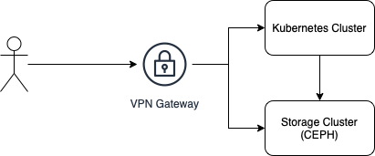
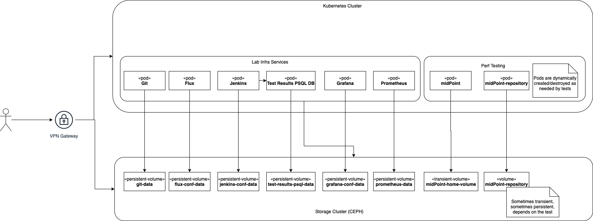
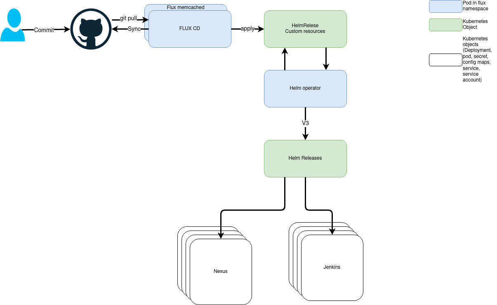
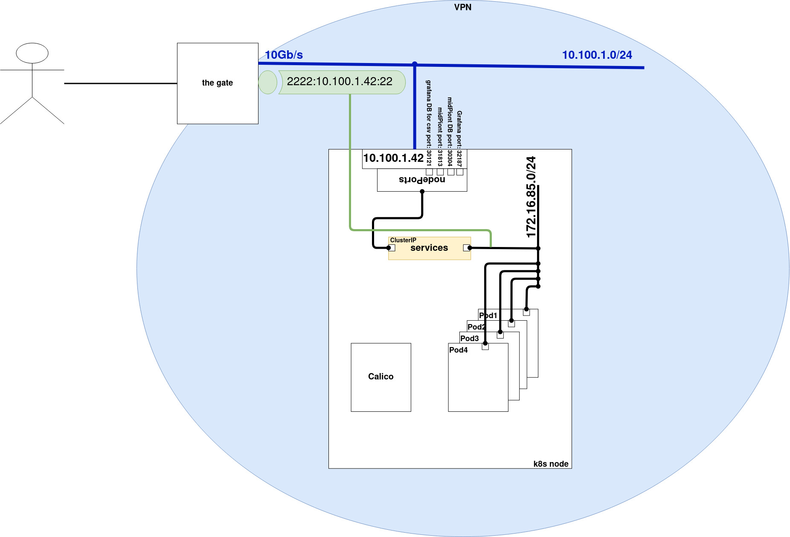
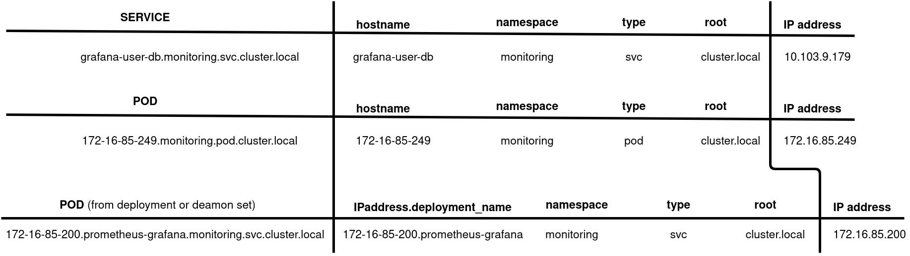
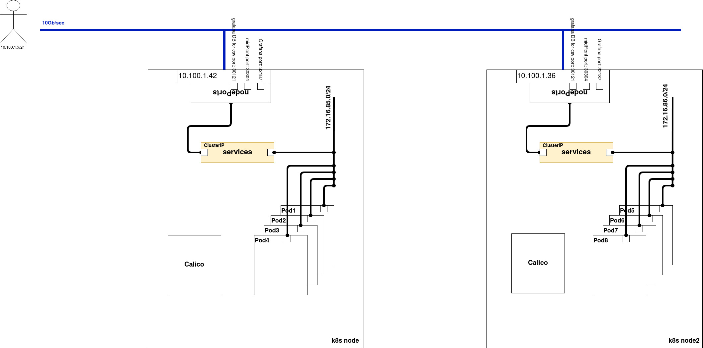
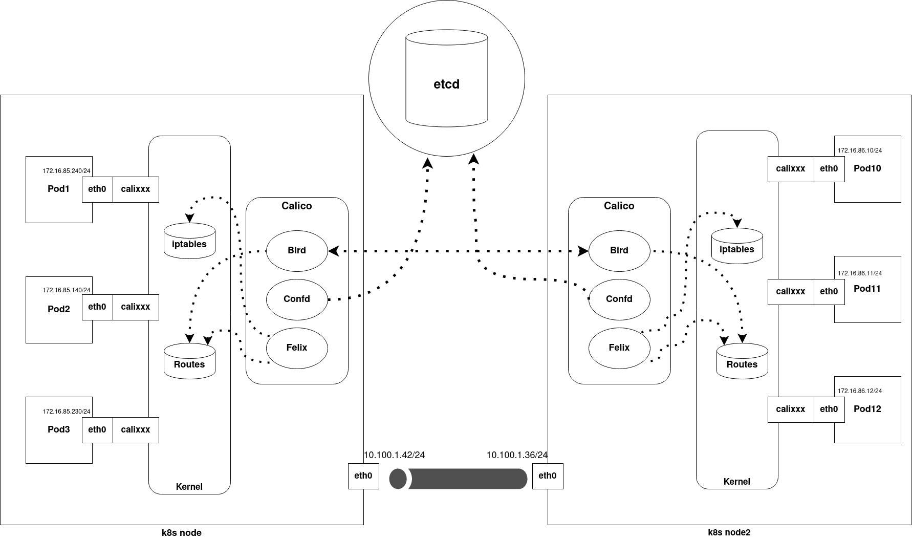
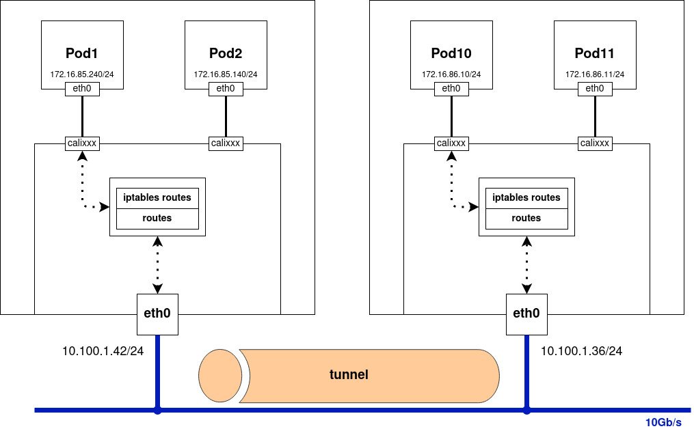
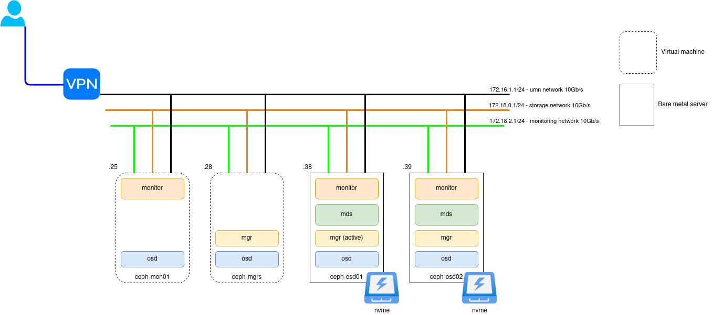
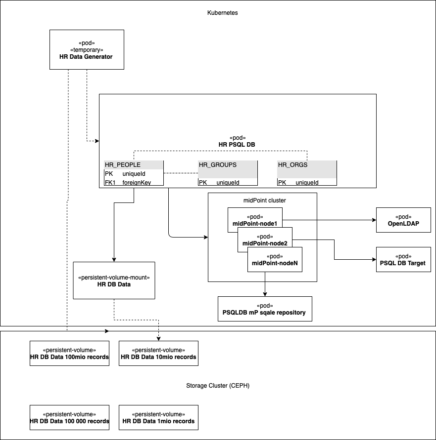

= MidScale Infrastructure Documentation
:page-nav-title: Infrastructure
:page-toc: top

== Performance testing lab system architecture

We have built our midScale lab performance testing environment using modern and popular infrastructure components: Kubernetes for docker container orchestration and CEPH used for clustered storage.

The environment is behind a VPN gateway to ensure some level of security and isolation to be able to perform the tests in a controlled manner.

=== Design principles and decisions

Even before midScale and in the beginning of the midScale project we have been collecting requirements and doing some preparations.

Design notes and requirements were collected in xref:/midpoint/projects/midscale/testing-design/index.adoc[Testing design] and xref:/midpoint/projects/midscale/design/infrastructure-design.adoc[Infrastructure Design].
After the sessions PoC experiments were conducted to make the decisions which matured in an environment described in this documentation.

Based on our identified requirements our preferred choice for the nature of the tests was to go for dynamic environment (kubernetes) with lego-like approach to built and reuse testing components (pods).
We have built the foundation of future-enabled possibility to grow the environment, so we have made sure to run it on at least to different hardware nodes. Also wanted make sure at least one hardware node is dedicated to run huge dedicated testing load to minimize any unnecessary deltas in the test results.

Storage (CEPH) cluster was built before the start of midScale project. It was proven to be stable so we have saved the effort and kept it for the midScale project.

We are running the lab environment in our DC, using our own dedicated hardware servers. Kubernetes and CEPH are installed directly on our servers to gain the best performance and results for our performance tests measurements.

== Technical design

In our lab we are running 2 different set of services:

* Lab Infrastructure services - These are support services to store, execute, evaluate the tests and also keep the environment monitored and synchronized.

* Performance testing environments - These are our test environments for different testing scenarios

Most of the containers (pods) in Kubernetes cluster are using a file system storage which is mapped to our ceph storage cluster. If there is need to permanently store the data for the container (mostly for infrastructure services or template volumes with huge amount of data) then we use persistent volumes.
If data do not have to be persisted then transient volumes claims are used.

=== Lab Infrastructure services

There are mostly typical services used in modern kubernetes infrastructures:

* Git - to store all our configuration and templates to build and maintain our lab services.

* Flux - used as part of our GitOps initiative to keep the kubernetes application/pods syncrhonised with Git resources.

* Jenkins - our continuous integration platform to store and execute jobs to execute tests and collect the results.

* Test results DB - we are using PSQL with our defined database to store all test results for further processing and evaluation.

* Grafana - is visualising our test results on our custom dashboards to not only evaluate but to also compare with our baseline (last release before midScale midPoint 4.2)

* Prometheus - store for the metrics collected from the environment. Typical k8s component.

=== Performance testing environments

We are running following type of tests:

* Component integration performance tests - these are like advanced unit tests, where we are running them in maven controlled environment. They are written and maintained by developers to have quick feedback loop about performance improvements in the code. Some of the tests even when isolated are executed for up to 20 hours to collect enough data to identify bottlenecks and further code optimization. These are executed from Jenkins using maven and are using our PSQL test results DB.

* UI performance tests - a simple suite to monitor our progress in UI typical page rendering times and number of DB requests. We have been using those tests to lower the DB load and speed up page rendering.

* UI feature tests a.k.a. Schrodinger tests - we have built a UI feature testing coverage on top of Selenide, automating our trainings, but mostly provide a reliable method to stabilise the UI.

* Automated end-to-end performance tests - Typical scenario built into end-to-end automated tests, usually running for long hours and working with huge amount of data in an integrated environment with typical systems connected to midPoint. Please, refer section xref:index.adoc#_performance_tests_system_design[Performance tests system design] and xref:/midpoint/projects/midscale/testing-design/system-perf-test/index.adoc[Task performance test]

* Manual end-to-end performance tests - for most of the tests we are using templates from automated end-to-end perf tests, but we are performing also some manual steps and evaluation. Typical scenario is midPoint cluster auto-scaling. Were we are adding or removing nodes from existing running cluster under different loads and observing automated recovery from error states.

== GitOps

We have configured the lab environment whenever applicable to follow modern GitOps principle. All configuration is stored in Git and kept synchronized by the Flux component to the Kubernetes cluster.
All changes in configuration are properly reviewed in git before applied to the environment.

We are using helm charts to configure/reconfigure and update/upgrade the applications/pods whenever applicable.
Where there is no helm chart we are going with k8s yaml configuration files that are stored in git.

Some applications cannot store all configuration in git conf files, for those we are using well defined persistent volumes. Typical example is Jenkins and its job definitions.

All applications are running as pods in the same kubernetes environment. Git and Flux are not special. The only speciality about the is to resolve chicken-egg problem. They cannot manage themself, so we have manual steps to install/maintain them.

Other advantage for the GitOps setup is we have conducted a fire-drill to identify and remove weak points to be able to rebuilt the whole lab from scracth in case of failure or need to have it in different DC/Cloud.

== Technical implementation

=== Kubernetes

=== Storage (CEPH)

== Performance tests system design

