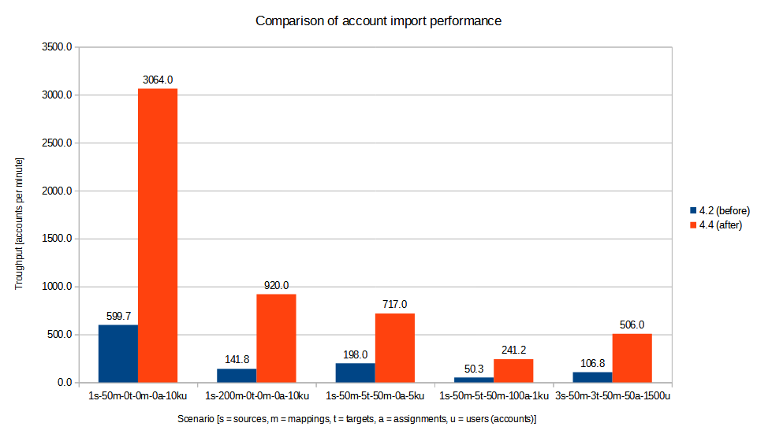
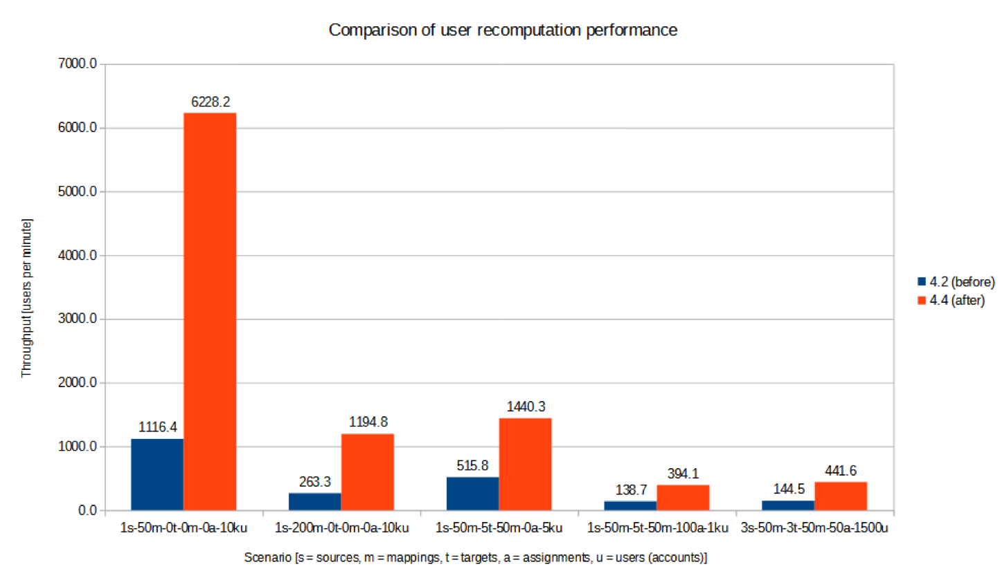
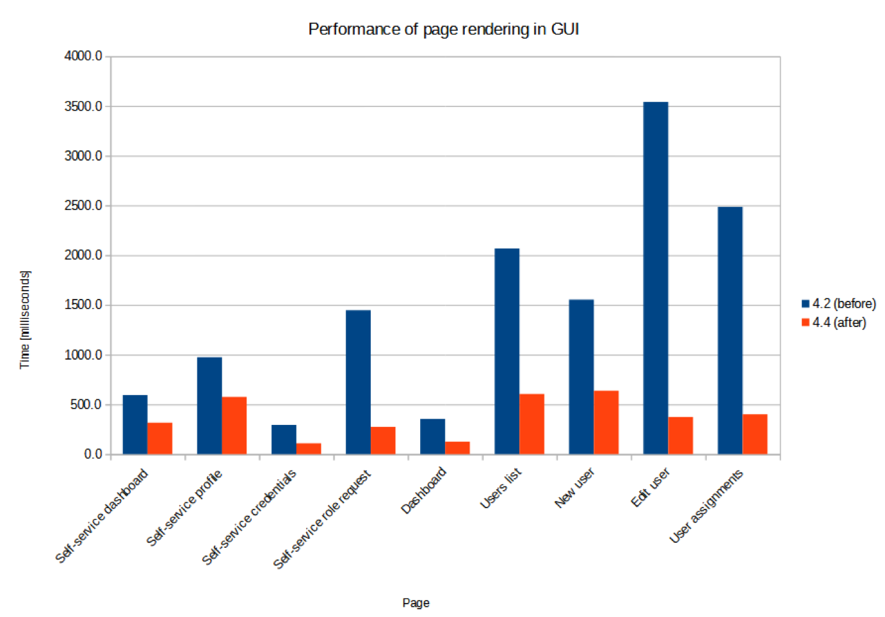
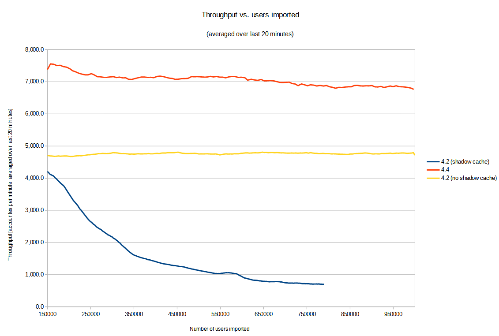
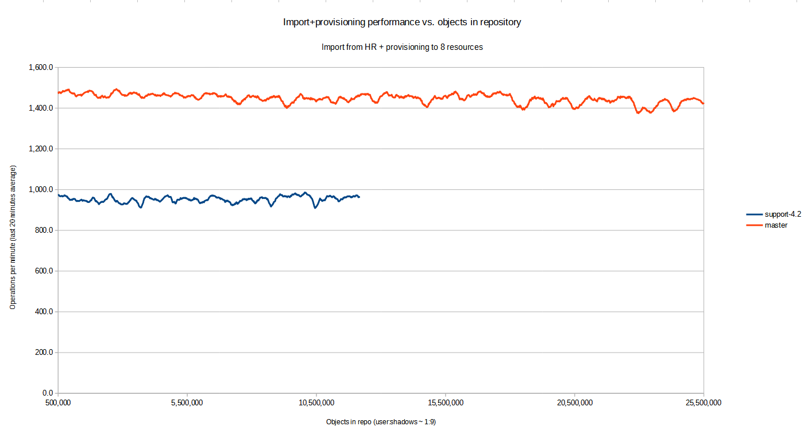
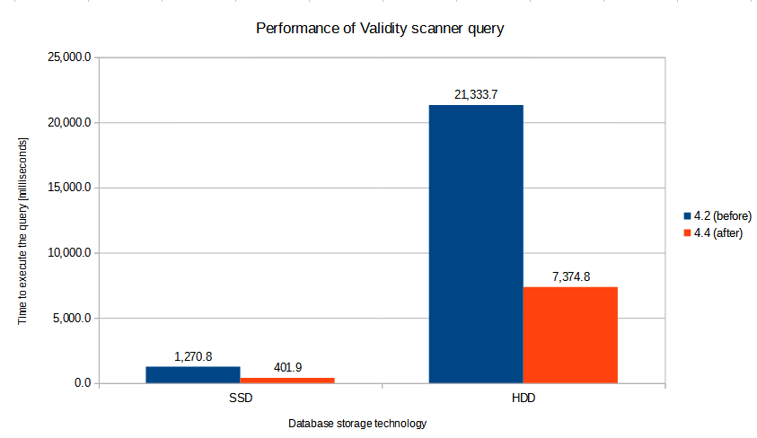
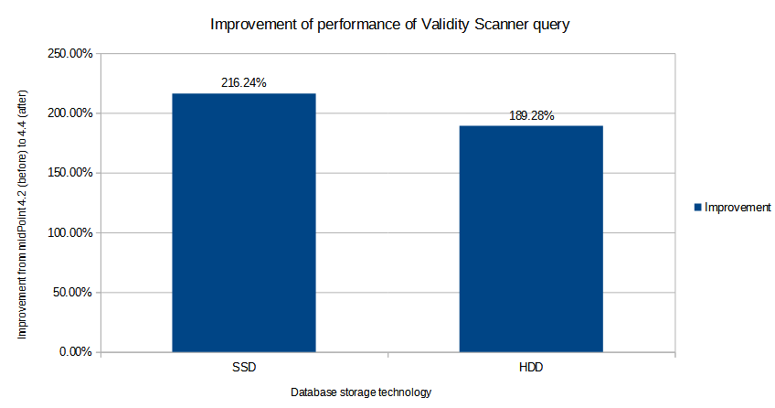

= MidScale Performance/Scalability test results
:page-nav-title: Performance/Scalability test results
:page-toc: top
:stem:

Here we describe the major tests that have been conducted during midScale project evaluation.

== Component integration performance tests

The first kind of tests deal with the performance of midPoint on a small population of identities (users and their accounts).

They consist of automated runs of _import_ and _recomputation_ tasks, against a set of "dummy" source and target
resources (link:https://github.com/Evolveum/midpoint/blob/master/icf-connectors/dummy-resource/src/main/java/com/evolveum/icf/dummy/resource/DummyResource.java[DummyResource] class). These resources execute in memory, so they are extremely fast.

Therefore, the execution times of import and recomputation tasks reflect the performance properties of midPoint itself,
as they are not influenced by external factors - except for the performance of the database used to host midPoint repository.

The midPoint is run on a single node, i.e. not in a clustered environment. The execution itself takes part within
link:http://maven.apache.org/surefire/maven-failsafe-plugin/[Maven Failsafe Plugin] in the
link:https://www.jenkins.io/[Jenkins] environment. The specific test class being used is link:https://github.com/Evolveum/midpoint/blob/91491cf8bb87528763a41b3f76d6a75644330648/testing/story/src/test/java/com/evolveum/midpoint/testing/story/sysperf/TestSystemPerformance.java[TestSystemPerformance]. Detailed description of the test is available in
link:https://docs.evolveum.com/midpoint/projects/midscale/design/testing-design/system-perf-test/[a separate document].

In midScale, the tests consisted of running import and recomputation tasks, measuring the time stem:[T] they needed to process specified number stem:[N]
of accounts or users, and determining the average time to process single account/user (i.e. stem:[\frac{T}{N}]) and the throughput
(per minute), i.e. stem:[\frac{N}{T} * 60,000].

In general, the performance of midPoint strongly depends on specific circumstances, like the number of source and target resources,
the number and complexity of mappings, the characteristics of data being processed (e.g. the typical number of values per item),
and so on. Therefore, we have prepared a set of different _scenarios_ and evaluated the performance for each of them.
The naming of the scenarios reflect their basic characteristics. As an example, let us describe the meaning of `3s-50m-3t-50m-50a-1500u`:

[%autowidth]
[%header]
|===
| Sign | Meaning | Example | Explanation
| `s` | Number of source resources | `3s` | three source resources
| `m` | Number of mappings | `50m` | 50 mappings for single-valued items plus 50 mappings for multi-valued items (100 in total).
There are two values of this parameter: one for source resources (i.e. inbound mappings) and one for target resources (i.e. outbound
mappings).
| `t` | Number of target resources | `3t` | three target resources
| `a` | Number of assignments per user | `50a` | each user has 50 direct assignments
| `u` | Number of users (source accounts) in the test | `1500u` | 1500 users (accounts)
|===

There are other parameters, not reflected in the scenario names by default. In the table below we summarize the key ones. (We still leave out
unimportant parameters, like the number of import no-op runs, or reconciliation runs, which were zero in all the tests.)

[%autowidth]
[%header]
|===
| Parameter | Meaning | 1s-50m-0t-0m-0a-10ku | 1s-200m-0t-0m-0a-10ku | 1s-50m-5t-50m-0a-5ku | 1s-50m-5t-50m-100a-1ku | 3s-50m-3t-50m-50a-1500u
| `schema.single-valued-properties` | Number of single valued extension properties `p-single-xxxx` in the schema | 50 | 200 | 50 | 50 | 50
| `schema.multi-valued-properties` | Number of single valued extension properties `p-multi-xxxx` in the schema | 50 | 200 | 50 | 50 | 50
| `schema.indexed-percentage` | Percentage of properties that should be indexed | 0 | 0 | 0 | 0 | 0
| `sources.resources` | Number of source resources | 1 | 1 | 1 | 1 | 3
| `sources.accounts` | Number of accounts on each resource. (This corresponds to the number of imported midPoint users.) | 10,000 | 10,000 | 5,000 | 1,000 | 1,500
| `sources.single-mappings` | Number of inbound mappings for single-valued dummy attributes → properties | 50 | 200 | 50 | 50 | 50
| `sources.multi-mappings` | Number of inbound mappings for multi-valued dummy attributes → properties | 50 | 200 | 50 | 50 | 50
| `sources.multi-attr-values` | Number of values for each multi-valued dummy attribute | 5 | 5 | 5 | 5 | 5
| `targets.resources` | Number of target resources | 0 | 0 | 5 | 5 | 3
| `targets.single-mappings` | Number of outbound mappings for single-valued dummy properties → attributes | 0 | 0 | 50 | 50 | 50
| `targets.multi-mappings` | Number of outbound mappings for multi-valued dummy properties → attributes | 0 | 0 | 50 | 50 | 50
| `roles.business.count` | Number of generated business roles | 0 | 0 | 0 | 100 | 100
| `roles.technical.count` | Number of generated technical roles | 0 | 0 | 0 | 500 | 500
| `roles.assignments.count` | Number of business role assignments per user | 0 | 0 | 0 | 100 | 50
| `roles.inducements.count` | Number of business → technical role inducements per business role | 0 | 0 | 0 | 2 | 2
| `import.threads` | Number of worker threads for the import tasks | 31 | 31 | 31 | 31 | 31
| `recomputation.threads` | Number of worker threads for the recomputation task | 31 | 31 | 31 | 31 | 31
|===

The detailed explanation of these parameters can be found in the
link:https://docs.evolveum.com/midpoint/projects/midscale/design/testing-design/system-perf-test/[test description] mentioned above.

Versions of midPoint that have been used in the tests:

[%autowidth]
[%header]
|===
| Label | Commit ID
| 4.2 (before) | link:https://github.com/Evolveum/midpoint/commit/45bc429df763db4a47003ac1cb2a1aeba372abdb[45bc429df763db4a47003ac1cb2a1aeba372abdb]
| 4.4 (after) | link:https://github.com/Evolveum/midpoint/commit/76d554337e5500005999ab4a1647ae5461036ada[76d554337e5500005999ab4a1647ae5461036ada]
|===

The tests were executed in our testing environment consisting of a two-node Kubernetes cluster. There results were the following:

We can see a significant improvement of midPoint performance in all the mentioned scenarios.

== UI performance tests

TODO: description

== UI feature tests a.k.a. Schrodinger tests

TODO: description

== Automated end-to-end performance tests

The goal of these tests is to determine the scalability of midPoint regarding the size of user population
(i.e. number of identities being managed).

They consist of a simulated HR resource (having a defined number of user accounts, organizations, organization units, groups,
and user-group membership relations), midPoint cluster, and eight target resources. All these components execute in our two-node
Kubernetes testing environment.

We run the tests in three stages, described separately. First two are covered in this section (Automated end-to-end performance
tests) and the third one is described in the following one (Manual end-to-end performance tests).

=== Stage 1: Pure import

The first stage consisted of a pure import, i.e. importing HR accounts without doing provisioning to the targets.

We have run the following scenarios:

[%autowidth]
[%header]
|===
| Internal ID | ID | Description | git commit ID
| `perf-test-1` | 4.4 (after) | The current version of midPoint | link:https://github.com/Evolveum/midpoint/commit/858a5efc79571a828b67aed4ea7fe5d419937e26[858a5efc79571a828b67aed4ea7fe5d419937e26]
| `perf-test-4` | 4.2 (before) | Version 4.2 (state as of Aug 9, 2021) | link:https://github.com/Evolveum/midpoint/commit/e7211bbbb6de2a2f76da1f7e7d4d4a57fefaa45d[e7211bbbb6de2a2f76da1f7e7d4d4a57fefaa45d]
| `perf-test-6` | 4.2 (no shadow cache) | Version 4.2 (state as of Aug 9, 2021), with disabled un-scalable functionality (see below). | link:https://github.com/Evolveum/midpoint/commit/e7211bbbb6de2a2f76da1f7e7d4d4a57fefaa45d[e7211bbbb6de2a2f76da1f7e7d4d4a57fefaa45d]
|===

The Kubernetes pods used:

[%autowidth]
[%header]
|===
| Pod name | Description
| `perf-test-1-hr-db-0` | PostgreSQL database with a simulated HR resource. Sizing: 1 million accounts,
100,000 organization units, 100,000 groups, but minimal number of account-group relations.
| `perf-test-X-db` | PostgreSQL database for midPoint repository for scenario X. (X = 1, 4, 6)
| `perf-test-X-mp-Y` | Application server number Y for midPoint for scenario X. (Y = 0, 1)
|===

The containers had unlimited resources (RAM, CPUs) available. However, we set Java parameters
for midPoint application servers heap to 20 GB max (`-Xmx20480m`).

Parameters of the import tasks used:

[%autowidth]
[%header]
|===
| Parameter | Value
| Worker tasks | 2 worker tasks per each midPoint node, i.e. 4 worker tasks overall
| Worker threads | 8 threads per each worker task, i.e. 32 worker threads overall
| Bucket size | 5,000 accounts
|===

The overall performance:

*Comments:* The sharply decreasing performance of "4.2 (before)" was identified to be due to
a bug link:https://jira.evolveum.com/browse/MID-6245[MID-6245] that was fixed during development
of midPoint 4.4. (Although we originally didn't expect it would have such a detrimental effect
on the scalability!) To allow a fair comparison of 4.2 and 4.4 we have modified the configuration
used in the test to avoid large-scale use of the query cache: turned it off for shadow objects.
This is indicated by "4.2 (no shadow cache)" scenario, plotted as yellow line in the chart above.
In this particular test the slowdown with shadow cache turned off was not significant. But generally,
the cache is a key component regarding the performance, so disabling it may slow the performance
down significantly in real-world operation.

The performance was determined by periodical sampling of the import task (once per minute), and
measuring how many accounts were imported during that time, and how many users were already
in the repository. (Besides users, there was an equal number of shadows: each user had one
corresponding HR shadow.) The performance was averaged over last 20 minutes, in order to show
the trends more clearly by avoiding fluctuations stemming e.g. from the processing across buckets
boundaries, and random deviations.

=== Stage 2: Import with provisioning

For this test, we have excluded the original 4.2 scenario (i.e. the one with the shadow cache enabled),
because there was no point in testing it for larger numbers of objects. On the other hand, we have added
8 target resources: 7 of them using simple DBTable connector, and the one with advanced ScriptedSQL
connector. The latter one was used because we wanted to check also the performance of provisioning accounts
with entitlements (group membership).

So, the scenarios were:

[%autowidth]
[%header]
|===
| Internal ID | ID | Description | git commit ID
| `perf-test-1` | 4.4 (after) | The current version of midPoint | link:https://github.com/Evolveum/midpoint/commit/2bba795a2c41b54f49e8f23a6568fb76518fa99a[2bba795a2c41b54f49e8f23a6568fb76518fa99a]
| `perf-test-2` | 4.2 (no shadow cache) | Version 4.2 (state as of Aug 9, 2021) | link:https://github.com/Evolveum/midpoint/commit/e7211bbbb6de2a2f76da1f7e7d4d4a57fefaa45d[e7211bbbb6de2a2f76da1f7e7d4d4a57fefaa45d]
|===

The Kubernetes pods used:

[%autowidth]
[%header]
|===
| Pod name | Description
| `perf-test-hr-db-3-0` | PostgreSQL database with a simulated HR resource. Sizing: 10 million accounts,
5,000 organization units, 5,000 groups, 20 million account-group membership
relations (two groups per a user in average).
| `perf-test-X-repo` | PostgreSQL database for midPoint repository for scenario X. (X = 1, 2)
| `perf-test-X-mp-Y` | Application server number Y for midPoint for scenario X. (Y = 0, 1)
|===

We have restricted the resources available to midPoint repositories (`perf-test-X-repo` pods)
to 8 GB of RAM and 6 virtual CPUs. The reason was that in stage 1 executions the servers acquired
approximately 60 GB of RAM (out of 192 GB available on each Kubernetes node). The Java parameters
for midPoint application servers were kept without change - 20 GB heap max.

Parameters of the import tasks used:

[%autowidth]
[%header]
|===
| Parameter | Value
| Worker tasks | 2 worker tasks per each midPoint node, i.e. 4 worker tasks overall
| Worker threads | 12 threads per each worker task, i.e. 48 worker threads overall
| Bucket size | 5,000 accounts
|===

(We have added worker threads because now there's more processing related to any single account being imported.)

Both versions of midPoint did scale well in this scenario, as can be seen on the graph below.

Note that x-axis shows the approximate number of objects in repository. This number consists
primarily of users and their shadows: for each user there are 9 shadows (HR + 8 targets).
The y-axis is the actual performance at given moment in time, averaged over last 20 minutes.

=== Manual end-to-end performance tests

Finally, after reaching approximately 3.16 million users (for 4.4) and 1.61 million users (for 4.2)
we decided to move into a higher gear and boost the numbers of users and assignments by injecting
them directly into the repository - i.e. without going through the full process of import from a resource.
(The full process includes e.g. projection computations, auditing, provisioning to target resources, and so on.
Simply adding objects to the repository is much faster.)

So, we increased the user population to approximately 20 million, and tried to execute the queries
that were known to be problematic in older midPoint versions. In particular, we run the queries used
by the Validity scanner task. To be able to see the difference between 4.2 and 4.4 more clearly,
we executed the queries both on fast SSD disks and slower HDD ones.

The results were the following:

The results show (approximately) threefold performance improvement (by ~ 200%) from 4.2 to 4.4.
