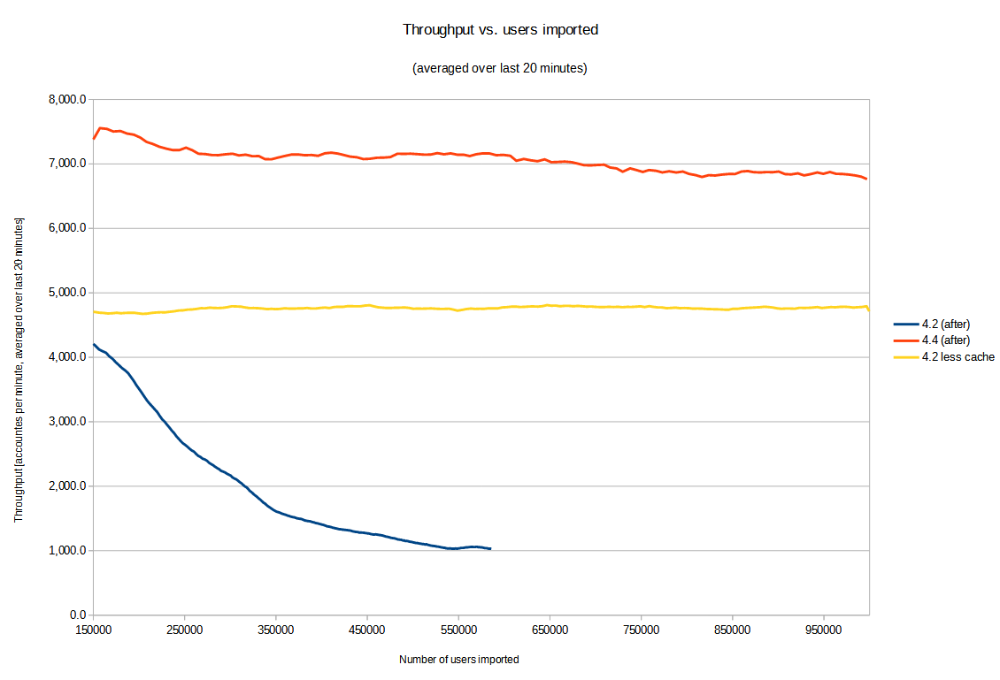
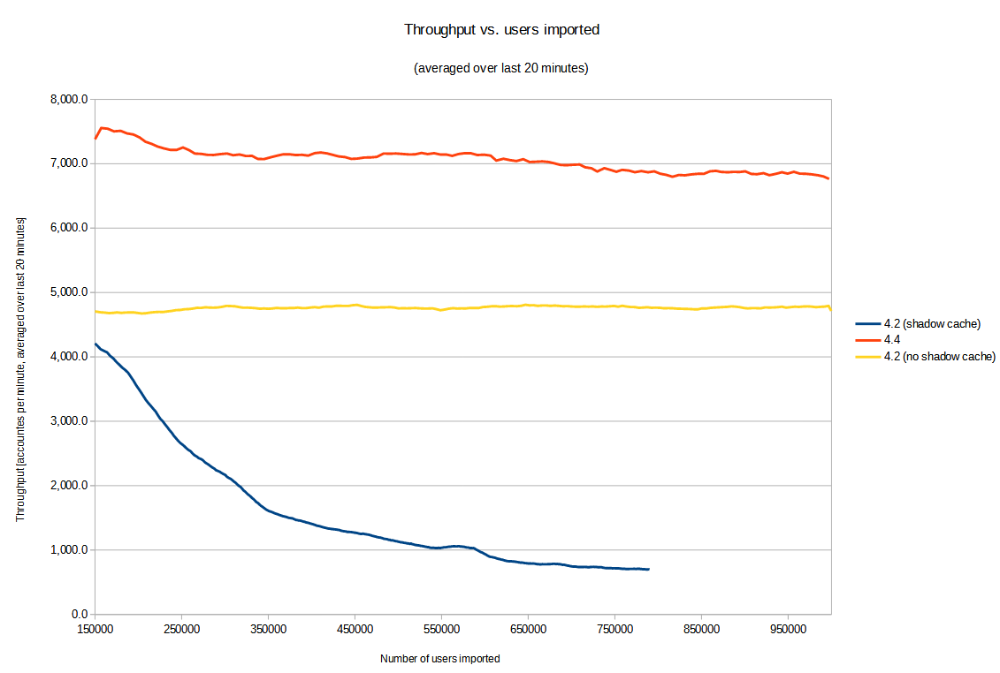
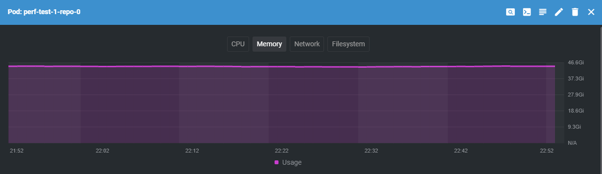
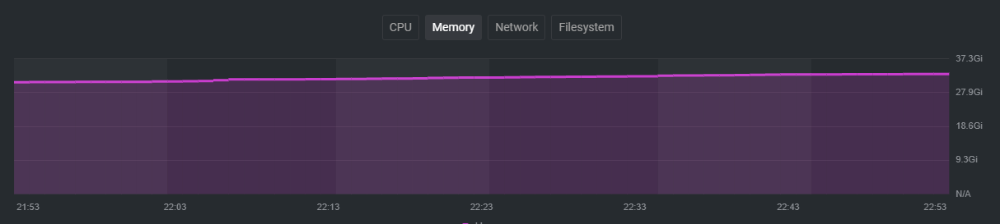
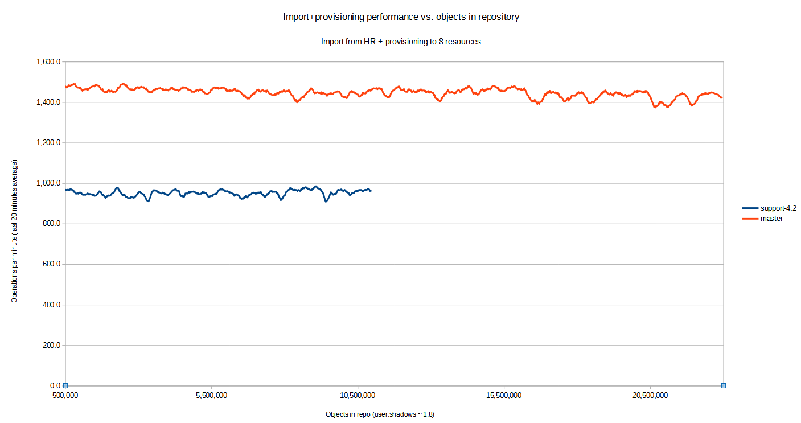
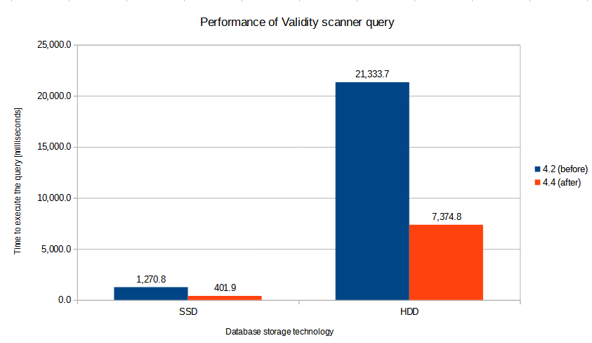
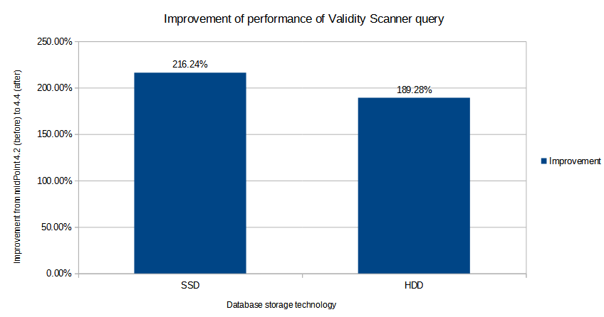

= MidScale Performance/Scalability test results
:page-nav-title: Performance/Scalability test results
:page-toc: top

== Type of the tests

=== Component integration performance tests

=== UI performance tests

=== UI feature tests a.k.a. Schrodinger tests

=== Automated end-to-end performance tests

image::image_2021_10_08T06_30_02_333Z.png[]

=== Manual end-to-end performance tests

