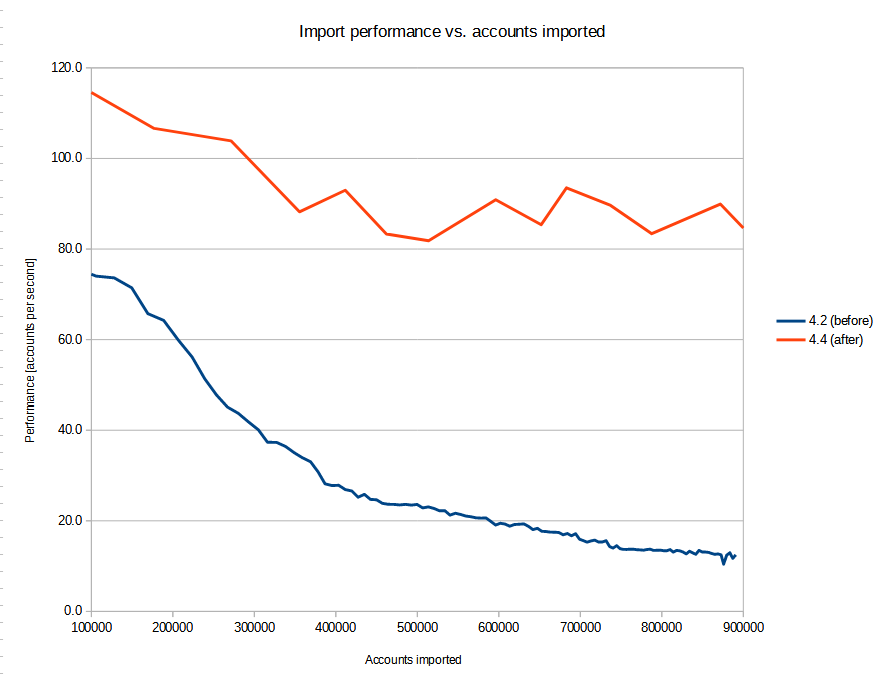

= MidScale Performance/Scalability test results
:page-nav-title: Performance/Scalability test results
:page-toc: top
:stem:

== Type of the tests

=== Component integration performance tests

These tests consist of automated runs of _import_ and _recomputation_ tasks, against a set of "dummy" source and target
resources (link:https://github.com/Evolveum/midpoint/blob/master/icf-connectors/dummy-resource/src/main/java/com/evolveum/icf/dummy/resource/DummyResource.java[DummyResource] class). These resources execute in memory, so they are extremely fast.

Therefore, the execution times of import and recomputation tasks reflect the performance properties of midPoint itself,
as they are not influenced by external factors - except for the performance of the database used to host midPoint repository.

The midPoint is run on a single node, i.e. not in a clustered environment. The execution itself takes part within
link:http://maven.apache.org/surefire/maven-failsafe-plugin/[Maven Failsafe Plugin] in the
link:https://www.jenkins.io/[Jenkins] environment. The specific test class used is link:https://github.com/Evolveum/midpoint/blob/91491cf8bb87528763a41b3f76d6a75644330648/testing/story/src/test/java/com/evolveum/midpoint/testing/story/sysperf/TestSystemPerformance.java[TestSystemPerformance]. Detailed description of the test is available in
link:https://docs.evolveum.com/midpoint/projects/midscale/design/testing-design/system-perf-test/[a separate document].

The tests consist of running import and recomputation tasks, measuring the time stem:[T] they need to process specified number stem:[N]
of accounts or users, and determining the average time to process single account/user (i.e. stem:[\frac{T}{N}]) and the throughput
(per minute), i.e. stem:[\frac{N}{T} * 60,000].

The performance of midPoint strongly depends on specific circumstances, like the number of source and target resources,
the number and complexity of mappings, the characteristics of data being processed (e.g. the typical number of values per item),
and so on. Therefore, we have prepared a set of different _scenarios_ and evaluated the performance for each of them. The naming of the scenarios
reflect their basic characteristics. As an example, let us describe the meaning of `3s-50m-3t-50m-50a-1500u`:

[%autowidth]
[%header]
|===
| Sign | Meaning | Example | Explanation
| `s` | Number of source resources | `3s` | three source resources
| `m` | Number of mappings | `50m` | 50 mappings for single-valued items plus 50 mappings for multi-valued items (100 in total).
There are two values of this parameter: one for source resources (i.e. inbound mappings) and one for target resources (i.e. outbound
mappings).
| `t` | Number of target resources | `3t` | three target resources
| `a` | Number of assignments per user | `50a` | each user has 50 direct assignments
| `u` | Number of users (source accounts) in the test | `1500u` | 1500 users (accounts)
|===

There are other parameters, not reflected in the scenario names by default. So let us summarize all the key ones. (We still leave out
unimportant ones, like the number of import no-op runs, or reconciliation runs, which were zero in all the tests.)

[%autowidth]
[%header]
|===
| Parameter | Meaning | 1s-50m-0t-0m-0a-10ku | 1s-200m-0t-0m-0a-10ku | 1s-50m-5t-50m-0a-5ku | 1s-50m-5t-50m-100a-1ku | 3s-50m-3t-50m-50a-1500u
| `schema.single-valued-properties` | Number of single valued extension properties `p-single-xxxx` in the schema | 50 | 200 | 50 | 50 | 50
| `schema.multi-valued-properties` | Number of single valued extension properties `p-multi-xxxx` in the schema | 50 | 200 | 50 | 50 | 50
| `schema.indexed-percentage` | Percentage of properties that should be indexed | 0 | 0 | 0 | 0 | 0
| `sources.resources` | Number of source resources | 1 | 1 | 1 | 1 | 3
| `sources.accounts` | Number of accounts on each resource. (This corresponds to the number of imported midPoint users.) | 10,000 | 10,000 | 5,000 | 1,000 | 1,500
| `sources.single-mappings` | Number of inbound mappings for single-valued dummy attributes → properties | 50 | 200 | 50 | 50 | 50
| `sources.multi-mappings` | Number of inbound mappings for multi-valued dummy attributes → properties | 50 | 200 | 50 | 50 | 50
| `sources.multi-attr-values` | Number of values for each multi-valued dummy attribute | 5 | 5 | 5 | 5 | 5
| `targets.resources` | Number of target resources | 0 | 0 | 5 | 5 | 3
| `targets.single-mappings` | Number of outbound mappings for single-valued dummy properties → attributes | 0 | 0 | 50 | 50 | 50
| `targets.multi-mappings` | Number of outbound mappings for multi-valued dummy properties → attributes | 0 | 0 | 50 | 50 | 50
| `roles.business.count` | Number of generated business roles | 0 | 0 | 0 | 100 | 100
| `roles.technical.count` | Number of generated technical roles | 0 | 0 | 0 | 500 | 500
| `roles.assignments.count` | Number of business role assignments per user | 0 | 0 | 0 | 100 | 50
| `roles.inducements.count` | Number of business → technical role inducements per business role | 0 | 0 | 0 | 2 | 2
| `import.threads` | Number of worker threads for the import tasks | 31 | 31 | 31 | 31 | 31
| `recomputation.threads` | Number of worker threads for the recomputation task | 31 | 31 | 31 | 31 | 31
|===

The detailed explanation of these parameters can be found in the
link:https://docs.evolveum.com/midpoint/projects/midscale/design/testing-design/system-perf-test/[test description] mentioned above.

Versions of midPoint used:

[%autowidth]
[%header]
|===
| Label | Commit ID
| 4.2 (before) | link:https://github.com/Evolveum/midpoint/commit/45bc429df763db4a47003ac1cb2a1aeba372abdb[45bc429df763db4a47003ac1cb2a1aeba372abdb]
| 4.4 (after) | link:https://github.com/Evolveum/midpoint/commit/76d554337e5500005999ab4a1647ae5461036ada[76d554337e5500005999ab4a1647ae5461036ada]
|===

The tests were executed in our testing environment consisting of a two-node Kubernetes cluster and provided the following results:

=== UI performance tests

=== UI feature tests a.k.a. Schrodinger tests

=== Automated end-to-end performance tests

image::image_2021_10_09T07_21_26_915Z.png[]

image::image_2021_10_10T20_53_38_632Z.png[]

image::image_2021_10_11T06_49_42_898Z.png[]

image::image_2021_10_12T21_47_40_131Z.png[]

=== Manual end-to-end performance tests

