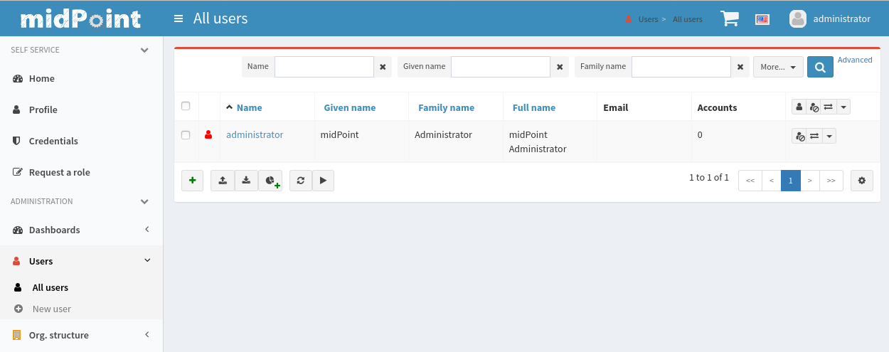

= MidPoint Quick Start Guide
:page-nav-title: Quick Start Guide
:page-wiki-name: First Steps
:page-wiki-metadata-create-user: semancik
:page-wiki-metadata-create-date: 2011-04-29T15:05:24.968+02:00
:page-wiki-metadata-modify-user: semancik
:page-wiki-metadata-modify-date: 2019-02-27T18:35:09.948+01:00
:page-display-order: 10
:page-liquid:
:page-toc: top
:experimental:
:page-upkeep-status: green



This guide describes steps how to quickly install and run midPoint, a comprehensive open source identity management and governance platform.

== Install MidPoint

There are two ways how to download and install midPoint:

[%autowidth]
|====
| Installation method | What to do? | What do you need?

| Distribution package
| Download the package, unpack and run
| Java runtime environment

| Docker image
| Pull the image and run it
| Docker environment
|====

=== Install MidPoint From Distribution Package

. Make sure you have *Java 11* runtime environment installed on your machine.
Java distributions based on OpenJDK are recommended, for example https://adoptopenjdk.net/[AdoptOpenJDK].
Perhaps the best method to install Java environment is to use packaging system of your operating system.
For example Debian/Ubuntu systems can use `sudo apt install openjdk-11-jdk`.

. Download the latest stable midPoint distribution package (link:https://evolveum.com/downloads/midpoint/{{lastReleased.version}}/midpoint-{{lastReleased.version}}-dist.zip[midpoint-{{lastReleased.version}}-dist.zip]) from https://evolveum.com/download/[Evolveum download page].

. Extract the package to a suitable location.
The usual location is `/opt/midpoint` on Linux systems.

. Run the `start.sh` or `start.bat` script, located in `bin` directory.

=== Use MidPoint Docker Image

. Make sure you have https://www.docker.com/[Docker] environment installed on your machine.

. Pull midPoint docker image from https://hub.docker.com/r/evolveum/midpoint[dockerhub.com]:
+
[source,bash]
----
docker pull evolveum/midpoint:{{lastReleased.version}}-alpine
----

. Run the image:
+
[source,bash]
----
docker run -p 8080:8080 --name midpoint evolveum/midpoint:{{lastReleased.version}}-alpine
----

== MidPoint User Interface

MidPoint has a web administration user interface.
This is a primary user interface to use and configure midPoint.
By default, the user interface is accessible at port `8080`:

`http://localhost:8080/midpoint/`

=== Logging In

Please log in to user interface as an `administrator` user:

[%autowidth, cols="h,1"]
|====
| Username | `administrator`
| Password | `5ecr3t`
|====

=== Have A Look Around

Administrator is an all-powerful user, therefore all the capabilities of midPoint are at your disposal.
Feel free to have a look around.
Some places of the user interface may be confusing, but you certainly find some fimiliar places:

* *Self service* part of the interface is used to manage the identity and privileges of a user that is currently logged in.

* *Administration* part of the user interface is used to manage user identities, roles, organizational structure and policies.
This part is used for routine administration of the system.
At this stage, this is perhaps the most interesting part of midPoint to explore.

* *Configuration* part of the user interface is used to customize midPoint behavior, going deep into midPoint internals.

=== Terminology

MidPoint is using terminology that is quite common in the identity management field, however it may be slightly confusing for people coming from other fields.
Following list explain basic midPoint terms:

* *User* means user record (profile) in midPoint database.
This data record usually contains unified data, synchronized from source systems.

* *Resource* is a remote system that is connected to midPoint.
It may a source system that feeds data to midPoint.
Or it may a target system, that is managed by midPoint.

* *Account* is a data structure (user profile) that resides on _resource_ (source or target system).
MidPoint reads data from accounts, or manages the accounts.

* *Role* gives privileges to users.
Role may also specify which _accounts_ on which _resources_ a _user_ should have.

=== Setting Up a Resource

MidPoint will not do much on its own.
We need to connect midPoint to a source or target system (a _resource_) to see it shine.
However, midPoint is very powerful and comprehensive system, there are many things that can be set up, customized and adjusted when a new _resource_ is connected to midPoint.
The configuration may be somehow overwhelming for a new midPoint engineer.

Therefore, the best strategy would be to start from a sample.
Have a look at midPoint collection of https://github.com/Evolveum/midpoint-samples/tree/master/samples/resources[midPoint resource samples] and choose one of them to start from.

Navigate to menu:Import object[] in midPoint menu and import the sample.
Then navigate to menu:Resources[All resources] to see your brand new resource in action.
Click on the resource name brings you to resource details, where you can test connection to the resource.
The tabs can be used to explore content of the resource.
Just make sure you click on the btn:[Resource] button (Search in:) to see live data.

== Next Steps

MidPoint is a very rich system.
It is in fact a platform, that can be customized to serve diverse environments.
It will take some time to get an understanding how midPoint works.
However, any time invested in learning midPoint will be paid back many times over.

There are three great ways how to start learning about midPoint:

* *xref:/book/[MidPoint Book]* provides a general introduction to identity management, it explains how midPoint works, it provides examples, ideas and tips for midPoint configuration, deployment and use.
This is _the_ book to learn about midPoint.
It is freely available for on-line reading and download.

* *Video tutorials* on https://www.youtube.com/channel/UCSDs8qBlv7MgRKRLu1rU_FQ[Evolveum YouTube channel].
There is a series of tutorials that is based on the book.
There are also other videos explaining various details of midPoint configuration and deployment.

* *https://evolveum.com/services/training-and-certification/[Trainings]* organized by Evolveum.
These are usually remote, instructor-lead trainings designed by midPoint authors.

There are also additional sources of information, that are usually suitable for engineers with some experience:

* *link:/[docs.evolveum.com]*: This entire site is dedicated to documentation.
It is more than worth exploring the content.

* *xref:/community/mailing-lists/[MidPoint mailing lists]* are a great place to discuss midPoint.

* *xref:/talks/[Conference talks]* and workshop recordings are a good resource for people that like to sit back and listen.

== Frequently Asked Questions

=== MidPoint won't start

Q: MidPoint won't start, I cannot access the `8080` port.

A: MidPoint is a substantial software system.
It usually takes 2-3 minutes for midPoint to start up.
You can monitor the progress of midPoint startup by looking at midPoint logs.

=== Something went wrong ...

Q: Something went wrong, I have no idea what is going on.

A: The best start to midPoint diagnostics is to have a look at midPoint logs.

In case of package-based deployment the log is located in `var/log/midpoint.log` (e.g. `/opt/midpoint/var/log/midpoint.log`).

When using a docker image, the standard docker logging mechanism is used: `docker logs midpoint`.

=== My first resource won't work

Q: My first resource won't work, there are connection errors, I can see no data, nothing works.

A: Have a look at the error message.
You can expand the error message to get more details about the problem.
However, please keep in mind that connecting new system to midPoint may be tricky.
There are nice systems that use standard protocols and provide good error messages.
However, many systems are not very nice.
They deviate from standards, require exotic configuration and return cryptic error messages.
It the resource does not work on the first try, it is usually helpful to learn more about midPoint and its workings.
Have a look at the xref:/book/[midPoint book], or check out the videos on https://www.youtube.com/channel/UCSDs8qBlv7MgRKRLu1rU_FQ[Evolveum YouTube channel].
That can help you to figure out the correct configuration to get your system connected.

=== Something else

Please check out xref:/faq/[MidPoint FAQs].