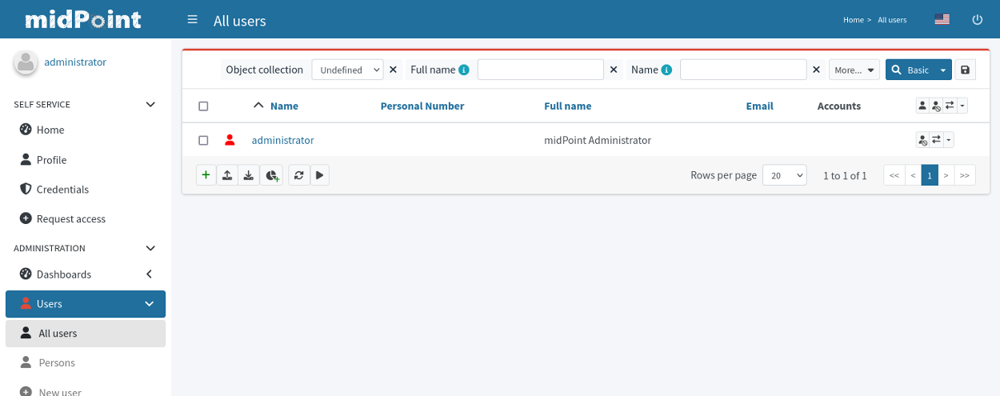

= MidPoint Quick Start Guide
:page-nav-title: Quick Start Guide
:page-wiki-name: First Steps
:page-wiki-id: 655474
:page-wiki-metadata-create-user: semancik
:page-wiki-metadata-create-date: 2011-04-29T15:05:24.968+02:00
:page-wiki-metadata-modify-user: semancik
:page-wiki-metadata-modify-date: 2019-02-27T18:35:09.948+01:00
:page-display-order: 10
:page-liquid:
:page-toc: top
:experimental:
:page-upkeep-status: green



This guide describes steps how to run midPoint, a comprehensive open source identity management and governance platform.

To have available full feature set there is requirements to utilized midpoint native repository.
Currently there is available only postgres implementation.
To be able quickly and easily start the environment the containers are currently preferred way.
There is docker-compose file available for quick start.
In case you have more complex environment there is available focused part of the docs with specific information for your use case.

[NOTE]
====
The usage of the container with the midPoint is not limited only to the provided examples.
In case you are using other tool implementing standardized / common features the container will also work for you (e.g. podman).

The information in this subtree of the docs are mainly for reference, or it can be used as hint how to start working with containerized midPoint.
====

=== Using docker-compose file

This is the easiest entry point - how to start with midPoint.

.Get available docker compose definition (@link:https://raw.githubusercontent.com/Evolveum/midpoint-docker/master/docker-compose.yml[github])
[source,bash]
----
curl -O https://raw.githubusercontent.com/Evolveum/midpoint-docker/master/docker-compose.yml
----

[NOTE]
====
You can use any way how to get the file from the github.
In case you are familiar with git operations feel free to checkout the repository.
This approach require additional application which may not be available without installation so the widely available application is used in the example.
====

Once we have available the file we can continue with next step.
To make it easier keep the name docker-compose.yml.
It is default name and it is used without explicit reference to the file - it has to be in the current working directory where we are going to run the command.

.start the environment
[source,bash]
----
docker compose up
----

It will take some time to start.
For a few seconds the web GUI will still not be available - it is expected.
There is initiation in progress - starting, loading init object to empty repository, etc.
You can try in a while or you can watch the log until you will see the line:

`INFO (org.springframework.boot.web.embedded.tomcat.TomcatWebServer): Tomcat started on port(s): 8080 (http) with context path '/midpoint'`

Once this line appear the web interface is available for you.

In case you want to stop the container use the following command.

.stop the environment
[source,bash]
----
docker compose down
----

This command will stop the container but keep it defined - allocated the space.
Allocation is not so big as only difference from the base image is stored in the overlay.

To clean up also the specific container related data you can use the following command.

.stop the environment and clean the allocated volume (data)
[source,bash]
----
docker compose down -v
----

As a summary here is table with the most often used command.

.Basic available commands with docker compose.
[%autowidth]
|====
| Command | Result

| `docker compose up`
| Start the environment based on docker-compose file content

| `docker compose down`
| Stop the environment (the stored data is kept)

| `docker compose down -v`
| Stop the environment and clean up the stored data

| `docker ps -a`
| List of currently used containers in the system.

|====

== MidPoint User Interface

MidPoint has a web administration user interface.
This is a primary user interface to use and configure midPoint.
By default, the user interface is accessible at port `8080`:

`http://localhost:8080/midpoint/`

=== Logging In

Please log in to user interface as an `administrator` user:

[%autowidth, cols="h,1"]
|====
| Username | `administrator`
| Password | `5ecr3t`
|====

=== Have A Look Around

Administrator is an all-powerful user, therefore all the capabilities of midPoint are at your disposal.
Feel free to have a look around.
Some places of the user interface may be confusing, but you certainly find some fimiliar places:

* *Self service* part of the interface is used to manage the identity and privileges of a user that is currently logged in.

* *Administration* part of the user interface is used to manage user identities, roles, organizational structure and policies.
This part is used for routine administration of the system.
At this stage, this is perhaps the most interesting part of midPoint to explore.

* *Configuration* part of the user interface is used to customize midPoint behavior, going deep into midPoint internals.

=== Terminology

MidPoint is using terminology that is quite common in the identity management field, however it may be slightly confusing for people coming from other fields.
Following list explain basic midPoint terms:

* *User* means user record (profile) in midPoint database.
This data record usually contains unified data, synchronized from source systems.

* *Resource* is a remote system that is connected to midPoint.
It may a source system that feeds data to midPoint.
Or it may a target system, that is managed by midPoint.

* *Account* is a data structure (user profile) that resides on _resource_ (source or target system).
MidPoint reads data from accounts, or manages the accounts.

* *Role* gives privileges to users.
Role may also specify which _accounts_ on which _resources_ a _user_ should have.

=== Setting Up a Resource

MidPoint will not do much on its own.
We need to connect midPoint to a source or target system (a _resource_) to see it shine.
However, midPoint is very powerful and comprehensive system, there are many things that can be set up, customized and adjusted when a new _resource_ is connected to midPoint.
The configuration may be somehow overwhelming for a new midPoint engineer.

Therefore, the best strategy would be to start from a sample.
Have a look at midPoint collection of https://github.com/Evolveum/midpoint-samples/tree/master/samples/resources[midPoint resource samples] and choose one of them to start from.

Navigate to menu:Import object[] in midPoint menu and import the sample.
Then navigate to menu:Resources[All resources] to see your brand new resource in action.
Click on the resource name brings you to resource details, where you can test connection to the resource.
The tabs can be used to explore content of the resource.
Just make sure you click on the btn:[Resource] button (Search in:) to see live data.

== Next Steps

MidPoint is a very rich system.
It is in fact a platform, that can be customized to serve diverse environments.
It will take some time to get an understanding how midPoint works.
However, any time invested in learning midPoint will be paid back many times over.

There are three great ways how to start learning about midPoint:

*  *xref:/midpoint/methodology/first-steps/[First Steps]* methodology also in https://www.youtube.com/watch?v=suo775ym_PE[First Steps Methodology Webinar] video, feel free to watch the recording to familiarize yourself with the approach and see live demonstration.

video::suo775ym_PE[youtube,title="First Steps Methodology Webinar Video",width="852",height="480"]

* *Video tutorials* on https://www.youtube.com/channel/UCSDs8qBlv7MgRKRLu1rU_FQ[Evolveum YouTube channel].
There is a series of tutorials that is based on the book.
There are also other videos explaining various details of midPoint configuration and deployment.

*TODO
** spojit first steps & ref to video
* youtube channel - explicitly list "recommended"

* *xref:/book/[MidPoint Book]* provides a general introduction to identity management, it explains how midPoint works, it provides examples, ideas and tips for midPoint configuration, deployment and use.
This is _the_ book to learn about midPoint.
It is freely available for on-line reading and download.

* *https://evolveum.com/services/training-and-certification/[Trainings]* organized by Evolveum.
These are usually remote, instructor-lead trainings designed by midPoint authors.

There are also additional sources of information, that are usually suitable for engineers with some experience:

* *xref:/[docs.evolveum.com]*: This entire site is dedicated to documentation.
It is more than worth exploring the content.

* *xref:/community/mailing-lists/[MidPoint mailing lists]* are a great place to discuss midPoint.

* *xref:/talks/[Conference talks]* and workshop recordings are a good resource for people that like to sit back and listen.

== MidPoint Repository

MidPoint is using embedded H2 database by default to store its data.
Even this embedded database is still available it is not currently offering full feature set.
Recently added features are available only in case you are running midPoint with native repository.
It is not supported for any pre-production and production use.
PostgreSQL database has to be used for any serious midPoint deployment.
Please see xref:/midpoint/reference/repository/native-postgresql/usage/[native PostgreSQL repository page] for installation details.

== Frequently Asked Questions

=== MidPoint won't start

Q: MidPoint won't start, I cannot access the `8080` port.

A: MidPoint is a substantial software system.
It usually takes 2-3 minutes for midPoint to start up.
You can monitor the progress of midPoint startup by looking at midPoint logs.

=== Something went wrong ...

Q: Something went wrong, I have no idea what is going on.

A: The best start to midPoint diagnostics is to have a look at midPoint logs.

In case of package-based deployment the log is located in `var/log/midpoint.log` (e.g. `/opt/midpoint/var/log/midpoint.log`).

When using a docker image, the standard docker logging mechanism is used: `docker logs midpoint`.

=== My first resource won't work

Q: My first resource won't work, there are connection errors, I can see no data, nothing works.

A: Have a look at the error message.
You can expand the error message to get more details about the problem.
However, please keep in mind that connecting new system to midPoint may be tricky.
There are nice systems that use standard protocols and provide good error messages.
However, many systems are not very nice.
They deviate from standards, require exotic configuration and return cryptic error messages.
It the resource does not work on the first try, it is usually helpful to learn more about midPoint and its workings.
Have a look at the xref:/book/[midPoint book], or check out the videos on https://www.youtube.com/channel/UCSDs8qBlv7MgRKRLu1rU_FQ[Evolveum YouTube channel].
That can help you to figure out the correct configuration to get your system connected.

=== Something else

Please check out xref:/faq/[MidPoint FAQs].