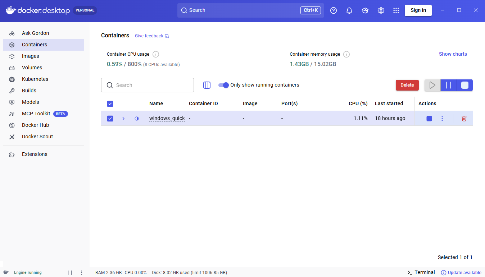
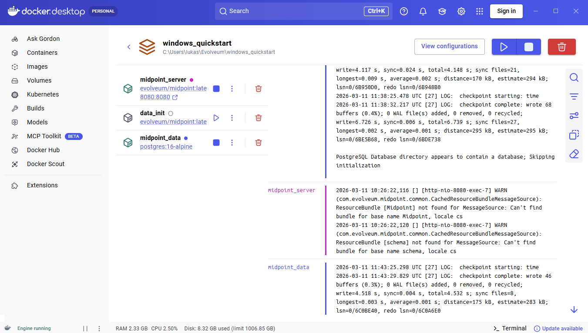
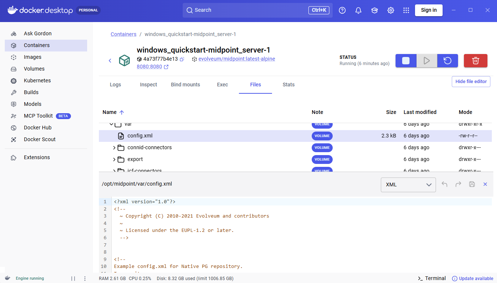

= MidPoint Quick Start Guide for Windows
:page-nav-title: Quick Start Guide for Windows
:page-display-order: 10
:page-liquid:
:page-toc: float-right
:toclevels: 2
:page-upkeep-status: green
:page-keywords:  [ 'quickstart', 'quickstart windows', 'quickstart for windows']

Get started and deploy midPoint on your local computer with Microsoft Windows operating system using Docker Desktop and PowerShell. 

== Requirements

Before you proceed further, make sure the following requirements are satisfied on your computer.

=== Microsoft Windows 

To proceed with this tutorial, you need to have Windows OS. 
If you're on Linux or macOS, follow xref:/midpoint/quickstart/index.adoc[Quick Start Guide].

=== Docker Desktop

You need to have Docker Desktop installed on your computer.
See the link:https://docs.docker.com/desktop/setup/install/windows-install/[Docker Desktop installation manual].
Feel free to use the default settings during the installation process.

[NOTE]
====
Docker Desktop on Windows requires the *WSL 2 backend*. 
During installation, make sure that the *Use WSL 2 instead of Hyper-V* option is enabled. 
This requirement and the installation steps are also described in the Docker Desktop installation manual linked above.
====

.*Quick check if you have Docker installed*
[TIP]
====
Type `docker desktop` in the Start Menu search. 
If you see the `Docker Desktop App`, you're good. 
If not, Docker is likely not installed at all. 
====

=== PowerShell

PowerShell is the default command-line shell on modern Windows systems.
If you are using Windows, PowerShell is already installed and available by default, so no additional setup is required.
The commands are written for PowerShell 5.1 or newer.

[TIP]
====
To check the installed PowerShell version, run the following command in PowerShell: `$PSVersionTable.PSVersion`
====

=== Internet Connection

During the initial setup, you need to download the Docker Compose file. 
Once everything is set up, you can work with midPoint offline.

== Start midPoint

This section explains how to start the midPoint environment using Docker Compose. 
You will download the compose file, start the containers, retrieve the administrator password, and access the midPoint web interface.

=== Start the Docker containers

A working midPoint environment requires more than just a single component. 
To simplify the setup, we provide a Docker Compose configuration file. 
It defines all required components and includes the necessary settings. 
Running this file creates an isolated environment with all parts properly configured.

Open PowerShell and navigate to the directory where you want to store the Docker Compose file using the `cd` command.

[source,powershell]
----
cd C:\my\desired\path
----
Paste the following command into PowerShell to download the compose file. 

[source,powershell]
----
Invoke-WebRequest -Uri `
"https://raw.githubusercontent.com/Evolveum/midpoint-docker/master/docker-compose.yml" `
-OutFile "docker-compose.yml"
----

[TIP]
====
Run `dir` in PowerShell to check the contents of the current directory. 
You should see the downloaded docker-compose.yml file. 
====

As an alternative to downloading the file via PowerShell, you can download it directly from GitHub:

. Open the link:https://github.com/Evolveum/midpoint-docker/blob/master/docker-compose.yml[Docker compose file in the GitHub repository]
. Click the *Download* button located above the file preview (top right).
. Save the file to your desired local directory.

It is recommended not to rename the downloaded `docker-compose.yml` file. 
If you use a different name, you need to define it explicitly in all Docker Compose commands with the *-f* parameter. 

Docker Compose automatically uses the name of the directory (project folder) as a name of your Docker project and a prefix for all created objects (such as containers, networks, and volumes).
For example, if your Docker Compose file is stored in a folder named `windows_quickstart`, Docker will create objects with names like:
`windows_quickstart-midpoint_server-1`

You can run multiple MidPoint instances in parallel.
In that case, each instance must be placed in a different directory with a unique name, as Docker Compose uses the directory name as the project identifier. 
This ensures that containers, networks, and volumes are created separately and do not conflict with each other.

[NOTE]
====
If you run multiple instances at the same time, you also need to make sure that the ports do not overlap (e.g. default port 8080). 
Otherwise, Docker will not be able to start the containers. 
In such cases, adjust the port mappings in the `docker-compose.yml` file.
====

Start the environment in the background:

[source,powershell]
----
docker compose up -d
----

[[compose_output]]
.Sample output after running the `docker compose up -d` command.
[%collapsible]
====
[source]
----
[+] up 4/4
 ✔ Network <project_name>_net                     Created              0.0s
 ✔ Container <project_name>-midpoint_data-1       Created              0.1s
 ✔ Container <project_name>-data_init-1           Exited               9.6s
 ✔ Container <project_name>-midpoint_server-1     Created              0.1s
----
====

The web GUI becomes available once the environment starts and the initialization process (loading initial objects into the empty repository, and so on) is completed.
Depending on your environment, this may take several minutes.

See the xref:/midpoint/quickstart/index.adoc[] to learn more about docker commands. 

=== Log into the midPoint

MidPoint has a web administration user interface. 
This is the primary user interface for using and configuring midPoint. By default, the user interface is accessible at port `8080`:

`http://localhost:8080/midpoint/`

Log into the user interface as the `administrator` user.

In midPoint 4.8.1 and newer versions, there is no default password for security reasons. 
With the first run, an administrator user is initialized and a new password is generated. 
This is then saved in a log file.

Use the following command to fetch the initial password from the log.
Make sure to replace the `<project_name>` with the name of your project folder. 

[source,powershell]
----
(docker logs <project_name>-midpoint_server-1 2>&1 `
 | Select-String "Administrator initial password").Line
----

[WARNING]
====
After you first log into the administrator account, change the password or disable the built-in administrator account completely. 
This is important because the initial password may remain in the logs or environment variables for some time.
====

After logging in, you will see the midPoint administration interface. 
The main navigation menu is located on the left side of the screen and provides access to key sections such as Users, Roles, Resources, and Reports. 
Use this menu to navigate through the system. When you open a section, the main panel displays the corresponding objects and actions that you can perform. 
The xref:/midpoint/install/post-install-orientation.adoc[] can help you navigate further.

== Docker Desktop Environment Walkthrough

As we mentioned earlier, we are using Docker Desktop application.
Docker Desktop shows containers grouped by Compose projects.
Each project represents one application environment defined by a `docker-compose.yml` file.
Docker Desktop provides a graphical interface for managing containers, images, volumes, and other Docker objects on your local machine.
Although most commands in this guide are executed in PowerShell, it is useful to know how to navigate the Docker Desktop interface and inspect the running environment visually.
The following sections introduce the parts of the Docker Desktop GUI that are relevant when working with midPoint.

=== Opening Docker Desktop

Start Docker Desktop from the Start Menu.
After it launches, wait until the application reports that Docker is running.
The main window provides an overview of your local Docker environment.

=== Containers

The *Containers* section shows all currently available projects.
When containers are started using Docker Compose, Docker Desktop groups them into projects.
A *project* represents an application environment defined by a `docker-compose.yml` file.
Each project typically contains multiple containers that work together to provide the application functionality.

In this guide, Docker Compose created the project `windows_quickstart`. 
This project contains the containers required to run MidPoint.

Select the project and see the details. 

From the project view, you can explore the container details and manage the running environment.

In the top-right corner of the project view you will see the *View configurations* button. 
This opens the Docker Compose configuration used to create the containers.

From there, you can open the `docker-compose.yml` file in your IDE and modify it if needed (for example, to mount additional files into the container or change the exposed port).

To return to the project view, click the *back arrow* in the top-left corner of the page next to the *Compose file viewer* title.

Inside the your project you should see three containers:

* `midpoint_server` – runs the MidPoint application and exposes the web interface on port `8080`.
* `midpoint_data` – provides the PostgreSQL database used by MidPoint.
* `data_init` – a helper container used during the initialization process.

For each project and container, Docker Desktop provides actions such as stopping, pausing, restarting, and deleting.
Open the project to see the individual containers it contains. 
You can execute these actions:

==== Stop a container

Click the *Stop* button in the *Actions* column.

Stopping a container terminates the running processes inside it, but the container itself is preserved.
It can be started again later from Docker Desktop.

==== Pause a container

Open *Show container actions* in the *Actions* column, and choose *Pause*.

Pausing a container temporarily suspends the processes running inside it.
The container is not stopped or removed, and its filesystem and configuration remain unchanged.
This action can be useful if you want to temporarily freeze the container without deleting it.

==== Restart a container

Open *Show container actions* in the *Actions* column, and choose *Restart*.

Restarting a container stops it and starts it again.
This is useful after changing configuration files or when troubleshooting issues with the running application.

==== Delete a container

Click the red *Delete* button on the right.

Deleting a container removes it from Docker Desktop.
Deleting a container removes the container itself, but it does not delete the data stored in Docker volumes.
If the container is created again and uses the same volumes, the stored data can still be available.

==== Delete a volume

A Docker *volume* is a dedicated storage space that exists outside of containers.  
It is used to store data that should *persist even if a container is stopped, removed, or recreated*.
In the case of MidPoint, the volume contains all application data, such as:

* Users and their attributes
* Roles and assignments
* System configuration
* Internal database content (repository)

This means that all changes you make in the MidPoint UI are stored in the volume, not inside the container itself.

You may want to delete a volume when you need to start with a clean environment, for example:

* When repeating a tutorial from the beginning.
* When testing different configurations.
* When the data become inconsistent or corrupted.

To delete a volume in Docker Desktop, open the *Volumes* view, locate the volume, and choose the option to delete it.
Deleting a volume permanently removes all data stored in it.
By deleting a volume you are erasing the data such as changes made in the MidPoint UI.
Deleting a volume is *irreversible.*

=== Logs

Select a container and see its detail page. One of the most useful tabs is *Logs*.

The logs view displays the output produced by the container. 
This is helpful for troubleshooting startup issues or retrieving information written during initialization, such as the initial administrator password generated by MidPoint.
On the right side in the menu panel are some useful tools for the work with the logs.
You can: 

* Search through the log.
* Set the settings for showing the log
* Copy the log to the clipboard
* Erase the log. 

=== Files

See the panel *Files*, which provides a graphical view of the container filesystem. 
You can browse directories and inspect files stored inside the container.
You can inspect the resource files copied into the container there. 

==== Inspect a file: example
As an example examine the `config.xml` file.

Open the `/opt/midpoint/var` directory.
It is used for runtime data generated or used by MidPoint while the application is running. 
This makes it a convenient location for temporary files or additional resources used during demonstrations or testing.

See the `config.xml` file.
If you right-click in the corresponding row and select the option `Edit file` Docker Desktop displays its contents in the built-in editor below the file list.

In the top-right corner of the editor, several actions are available:

* **Save** – saves the changes made to the file.
* **Undo** – reverts the most recent changes in the editor.
* **Close** – closes the editor and returns to the file list.

These controls allow you to quickly edit files inside the container without opening a terminal.

[NOTE]
====
If you modify the configuration file, the container must be restarted for the changes to take effect.
You can restart the container by following the steps shown earlier in this tutorial.
====

==== Upload a file
In addition to viewing files, you can also *upload new files* by simply dragging and dropping them into the desired directory.
Uploading files via the *Files* tab is especially useful in demonstration or testing scenarios.  
For instance, you can upload a CSV file here and then use it as a resource in midPoint (e.g., via the CSV connector).

To create the resource in the midPoint GUI continue with the tutorial xref:/midpoint/reference/admin-gui/resource-wizard/create-resource-using-wizard/[create a resource and import accounts from a CSV file via the CSV connector].

=== Stats

The *Stats* tab displays real-time resource usage information for the selected container. 
It shows metrics such as CPU usage, memory consumption, disk I/O, and network activity.

This view can be useful when monitoring the behavior of the container or troubleshooting performance issues. 
For example, you can check whether the MidPoint container is consuming too much memory or whether the database container is actively processing requests.

== Clean up the environment 

When you finish working with the environment, you can remove all related resources using Docker Desktop.
To stop and remove the running containers:

. Open Docker Desktop.
. Go to the Containers view.
. Locate the containers belonging to your project (e.g. `<project_name>-midpoint_server-1`).
. Stop them if they are running by clicking on the *Stop* button.
. Click *Delete* (red trash bin icon) to remove them.

This removes the containers, but keeps the data stored. 
If you put them into operation again by using the `docker compose up` command, all previous data and changes made in midPoint (such as users, roles, and configuration) will still be available.

To completely reset the environment (including all data):

. Do the steps described above to *Clean up the environment*. 
. Go to the *Volumes* view.
. Locate the volumes created for your project (they use the same project name prefix).
. Delete them by clicking on the *Delete* (red trash bin icon).

[WARNING]
Deleting volumes will permanently remove all data, including users, roles, and configuration stored by MidPoint.

After that, you can start the environment again from scratch using the steps described earlier.
