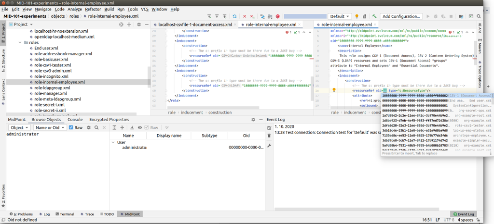

= MidPoint Studio

MidPoint studio is an integrated development environment (IDE) to develop solutions based on midPoint.
The primary purpose of MidPoint Studio is to support process of creating, developing and maintaining midPoint configurations.
However, there may be other advanced features in the futures, such as visualizations, configuration wizards and so on.
The Studio is developed in the same iterative way as midPoint.
It will be improved and extended as needed (and as the funding allows).

MidPoint Studio is built on top of open source https://www.jetbrains.com/opensource/idea/[IntelliJ platform] that is the foundation of IntelliJ IDEA, a well-known IDE for Java developers.
While https://www.jetbrains.com/idea/[IntelliJ IDEA] has a commercial  _Ultimate Edition_ (which we recommend), there is also an open source _Community Edition_ of the IDE, that is built on an open source platform.
MidPoint Studio is a plug-in for IntelliJ platform that will work both in the _Community_ and _Ultimate_ editions of IntelliJ IDEA.

== Current Status

MidPoint Studio plugin is currently in beta stage.
Only link:builds[milestones and nightly builds] are available.
The first production-quality release is planned soon.

Please see Studio https://github.com/Evolveum/midpoint-studio/blob/master/README.adoc[README file] for the details.

== Getting MidPoint Studio

MidPoint studio is distributed as IntelliJ IDEA plugin on https://plugins.jetbrains.com/plugin/13809-midpoint-studio[JetBrains marketplace].

Only a milestone (beta quality) release is available now.

. Download and install https://www.jetbrains.com/idea/[IntelliJ IDEA].
Both _Community_ and _Ultimate_ editions will work.

. Start IntelliJ IDEA

. Go to menu `File` → `Settings (Preferences)` → `Plugins` → `Manage plugin repositories`

. Add repository `https://plugins.jetbrains.com/plugins/Milestone/list`

. Go back to menu `File` → `Settings (Preferences)` → `Plugins`

. Search for `MidPoint Studio` and click on `Install`

If you like to live on the edge, you can try link:builds[nightly builds] of Studio.

== MidPoint Studio Usage

* link:usage/[Working with MidPoint Studio]
* link:migrate/[Migration from Eclipse Plugin]
* Limitations
* Document Generator (midScribe)
* Log Viewer

== Source Code and Contributions

MidPoint Studio is licensed under the terms of Apache License. Source code is available at GitHub:

https://github.com/Evolveum/midpoint-studio

The community is more than welcome to submit contributions using the usual _pull request_ mechanism.
For contributions, please follow the https://wiki.evolveum.com/display/midPoint/Code+Contribution+Guidelines[code contribution guidelines].

== Compatibility, Versioning and Releases

Studio is using the same versioning scheme as midPoint.
Therefore, compatible version of Studio will have the same version as midPoint.
Interim (milestone) releases of the Studio have a build number added to the version number after the dash.

// TODO: add link to IntelliJ Marketplace when the milestone is released
|====
| Version | Release date | Release type | Description

| https://plugins.jetbrains.com/plugin/13809-midpoint-studio/versions/milestone/101871[4.2-150]
|10 Nov 2020
|Beta
|Initial release.
Beta quality.
Released in order to gather community feedback.

|====

It is quite likely newer Studio can be used to configure older midPoint releases, but there may be problems in case there are incompatible schema changes.
This usually happens when major version of midPoint is released, therefore using Studio within the constraints of major midPoint releases should work well.
However, this is all just "best effort" compatibility.
Strict schema compatibility is not officially supported yet.
It probably will not be supported until midPoint makes a complete switch to Axiom.
When Studio does not work for older versions, use the matching version of Studio instead.

== Community and Feedback

link:/community/mailing-lists/[MidPoint mailing lists] can be used to discuss the Studio and provide community feedback.
The usual https://wiki.evolveum.com/display/midPoint/Creating+a+Bug+Report[bug reporting procedure] should be used to report studio issue.
Please make sure to set the component field to `Studio` and include studio version number in the report.
