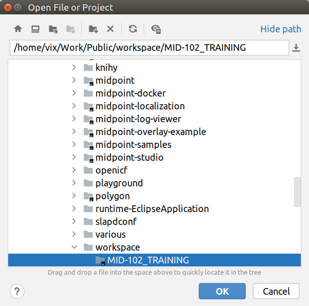
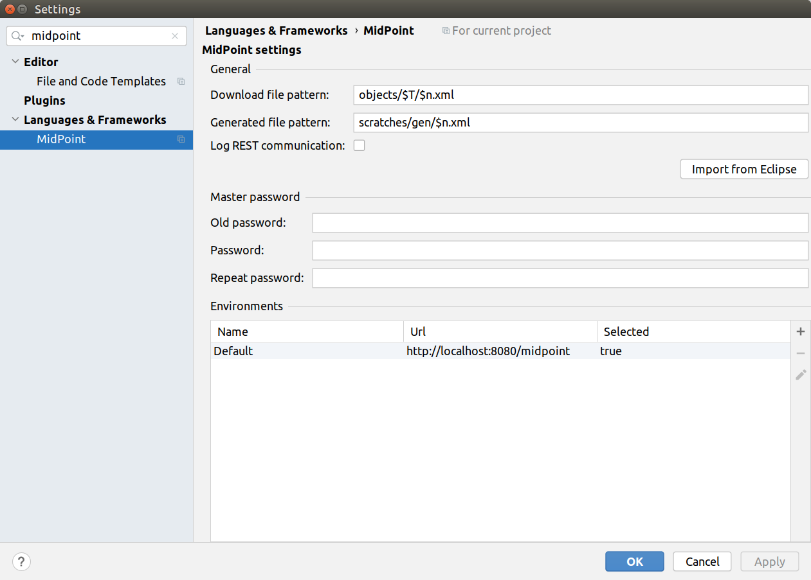

= Migration from Eclipse Plugin
:page-toc: top

== Importing Eclipse Project

Importing an existing Eclipse project consists of opening the project in IntelliJ IDEA and creating the files which MidPoint Studio needs.

To migrate existing Eclipse project, follow these steps:

. start IntelliJ IDEA
. go to *File → Open ...*
. navigate to the directory with your Eclipse project
. click *OK* button
. press `Shift` key twice to open the IntelliJ IDEA search window
. start to type `midpoint`
. select the row *MidPoint Settings* to open midPoint project settings
. keep *Download file pattern* as is unless you know what you are doing. See also link:/midpoint/studio/[Updating Project Settings]
. keep *Generated file pattern* as is unless you know what you are doing. See also <<Updating Project Settings>> (TODO fix link)
. click *Import from Eclipse* button
. set the *Master password* for your encrypted properties store (`Keepass`).
* do not set `Old password`, keep it empty
* the master password will be used for encryption of `Keepass` file. See <<Using Keepass File>>. (TODO fix link)
* the master password will be stored in your operating system key management subsystem to not ask for it each time you start IntelliJ IDEA
. Select a proper *Environment*
* by default there is a `Default` environment for `http://localhost:8080/midpoint`
* you can modify or add new environments for your projects now or later, see <<Working With Environments>> (TODO fix link)
. click *OK* button

.Importing existing project, step 1

.Importing existing project, step 2

== Limitations

* MidPoint Studio will not automatically migrate environments (as they are global in Eclipse). You have to create your environments manually including references to properties files
* MidPoint Studio will not overwrite `.gitignore` and `pom.xml` files if they existed in the imported Eclipse project

The default content of these files:

|===
^|`.gitignore`
|https://github.com/Evolveum/midpoint-studio/blob/master/studio-idea-plugin/src/main/resources/fileTemplates/MidPoint%20Git%20Ignore.git.ft
|===
