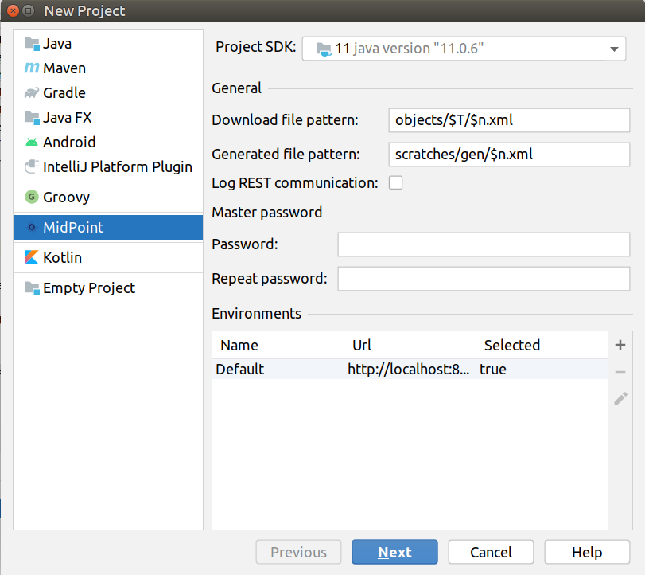
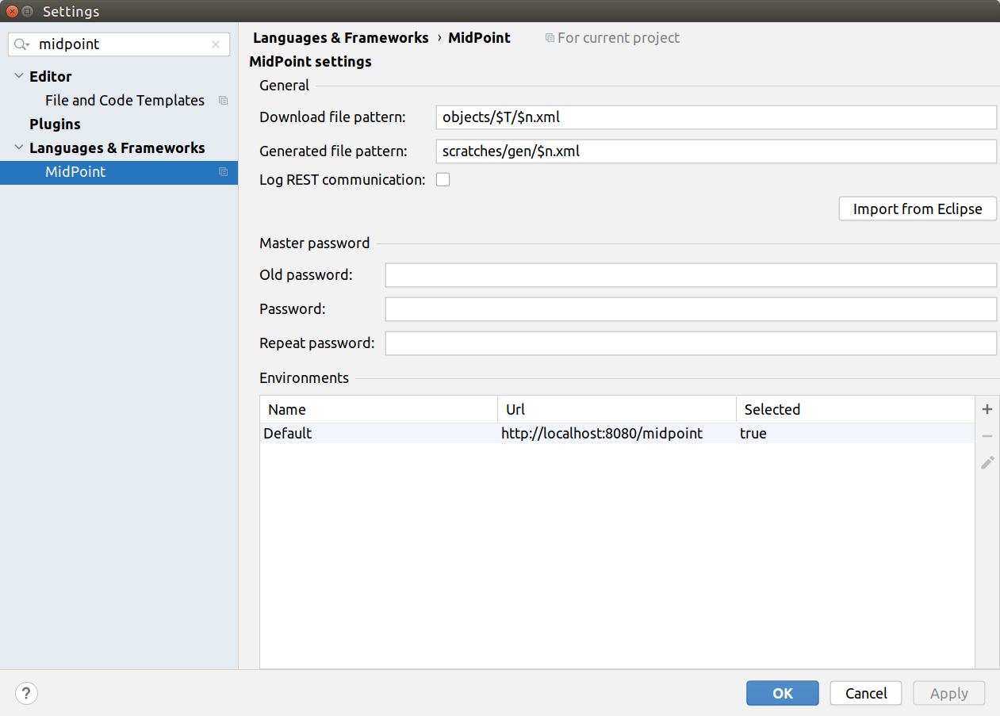

= Working with midPoint Studio
:page-toc: top

== Creating midPoint Project

To create a new midPoint project, follow these steps:

. start IntelliJ IDEA.
. go to *File → New → Project...*
. select *MidPoint* in the left panel
. keep *Download file pattern* as is unless you know what you are doing. See also <<Updating Project Settings>>
. keep *Generated file pattern* as is unless you know what you are doing. See also <<Updating Project Settings>>
. set the *Master password* for your encrypted properties store (`Keepass`).
* the master password will be used for encryption of `Keepass` file. See <<Using Keepass File>>.
* the master password will be stored in your operating system key management subsystem to not ask for it each time you start IntelliJ IDEA
. Select a proper *Environment*
* by default there is a `Default` environment for `http://localhost:8080/midpoint`
* you can modify or add new environments for your projects now or later, see <<Working With Environments>>
. click *Next* button
. specify *Project name* and *Project location*
. click *Finish* button

.Creating project, step 1

.Creating project, step 1

IntelliJ IDEA will automatically open your new project.

.Newly opened project

NOTE: MidPoint Studio stores the project configuration under `.idea` project
subdirectory and several files in the main project directory.

.The list of files in the project directory
[cols="25%,75%", options="header"]
|===
^|File
^|Content
|`credentials.kdbx`
|Credentials/encrypted properties database (`keepass` file)
|.`gitignore`
|`.gitignore` file for the main project
|`.idea/`
|Project configuration directory. You should not touch these files. The only interesting file might be `midpoint.xml`.
|`objects/`
|midPoint project object files directory with the usual subdirectories for object types
|`pom.xml`
|Properties for Java code completion (based on specific midPoint version supported by MidPoint Studio).
|`scratches/`
|Directory for "temporary" files downloaded from midPoint repository.
|===

== Using IntelliJ IDEA Interface

This section describes the default configuration of the IntelliJ IDEA when using midPoint Studio.

The main toolbar contains a section for midPoint-related tasks.

.MidPoint toolbar section

The buttons are (from left to right):

* Upload/Execute
* Upload/Recompute
* Upload/Test Resource
* Refresh From Server
* Delete (non-raw)
* Delete (raw)
* Other Update Actions
* Server Log
* Generate Random OID
* (environment color)
* Environment selector
* Test Connection
* Generate Documentation

The interface uses several tool windows.
It is possible to move and reorder them as you like.

=== Top-left Tool Window

* *Project*: contains the list of files in your project.
Everything related to  midPoint objects will be in the `objects/` subdirectory.
* *Structure*: contains the object structure from the file (elements)
* *Lens Context*: *TODO* log/trace viewer

=== Top-center Tool Window

* contains the currently opened midPoint object(s)

=== Bottom-left Tool Window

* *MidPoint*: contains the MidPoint-related information with the following tabs:
** *Browse Objects*: allows searching within midPoint repository and creating bulk actions/tasks from the results. See <<Bulk Action Generator>>
** *Console*: displays MidPoint Studio console (success/error messages)
** *Encrypted Properties*: displays the content of the current Keepass database
*** *Key*: property name (such as username)
*** *Environment*: environment tied to this encrypted property (can be empty meaning all environments)
*** *Value*: encrypted value (such as password)
*** *Description*: encrypted property description (optional)
* *Problems*: displays the detected problems within the editor (content validation)
* *Trace*: *TODO* log/trace viewer
* *Terminal*: opens a terminal window

NOTE: The `Key` column of your Keepass database entries corresponds to the key
name in your operating system's key database.

=== Bottom-right Tool Window

* *Event Log*: contains the event log entries from IntelliJ IDEA

== Working With Environments

You can create several environments for each project.
This can be used for example to allow connection to TEST, QA and PROD
environments of the same customer.
The environment `Default` is created automatically and points to `http://localhost:8080/midpoint`.
There is a color box specifying the color assigned to the environment for a quick overview of which environment are you currently working with.

NOTE: Unlike in the Eclipse plugin, the environments are now project-based.

=== Selecting Environment

There are several ways how to select a new environment to connect to:

* in the main toolbar, click the name of the current environment
* select the environment to switch to

or:

* in the main toolbar, click the name of the current environment
* select *Edit environments*
** select proper environment and click *Edit* icon
** check *Selected* checkbox
** click *Save* button

or:

* press `Shift` key twice to open the IntelliJ IDEA search window
* start to type `midpoint`
* select the row *MidPoint Settings* to open midPoint project settings
* the list of environments is displayed at the bottom of the page
** select proper environment and click *Edit* icon
** check *Selected* checkbox
** click *Save* button

=== Testing Connection to Environment

You can test the connection to your current environment by clicking the *Test* icon.
The result will be displayed in the *Event log* window and as a popup and will look like this:

.Test Connection Message
----
21:26	Test connection: Connection test for 'Default' was successful. Version: 4.2-SNAPSHOT, build: v4.2devel-1670-g4643e042ec.
----

=== Adding A New Environment

To add a new environment:

* in the main toolbar, click the name of the current environment
* select *Edit environments*
* click *+* icon
* a new window will open, enter the following information:
** *Name*: your new environment name. E.g. `QA`
** *Selected*: check if you want to switch to the new environment
** *Server settings*: select the connection information:
*** *Url*
*** *Username*: will be stored in your keepass database, see <<Using Keepass File>>
*** *Password* will be stored in your keepass database, see <<Using Keepass File>>
*** *Ignore SSL Errors*: check to ignore any SSL-related connection errors such as a missing or self-signed certificate
** *Proxy settings*: enter your proxy server settings (optional)
** *Other*: enter the other settings (optional)
*** *Properties file*: select the properties file for this environment. See <<Environment or Project-Specific Properties>>.
*** *Color*: select the color for this environment
** click *Test connection* to test the connection to the new environment (optional)
** click *Save* button to save the new environment

.Edit environments

=== Updating Existing Environment

To update already existing environment:

* in the main toolbar, click the name of the current environment
* select *Edit environments*
* select the environment to edit
* click *Edit* icon
* modify the desired parameters
* click *Save* button to save the modified environment

=== Deleting Existing Environment

TODO: BUG MID-6543.

* in the main toolbar, click the name of the current environment
* select *Edit environments*
* select the environment to edit
* click *Delete* icon
* click *Save* button to save the modified environment

== Working with midPoint Objects

You can do the following operations to the midPoint objects.
The actions are available either from the main toolbar or from the context menu *Update Object Actions* for the currently opened file or for selected files in your list of objects.

=== Uploading midPoint objects

This operation will send the selected object to midPoint repository and optionally execute an after-upload action.

The following operations are available either from the main toolbar or from the *Update object actions* context menu:

* *Upload/Execute*: will upload the selected object(s). Tasks may be automatically executed (based on their `executionState`).
* *Upload/Execute (stop on error)*: will upload the selected object(s). Tasks may be automatically executed (based on their `executionState`). The first object with an upload error will stop the action.
* *Upload/Recompute*: will upload the selected object(s) and recompute them after the upload.
* *Upload/Test Resource*: will upload the selected object(s) and assuming they are resources, it will also test the connections.

The `Console` tool window will display the operation status, for example:

.Message
----
2020-09-28T21:09:43.091+0200 UploadExecute: Initializing upload action
2020-09-28T21:09:43.094+0200 MidPointClient: Client created
2020-09-28T21:09:43.575+0200 UploadExecute: Upload 'Role X123' finished
----

Or, for upload/test resource:
.Message
----
020-09-30T11:55:33.910+0200 UploadTestResource: Initializing upload action
2020-09-30T11:55:33.912+0200 MidPointClient: Client created
2020-09-30T11:55:34.557+0200 UploadTestResource: Upload 'CSV-1 (Document Access)' finished
2020-09-30T11:55:34.559+0200 MidPointClient: Starting test resource for 10000000-9999-9999-0000-a000ff000002
2020-09-30T11:55:35.191+0200 UploadTestResource: Test connection 'CSV-1 (Document Access)' finished
----

The `Event Log` tool window will display the errors or warnings, for example:

.Message
----
21:09	Error: Exception occurred during upload of 'Role X123(4874b65b-fa18-419e-917f-e878122e64ca)', reason: Unknown response status: 400, reason: Bad Request

21:09	Warning
        There were problems during 'Uploading objects'
		Processed: 0 objects
		Failed to process: 1 objects
		Files processed: 0
		Failed to process: 0 files
----

NOTE: Rule of thumb: you typically want to use *Upload/Test Resource* for your resources and *Upload/Execute* for most other cases.

=== Refresh From Server

This operation will re-download the selected object from midPoint repository and overwrite the file.
You can execute this operation for the current window by clicking the *Refresh From Server* toolbar icon, or for file(s) in the list of files by clicking the context menu and selecting *Update object actions → Refresh From Server*.
You will need to confirm the operation before proceeding.

The `Console` tool window will display the operation status, for example:

.Message
----
2020-09-28T21:06:24.612+0200 MidPointClient: Client created
2020-09-28T21:06:24.612+0200 MidPointClient: Getting object <object type and oid here>
2020-09-28T21:06:24.770+0200 MidPointClient: Get done
----

The `Event Log` tool window will display the errors or warnings, for example:

.Message
----
21:06	Refresh Action
        Reloaded 1 objects
        Missing 0 objects
        Failed to reload 0 objects
        Skipped 0 files
----

NOTE: The local file will be overwritten. All XML comments will be lost.

=== Delete (Non-raw)

This operation will delete the selected object(s) from midPoint repository.
Provisioning will be executed to delete also the object's projections, if applicable.
You can execute this operation for the current window by clicking *Delete (non-raw)* toolbar icon, or for file(s) in the list of files by clicking the context menu and selecting *Update object actions → Delete (non-raw)*.

The `Console` tool window will display the operation status, for example:

.Message
----
2020-09-30T12:07:43.043+0200 DeleteRawAction: Initializing delete action
2020-09-30T12:07:43.043+0200 MidPointClient: Client created
----

The `Event Log` tool window will display the errors or warnings, for example:

.Message
----
12:07	Success
		Deleting objects finished.
		Processed: 1 objects
		Failed to process: 0 objects
		Files processed: 0
		Failed to process: 0 files
----

=== Delete (Raw)

This operation will delete the selected object(s) from midPoint repository with the `raw` flag.
No provisioning will be executed.
You can execute this operation for the current window by clicking *Delete (raw)* toolbar icon, or for file(s) in the list of files by clicking the context menu and selecting *Update object actions → Delete (raw)*.

The `Console` tool window will display the operation status, for example:

.Message
----
2020-09-30T12:08:46.043+0200 DeleteRawAction: Initializing delete action
2020-09-30T12:08:46.043+0200 MidPointClient: Client created
----

The `Event Log` tool window will display the errors or warnings, for example:

.Message
----
12:08	Success
		Deleting objects finished.
		Processed: 1 objects
		Failed to process: 0 objects
		Files processed: 0
		Failed to process: 0 files
----

=== Browsing Objects

To browse midPoint repository objects, go to *MidPoint* tool window and select *Browse Objects* tab.

You can use the following to select the objects:

* *Object*: allows to select the object type
* *Name or Oid*: allows to select the object's name or oid, or other options:
** *Name*: to search only by the object's name
** *Oid*: to search only by the object's oid
** *Query XML*: to search by a query in midPoint query language

To fetch only a limited number of objects, use the *Paging* button.

To execute the search, click the *Search* button.

The results are displayed in the *MidPoint* window.
You can do the following actions:

* *Download*: will download and store the object in your project. By default, the directory with plural form of object type will be used. E.g. `objects/resources`.
* *Show*: will download and store the object in a "temporary" subdirectory `scratches`.
* *Process*: allows to execute an action for the selected result(s)

.Example 1: to search all users containing `a` in their `name` attribute:
* select *User* object type
* select *Name*
* enter the string `a` in the text field under the query selector
* click *Search* button

The `Console` tool window will display the operation status, for example:

.Message
----
2020-09-28T21:13:13.029+0200 MidPointClient: Client created
2020-09-28T21:13:13.029+0200 MidPointClient: Starting objects search for UserType, [ObjectOperationOptions(/:raw), ObjectOperationOptions(name:retrieve=INCLUDE), ObjectOperationOptions(subtype:retrieve=INCLUDE), ObjectOperationOptions(displayName:retrieve=INCLUDE)]
2020-09-28T21:13:13.294+0200 MidPointClient: Search done
----

.Example 2: to search all users with directly assigned `Superuser` role:
* select *User* object type
* select *Query XML*
* enter the following in the text field under the query selector:
[source,xml]
----
<query>
  <filter>
    <ref>
      <path>assignment/targetRef</path>
      <value oid="00000000-0000-0000-0000-000000000004"/>
    </ref>
  </filter>
</query>
----
* click *Search* button

If you click *Download* or *Show* icons, the object will be downloaded.

The `Console` tool window will display the operation status, for example:

.Message
----
2020-09-28T21:06:24.612+0200 MidPointClient: Client created
2020-09-28T21:06:24.612+0200 MidPointClient: Getting object <object type and oid here>
2020-09-28T21:06:24.770+0200 MidPointClient: Get done
----

=== Bulk Action Generator

When you search for objects, you can view or download them, but you can do much more: you can execute bulk actions on the search results.

You can select which object you want to execute the action.

Click *Process* icon in the results part of the *MidPoint* tool window and select:

* *Generate*: select the action
* *Execution*: select how the results will be processed
** *By OIDs, in one batch*: the results will be processed by their OIDs
** *By OIDs, in batches of N*: the results will be processed by their OIDs in batches (you need to select batch size *N*)
** *Using original query (selection ignored)*: the results will be processed by the original query and any selection is ignored
* *Wrap created bulk action into tasks*: not only a bulk action will be created, but a task object will wrap it
* *Create tasks in suspended state*: the tasks will be created as `suspended` and not executed upon import to midPoint
* *Execute in raw mode*: the actions will be executed in `raw` mode
* *Use symbolic references*: TODO
* *Runtime resolution*: TODO

Then click a button:

* *Execute*: execute the action/task immediately in midPoint
* *Cancel*: abandon the operation
* *Generate XML*: generate a bulk action/task object to be further customized and uploaded later

== Working With Object Editor

The object editor uses all IntelliJ IDEA tricks to make the text editing very comfortable.
Some midPoint object-related tricks are:

* the ability to complete open elements (end tags)
* the ability to complete variable names from mapping sources
* the ability to suggest elements based on the schema
* the ability to generate a new OID when creating a new object
* the ability tu suggest OID based on the existing project files
* the ability to resolve object names from OIDs based on the existing project files
* the ability to navigate to other object by CTRL+clicking the OID in references
* mixed syntax highlighting (XML/Groovy).

You can force most of the completions using `CTRL+space`.

.Mixed code completion

=== Creating a New MidPoint Object

This is best explained using an example for a new role creation:

. under `objects` directory, create a new `roles` directory unless it already exists by right-clicking `objects` directory and selecting *New → Directory*
. right-click `roles` directory and select *New → File*
. type a file name, e.g. 'role-test.xml'
. an empty file is created/opened in the main window
. start typing: `<role`
. from the tooltip with object type hints, select `role`
. `xmlns` namespace is automatically filled
. start typing `oid=`
. from the tooltip select a random OID
. type `>` to close the element
. end-tag is automatically completed (`</role>`)
. do under `<role ...>` element
. start typing `<`
. all possible elements are displayed in the tooltip
. continue with the role editing

.Suggested XML elements

=== Variable Name Completion

MidPoint Studio allows to auto-complete variable names in mappings/expressions.
For example the built-in variables or variables from mapping sources can be completed.

.Suggested variables

=== Function Completion

MidPoint Studio allows to auto-complete function names in expressions.

.Suggested functions

=== Inserting OID

It is possible to generate a new random OID by clicking *Generate Random OID* button in the toolbar.
OID will be generated and stored to clipboard.

When creating a new object, if you start to type `oid=`, a random OID will be generated by MidPoint Studio and can be inserted by selecting it in the tooltip.

=== Resolving Object Name from OID in References

MidPoint Studio will automatically resolve the object name for all OID
references next to the OID.

.Object name resolution from OID

This is done for objects in the project files, not fetching the data from the
repository.

=== Cross-Referencing OIDs

When you are creating a _reference_ to other object, if you start to type `oid=`, a list of known OIDs (from the project, not from the repository) will appear in the tooltip to select.
You can also start typing the object name to select from the list.

.Suggested objects

=== Navigating to Other Referenced Objects

You can navigate to referenced objects within your project by clicking the OID in references with `CTRL` key pressed.

This is done for objects in the project files, not fetching the data from the repository.

== Updating Project Settings

To update the project settings:

* press `Shift` key twice to open the IntelliJ IDEA search window
* start to type `midpoint`
* select the row *MidPoint Settings* to open midPoint project settings
* *General* section contains the general options:
** *Download file pattern*: template for downloaded object file name relative to the project directory. Default: `objects/$T/$n.xml`
** *Generated file pattern*: template for generated object file name relative to the project directory. Default: `scratches/gen/$n.xml`
+
[cols="25%,75%", options="header"]
|===
^|Placeholder
^|Description
|`$t`
|Object type singular. E.g. `resource`
|`$T`
|Object type plural. E.g. `resources`
|`$n`
|Object name (downloaded object) or `scratch_N` (generated object)
|`$o`
|Object OID
|===
* *Log REST communication*: allows logging the REST communication between midPoint Studio and midPoint REST interface (useful for debugging)
* *Master password* section allows to change the master password for the encrypted properties, see also <<Using Keepass File>>
** *Old password:* enter the old password before changing the password
** *Password*: enter the new password
** *Repeat password*: enter the new password again
* *Environments* section contains the list of environments. See also <<Working With Environments>>

.Project settings

== Environment or Project-Specific Properties

Similar to Eclipse plugin, you can use "macro expansions" to avoid hard-coded
properties in your source files.
This allows to have the same source files and use them in multiple
environments where you have different hostnames, ports etc.
It is referenced by using the following syntax: `$(propertyName)`.
See below for special cases.

.Macro expansion example
[source,xml]
----
<resource>
   ...
   <connectorConfiguration>
      <icfc:configurationProperties xmlns:icfcldap="http://midpoint.evolveum.com/xml/ns/public/connector/icf-1/bundle/com.evolveum.polygon.connector-ldap/com.evolveum.polygon.connector.ldap.LdapConnector">
         <icfcldap:port>$(ldapPort)</icfcldap:port>
         <icfcldap:host>$(ldapHost)</icfcldap:host>
         <icfcldap:baseContext>$(ldapBaseContext)</icfcldap:baseContext>
         <icfcldap:bindDn>$(ldapAdmin)</icfcldap:bindDn>
         <icfcldap:bindPassword>
            <t:clearValue>$(ldapPassword)</t:clearValue>
         </icfcldap:bindPassword>
         <icfcldap:pagingStrategy>auto</icfcldap:pagingStrategy>
         <icfcldap:vlvSortAttribute>entryUUID</icfcldap:vlvSortAttribute>
         <icfcldap:operationalAttributes>ds-pwp-account-disabled</icfcldap:operationalAttributes>
         <icfcldap:operationalAttributes>isMemberOf</icfcldap:operationalAttributes>
      </icfc:configurationProperties>
  ...
  </connectorConfiguration>
  ...
</resource>
----

In the above example, the following properties are used:

* `ldapHost`
* `ldapPort`
* `ldapBaseContext`
* `ldapAdmin`
* `ldapPassword`

In Eclipse, there was a possibility to use `properties` file which would
store the properties and their values.
The possibilities in IntelliJ IDEA are expanded.
You can use a standard `properties` file, or a `keepass` file, or both.

Except of those, you can use the following special properties.

=== Special expression-like properties

The following table summarizes special expression-like properties.

[cols="25%,50%,25%", options="header"]
|===
^|Property
^|Description
^|Example

|`$(#project.name)`
|Name of the current project
|`MyFirstProject`

|`$(#project.dir)`
|The OS directory of the current project. Useful for CSV resource pointing to a file within the current project directory.
|`/home/vix/Work/Public/IdeaProjects/MyFirstProject`

|`$(#server.displayName)`
|The name of the currently selected environment (for remote MidPoint)
|`Default`

|`$(@filename)`
|The content of the file will be inserted at this position. Useful for example to include notification configuration in `System Configuration` object.
|`$(@insert.txt)` or `$(@../../insert2.txt)`

|===

=== Using Properties File

The properties file contains the definitions of the properties.
You can use the properties files which are either environment-specific or project-specific.
It all depends on which property file is used in your specific environment configuration.

Properties file is more convenient for storing non-sensitive properties as the
properties file is not encrypted.
The properties file can be edited as an ordinary text file.
The appropriate location could be the root directory of your project.

The format is very simple:

.Properties file example
[source]
----
ldapHost=server.example.com
ldapPort=389
ldapBaseContext=dc=example,dc=com
...
----

Some important notes:

* property name _cannot_ contain spaces or tabs or `=` character
* property value can contain `=` (so LDAP distinguished names are possible)
* property name can contain also dots (e.g. `mail.primary.server.name` and `mail.secondary.server.name` are OK)
* you can use comments (`#`) in the properties files

=== Using Keepass File

The keepass file is used for all environments for the project.
It's primary use is to store credentials for your midPoint servers, but you can also use it to store arbitrary sensitive properties such as passwords.
The properties and their values are stored in an encrypted file (`keepass2` format).

This file is created when you create your project `credentials.kdbx`) when you have specified your master password.
The master password is *not* stored anywhere in IntelliJ IDEA/project.
It is rather stored in your operating system keystore database.

The master password identifier is stored in the `.idea/midpoint.xml` file:

.idea/midpoint.xml file:
[source,xml]
----
<option name="projectId" value="91945432-7183-48f8-ab85-fb13cade9ed3" />
----

In your operating system, the `projectId` can be searched in your key-storing application.
Then the master password can be revealed.

.Password and Keys application on Ubuntu Linux showing the master password entry

You can also access the encrypted file using `Keepass` program.

To modify the content of your Keepass file:

* go to *MidPoint* tool window
* click *Encrypted Properties* tab
* click *+* icon to add a new encrypted property and enter the following information:
** *Key*: property name, e.g. `ldapPassword`
** *Environment*: select a specific environment or `All Environments`. MidPoint Studio will expand the macro only for that environment.
** *Value*: property value, e.g. `secret`
** *Description*: property description (optional)

NOTE: The `credentials.kdbx` file is ignored from versioning using the project's `.gitignore` file. As it is encrypted, you might want to keep it under version control and share the password between your project team members using other channels.

NOTE: If you refer to a property which is stored both in the keepass file and standard properties file, the keepass file takes priority.

=== Example: All Properties Combined

A picture is worth a thousand words.

The following screenshot summarizes the possibilities and their result: midPoint role editor, the `Description` property displayed in a browser.

MidPoint role `role-test2.xml` references the following properties:

[cols="25%,75%", options="header"]
|===
^|Property
^|Origin

|`$(role.description)`
|Properties file `test.properties` (set in the current environment)

|`$(ldapPassword)`
|Keepass file (property is encrypted)

|`$(#project.dir)`, `$(#project.name)`, `$(#server.displayName)`
|Expression - computed by MidPoint Studio

|`$(@../../insert2.txt)`
|Content of the file `../../insert2.txt`; expression - inserted by MidPoint Studio

|===

