= Developing midPoint with IntelliJ IDEA
:page-toc: float-right
:link-mp-build: https://docs.evolveum.com/midpoint/install/source/
:link-dev-guidelines: https://docs.evolveum.com/midpoint/devel/guidelines/
:link-dev-guides-and-howtos: https://docs.evolveum.com/midpoint/devel/guides/

This guide describes how to set up midPoint in https://www.jetbrains.com/idea/[IntelliJ IDEA].
IDEA impressed most of our development team members and makes out team much more productive.

This guide assumes you've cloned https://github.com/Evolveum/midpoint[the repository] and perhaps {link-mp-build}[built it] already.
The guide only covers IDEA related steps, see also development {link-dev-guidelines}[guidelines]
and other {link-dev-guides-and-howtos}[guides and how-tos].

See the very end of this document for tl;dr/checklist version.

== Install JAVA

Since midPoint 4.8 preferred JDK version is 21 (LTS). JDK 17 (LTS) is supported for midPoint 4.4 and newer.
You can download from http://www.oracle.com/technetwork/java/javase/downloads/index.html[Oracle JDK], but you better check the license.
Or you can try more license-friendly releases like https://adoptopenjdk.net/[OpenJDK from AdoptOpenJDK]
or https://www.azul.com/downloads/?version=java-21-lts&architecture=x86-64-bit&package=jdk#zulu[Zulu JDK from Azul].

JDK (sometimes called SDK) is necessary for building - JRE (just the runtime) is not enough.

== Install IDEA

IDEA is provided in https://www.jetbrains.com/idea/features/editions_comparison_matrix.html[two editions].
You can use free _Community edition_ just fine, paid _Ultimate Edition_ offers advanced support for web development and frameworks.
Both editions allow building and running midPoint just fine.

* Download IDEA from http://www.jetbrains.com/idea/download/index.html[jetbrains.com].
* Select the version for your operating system and edition.
* Install IntelliJ IDEA on your computer.

Pictures in the guide are mix of both editions, but we will focus on the basics with the _Community Edition_.

== Import of midPoint into IDEA

Importing midPoint into IDEA can be smooth if you have already {link-mp-build}[built it] before.

[NOTE]
It is possible to clone the project from GitHub directly in IDEA, but especially on Windows it is recommended to use command line to apply project specific Git configuration during the clone.

It is recommended to first build the project which avoids a few hiccups during the first import.
We will show what happens if you don't and the project can be built from IDEA too and reimported.

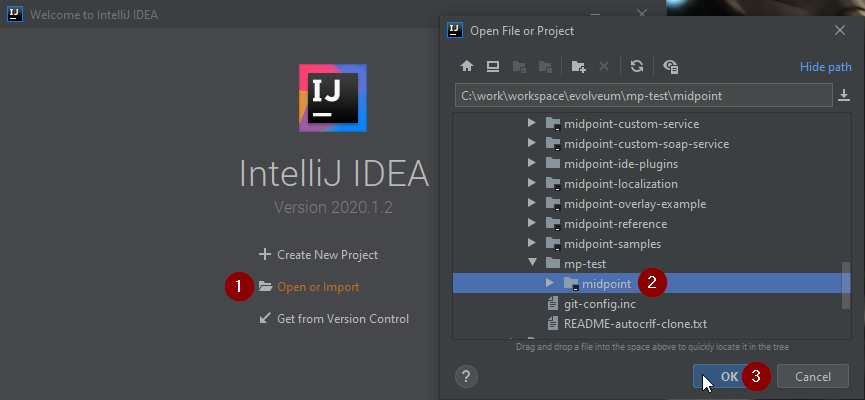

1. Run the IDE and choose *Open or import*.
If IDEA opens with existing project use *File | Open* from the main menu.
2. Find the cloned `midpoint` directory, select it.
3. Click *OK* to confirm.

Wait until the IDE settles and the progress bar at the bottom stops working.

=== Possible import problems before the first build

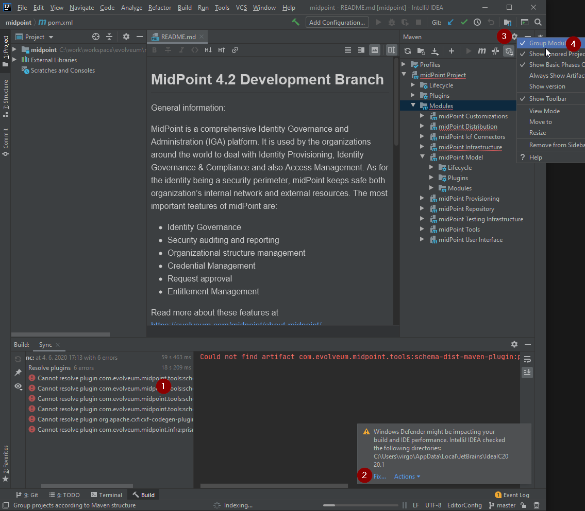

1. If you haven't built the project before (or deleted `~/.m2/repository/com/evolveum`) IDEA can't fully import the project, because Maven POMs reference midPoint plugins that are not built yet.
2. On Windows, it is recommended to exclude IDEA's working directory and project repository from Windows Defender scanning - IDEA suggests that and offers an automatic fix.
3. Open the Maven panel on the right edge of the window (hidden behind contextual menu in the picture).
Normally the list of Maven projects is flat, if you prefer it to follow the directory structure, click on the Maven Options menu.
4. Check *Group Modules* to change the visualization of Maven projects structure.

=== IDEA JDK setup

Before we continue we will check that we're using the right JDK in IDEA.
In the menu, choose *File | Project Structure...* to open the *Project Structure* window.

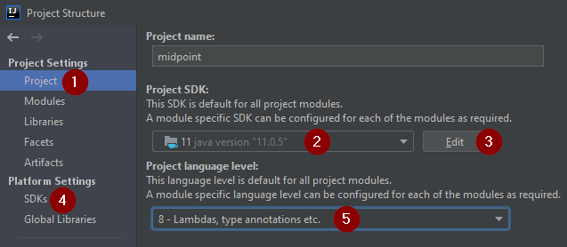

1. Choose *Project* section in the *Project structure* window.
2. Check that *Project SDK* shows JDK 21
3. If not, click *Edit* and set JDK as described on https://www.jetbrains.com/help/idea/sdk.html[this help page].
4. Alternatively you can access JDK setting via *SDKs* section on the left.
5. Check the *Project language level* - normally it would be fine to use the level for JDK 17

=== Setting Maven build

We may run the Maven build from IDEA, even the first before the project is synced properly.

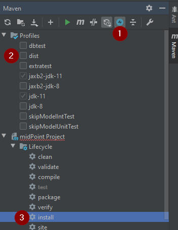

1. We often want to *Toggle 'Skip Tests' Mode* - icon has to be highlighted - to avoid very long full build.
2. It is also not necessary to build full distribution with IDEA, so you can uncheck *dist* in *Profiles* (it's a bit laggy, be patient or try again).
3. Finally, run the *install* phase from under the *Lifecycle* under the root project.
It's easy to locate the project with modules grouped, in the plain list it's indicated with *(root)* after the name.

Without the tests and distribution the build can run for around 4-12 minutes.

[NOTE]
Phase *package* is not enough, we need to get midPoint plugins into the local repository under `~/.m2/repository`.

After this we can reimport the Maven project:

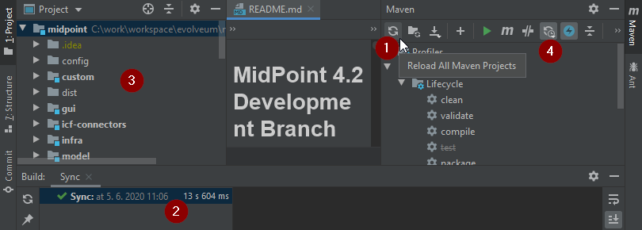

1. Click reimport icon in the Maven panel.
2. This time everything should be synchronized properly.
3. Project window will show the project structure with recognized modules marked accordingly (blue squares).
When the change is detected in the POM files IDEA prompts us to reimport the project.
4. Alternatively, we can choose one of the **Auto-reload Mode**s.

=== Setting generated sources

During the Maven build of *import/schema* module, Java sources are from schema files.
Unfortunately, the generated directory is not automatically recognized.
This manifests as unrecognized classes from `com.evolveum.midpoint.xml...` packages.
To add it manually, follow the steps in the picture:

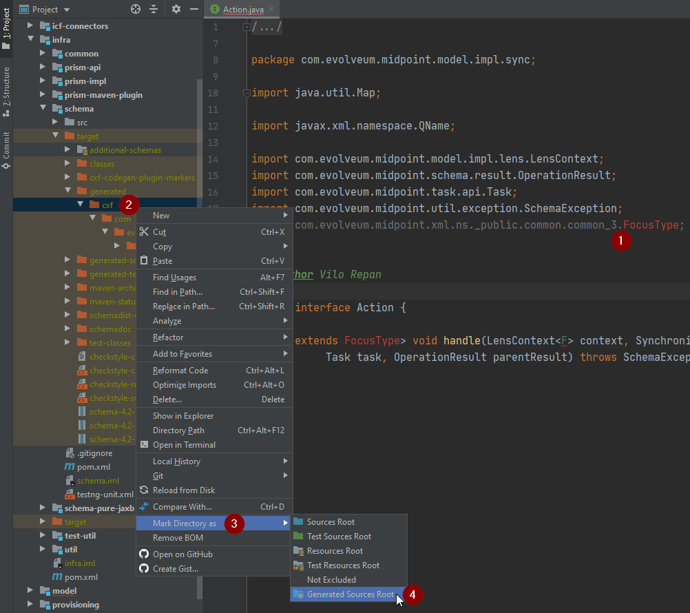

1. To be sure, open a source file that uses the generated class, e.g. `Action` interface from *model-impl* module.
Notice the unrecognized class.
2. Locate `infra/schema/target/generated-sources/prism` directory, and right-click on it.
3. Open *Mark Directory as* submenu.
4. Click on *Generated Sources Root*.

After a while (a click to an editor may be needed) the missing files are recognized and the errors disappear.

== Running midPoint in IDEA

We will run midPoint as standalone application which is a recommended deployment.

=== Preparing PostgreSQL database for native repository

Since midPoint 4.4 generic repositories are deprecated and since midPoint 4.9, embedded H2 database support was dropped.
This means we should use PostgreSQL database to enable all features of midPoint.

New database is needed and has to be populated with scripts located in `config/sql/native` directory:

* `postgres.sql` - main db objects
* `postgres-quartz.sql` - quartz scheduler objects
* `postgres-audit.sql` - audit db objects

Detailed instructions on how to set up PostgreSQL database are available in the xref:/repository/native-postgresql/usage/[configuration] for native PostgreSQL repository.

JDBC url, username and password will be needed in next steps.

=== Preparing <MIDPOINT_HOME> directory

MidPoint needs a directory to store basic configuration and logs.
It's called `midpoint.home`.
Create a directory where repository configuration, logs and other files will be stored.
Copy `config/config-native.xml` to the `midpoint.home` directory and rename it to `config.xml`.
Edit the file to set the database JDBC url, username and password.

=== Setting up the run configuration

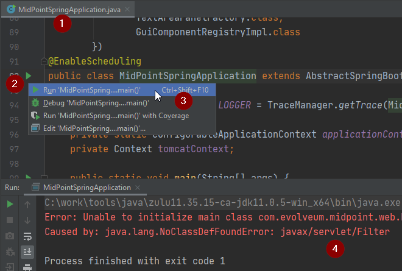

To run the application:

1. Locate the main class `MidPointSpringApplication`, for instance press `Ctrl+N`, type *mpsa* and press `Enter`.
2. Click the green run icon.
3. Choose *Edit 'MidPointSpringApplication '...*.

IDEA creates the run configuration and whenever the right run configuration is selected, it's easy to run it with the icons in the toolbar next to the name of the run configuration, or just press `Shift+F10`.
Alternatively you can use `Alt+Shift+F10` to show the *Run...* popup.
Right now we need to edit it:

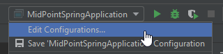

Click on the dropdown with run configurations in the toolbar and choose *Edit Configurations...*.
Alternatively, press `Alt+Shift+F10` and then `0`.

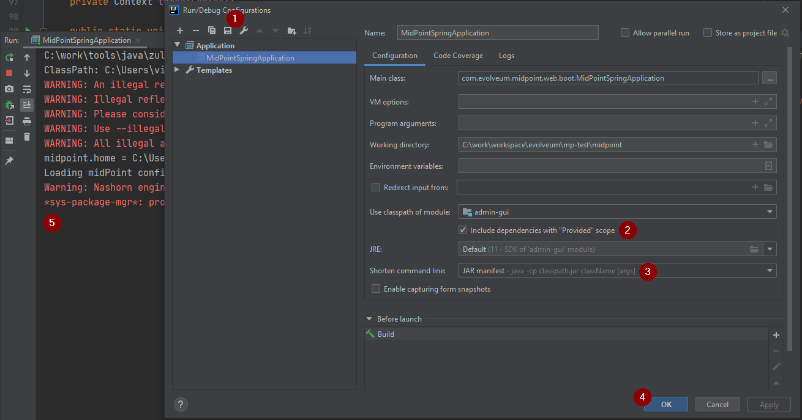

In the run configuration:

. Give the configuration some name, e.g. _midpoint_ and save so it's not transient anymore.
. Make sure java 21 is selected to be used to run the application.
. Add VM options
+
[source]
----
-Dserver.port=8080
-Xms1g
-Xmx4g
-Dmidpoint.home=<PATH_TO_MIDPOINT_HOME>
-Dmidpoint.nodeId=node1
--add-opens
java.base/java.io=ALL-UNNAMED
-XX:ReservedCodeCacheSize=250m
-Dmidpoint.administrator.initialPassword=qwer1234X!
----
. Check the checkbox named *Include dependencies with "Provided" scope*.
. (Optional) Running the application may also fail on the command line being too long (especially on Windows).
It is easy to fix with the option name *Shorten command line*.
This is actually offered by IDEA if this happens, so there is no need to do it proactively.
The application runs just fine with the shortened classpath, but the classpath information in the log is less helpful.
. Confirm the changes with *OK* and run the application again.
. This time it should not terminate and show log similar to the picture.
You may ignore various warnings reported on stderr output (in red).

After a while, open your browser and head to http://localhost:8080 - midPoint application should appear and you can log in with the traditional *administrator*/*qwer1234X!* combo.

=== Viewing logs

If something goes wrong it's time to check the main applicaiton log.
Console output reports the location of `midpoint.home`, open the directory, go to `log` subdirectory and open `midpoint.log` there.
It's beyond the scope of this article to cover possible problems, but there should be none under normal circumstances.

The console shows very little and it may be preferred to see the logs in the IDE too.

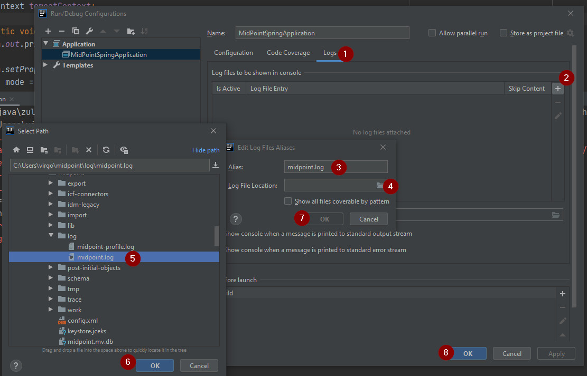

1. Open the run configuration and choose *Logs* tab.
2. Click the plus icon to add a new log file.
3. Choose the alias for a log file, it will be displayed on its tab.
4. Click the folder icon.
5. Locate the log file.
6. Confirm the location.
7. Confirm the log file configuration.
8. Confirm the run configuration changes.

After restarting the application there will be separate tab *Console* and *midpoint.log*.
It may take some time after the start of the application before first logs appear.

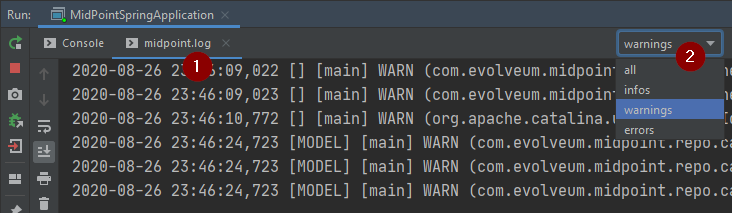

It may happen that not all logs are shown at first.
To fix this:

1. Click on the *midpoint.log* tab.
2. Click on the log level filter dropdown and choose required level (e.g. *all*).

== Running the tests in IDEA

To run the tests in IDEA, you can open the test class, right-click on the class name and choose *Run 'Test...'*.
IDEA will run the test and show the results in the *Run* window.

For tests that require repository to be available, test database has to be prepared.
New database can be prepared as described in the previous section.
Don't share the database with your standard run configuration.
Tests often clean the database during the run, and you may lose your data.

Edit run configuration for test and add following `VM options`:

.Example of VM options for running tests with native repository in IDEA.
[source]
----
-ea
-Xmx4g
--add-exports
java.management/sun.management=ALL-UNNAMED
-Duser.language=en
-Dmidpoint.repository.jdbcUrl=jdbc:postgresql://localhost:5432/midpoint_test
-Dmidpoint.repository.jdbcPassword=midpoint_test
-Dmidpoint.repository.jdbcUsername=midpoint_test
-Dmidpoint.repository.database=postgres
-Dtest.config.file=test-config-new-repo.xml
----

Don't forget to update JDBC url, username and password to match your test database.

== Create copyright profile

Copyright profile is a set of rules that IDEA uses to insert copyright headers into new files.

MidPoint code is dual licensed under Apache License 2.0 and European Union Public License and the copyright header should be present in every source file.

.Screenshot of settings for copyright profiles.
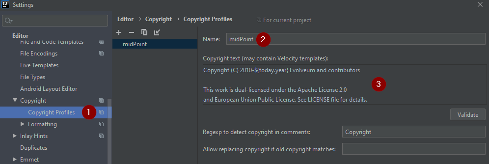

== TODO

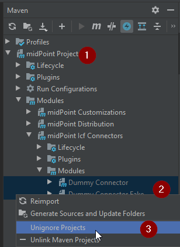
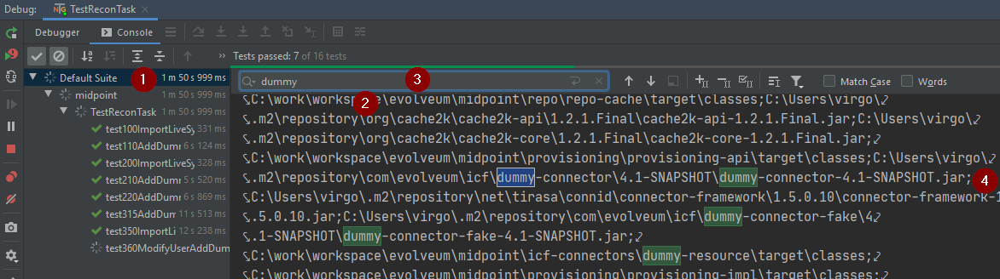
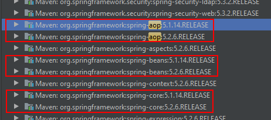
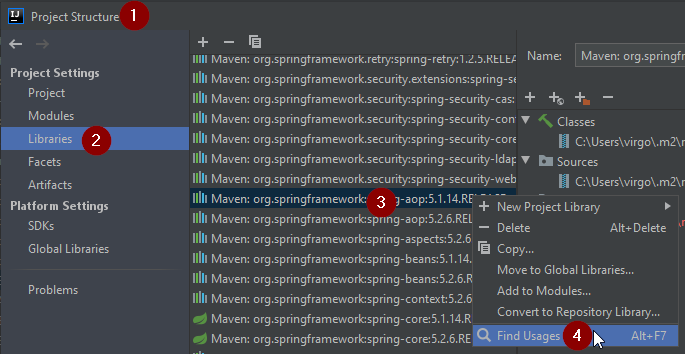

== Other IDEA customizations

* To change the font size in the editor (it may be too small on some screens), see *File | Settings | Editor | Font*.

== Short version (checklist)

Essential setup tasks:

* Use JDK 11 (for midPoint up to 4.3) or JDK 17 (for midPoint 4.4 and later).
* Run `mvn clean install -DskipTests -P -dist` at least once.
* Import the project into IDEA as Maven project, set your JDK to correct version (11/17).
* Set Maven profiles, e.g. disable the *dist* profile.
* Mark `infra/schema/target/generated/cxf` directory as generated sources.
* Add run configuration for `MidPointSpringApplication` with *Provided* dependencies included on the classpath and try to run it (shorten the command line if necessary, e.g. using *JAR manifest*).
* Disable Maven modules *Dummy Connector* and *Dummy Connector Fake* under *midPoint Icf Connectors* but keep them as IDEA modules (to avoid incomplete refactorings).
Try to run test like `TestReconTask` to check the setup.

Now you can perform other setup tasks like copyright headers, database settings, etc.
