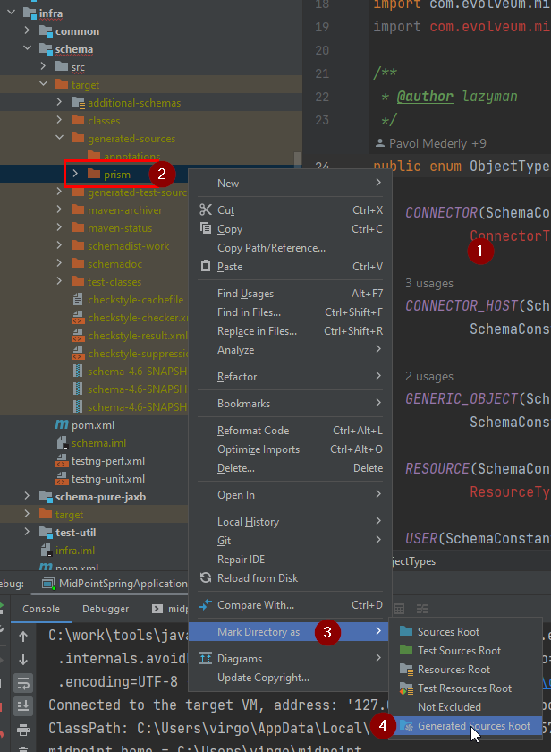

= Developing midPoint with Intellij IDEA
:page-toc: float-right
:link-mp-build: https://wiki.evolveum.com/display/midPoint/Building+MidPoint+From+Source+Code
:link-dev-guidelines: https://wiki.evolveum.com/display/midPoint/Development+Guidelines
:link-dev-guides-and-howtos: https://wiki.evolveum.com/display/midPoint/Development+Guides+and+HowTos

This guide describes how to set up midPoint in https://www.jetbrains.com/idea/[IntelliJ IDEA].
IDEA impressed most of our development team members and makes out team much more productive.

This guide assumes you've cloned https://github.com/Evolveum/midpoint[the repository] and perhaps {link-mp-build}[built it] already.
The guide only covers IDEA related steps, see also development {link-dev-guidelines}[guidelines]
and other {link-dev-guides-and-howtos}[guides and how-tos].

See the very end of this document for tl;dr/checklist version.

== Install JAVA

JDK 11 (LTS) is supported for midPoint 4.0 and newer.
You can download from http://www.oracle.com/technetwork/java/javase/downloads/index.html[Oracle JDK], but you better check the license.
Or you can try more license-friendly releases like https://adoptopenjdk.net/[OpenJDK from AdoptOpenJDK]
or https://www.azul.com/downloads/zulu-community/?version=java-11-lts&architecture=x86-64-bit&package=jdk[Zulu JDK from Azul].

JDK (sometimes called SDK) is necessary for building - JRE (just the runtime) is not enough.

== Install IDEA

IDEA is provided in https://www.jetbrains.com/idea/features/editions_comparison_matrix.html[two editions].
You can use free _Community edition_ just fine, paid _Ultimate Edition_ offers advanced support for web development and frameworks.
Both editions allow building and running midPoint just fine.

* Download IDEA from http://www.jetbrains.com/idea/download/index.html[jetbrains.com].
* Select the version for your operating system and edition.
* Install IntelliJ IDEA on your computer.

Pictures in the guide are mix of both editions, but we will focus on the basics with the _Community Edition_.

== Import of midPoint into IDEA

Importing midPoint into IDEA can be smooth if you have already {link-mp-build}[built it] before.

[NOTE]
It is possible to clone the project from GitHub directly in IDEA, but especially on Windows it is recommended to use command line to apply project specific Git configuration during the clone.

It is recommended to first build the project which avoids a few hiccups during the first import.
We will show what happens if you don't and the project can be built from IDEA too and reimported.

1. Run the IDE and choose *Open or import*.
If IDEA opens with existing project use *File | Open* from the main menu.
2. Find the cloned `midpoint` directory, select it.
3. Press OK to confirm.

Wait until the IDE settles and the progress bar at the bottom stops working.

=== Possible import problems before the first build

image:mp-idea-maven-import.png[]

1. If you haven't built the project before (or deleted `~/.m2/repository/com/evolveum`) IDEA can't fully import the project, because Maven POMs reference midPoint plugins that are not built yet.
2. On Windows, it is recommended to exclude IDEA's working directory and project repository from Windows Defender scanning - IDEA suggests that and offers an automatic fix.
3. Open the Maven panel on the right edge of the window (hidden behind contextual menu in the picture).
Normally the list of Maven projects is flat, if you prefer it to follow the directory structure, click on the Maven Options menu.
4. Check *Group Modules* to change the visualization of Maven projects structure.

=== IDEA JDK setup

Before we continue we will check that we're using the right JDK in IDEA.
In the menu, choose *File | Project Structure...* to open the *Project Structure* window.

1. Choose *Project* section in the *Project structure* window.
2. Check that *Project SDK* shows JDK 11.
3. If not, click *Edit* and set JDK as described on https://www.jetbrains.com/help/idea/sdk.html[this help page].
4. Alternatively you can access JDK setting via *SDKs* section on the left.
5. Check the *Project language level* - normally it would be fine to use the level for JDK 11, but as of June 2020 we still secretly (but not officially anymore!) support JDK 8.

=== Setting Maven build

We may run the Maven build from IDEA, even the first before the project is synced properly.

image:mp-idea-maven-profile-and-build.png[]

1. We often want to *Toggle 'Skip Tests' Mode* - icon has to be highlighted - to avoid very long full build.
2. It is also not necessary to build full distribution with IDEA, so you can uncheck *dist* in *Profiles* (it's a bit laggy, be patient or try again).
3. Finally, run the *install* phase from under the *Lifecycle* under the root project.
It's easy to locate the project with modules grouped, in the plain list it's indicated with *(root)* after the name.

Without the tests and distribution the build can run for around 4-12 minutes.

[NOTE]
Phase *package* is not enough, we need to get midPoint plugins into the local repository under `~/.m2/repository`.

After this we can reimport the Maven project:

1. Click reimport icon in the Maven panel.
2. This time everything should be synchronized properly.
3. Project window will show the project structure with recognized modules marked accordingly (blue squares).
When the change is detected in the POM files IDEA prompts us to reimport the project.
4. Alternatively, we can choose one of the **Auto-reload Mode**s.

=== Setting generated sources

During the Maven build of *import/schema* module, Java sources are from schema files.
Unfortunately, the generated directory is not automatically recognized.
This manifests as unrecognized classes from `com.evolveum.midpoint.xml...` packages.
To add it manually, follow the steps in the picture:

1. To be sure, open a source file that uses the generated class, e.g. `Action` interface from *model-impl* module.
Notice the unrecognized class.
2. Locate `infra/schema/target/generated/cxf` directory, and right-click on it.
3. Open *Mark Directory as* submenu.
4. Click on *Generated Sources Root*.

After a while (click to editor may be needed) the missing files are recognized and the errors disappear.

== Running midPoint in IDEA

TODO

== Running the tests in IDEA

TODO

== TODO

image:mp-idea-copyright-profile.png[]
image:mp-idea-unignore-maven-projects.png[]
image:mp-idea-running-test-dummy-connector-classpath.png[]

image:mp-idea-find-library-usage.png[]

== Other IDEA customizations

* To change the font size in the editor (it may be too small on some screens), see *File | Settings | Editor | Font*.

== Short version (checklist)

Essential setup tasks:

* Use JDK 11.
* Run `mvn clean install -DskipTests -P -dist` at least once.
* Import the project into IDEA as Maven project, set your JDK to 11.
* Set Maven profiles, e.g. disable *dist*.
* Mark `infra/schema/target/generated/cxf` directory as generated sources.
* Add run configuration for `MidPointSpringApplication` with *Provided* dependencies included on the classpath and try to run it (shorten the command line if necessary, e.g. using *JAR manifest*).
* Disable Maven modules *Dummy Connector* and *Dummy Connector Fake* under *midPoint Icf Connectors* but keep them as IDEA modules (to avoid incomplete refactorings).
Try to run test like `TestReconTask` to check the setup.

Now you can perform other setup tasks like copyright headers, database settings, etc.
