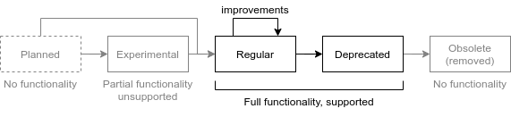

= Feature Lifecycle

The world around us is changing every day.
MidPoint is a practical identity management platform, therefore it has to adapt to changes around it all the time.
New features are added, existing features are improved, old features are deprecated and removed.

While such a constant change is necessary to survive in the ever-changing world, it may be a challenge for stability.
It may not be easy to keep track of the changes in midPoint releases.
It is also a challenge for midPoint developers to keep midPoint versions compatible and to keep midPoint upgrades relatively safe.
Therefore, there is a system of _feature lifecycle_ that brings some stability to this dynamic world.

Every midPoint feature lives through several stages in its lifetime.
The stages are illustrated in following diagram.

Life of a feature usually starts at a drawing board, as a _planned_ feature.
At this state there is usually just a couple of drawings and maybe some description of the feature.
Then the development of a feature starts.
Simple features are developed quickly, and immediately enter _regular_ stage.
Complex features may pass through an _experimental_ stage.
Anything may change while the feature is in experimental stage.
When the feature matures, it enters it main lifecycle state, it becomes a _regular_ feature.
Features live in regular stage for years, even decades.
The feature usually receives several improvements during its life in the regular stage.
However, some features are likely to go "out of fashion".
Some features may not be needed, because there is no demand for them any more.
Other features may be replaced by a more advanced functionality.
One way or another, features may get close to the end of their useful life.
However, we are not removing the feature immediately.
MidPoint users will need some time to adapt, some time to migrate to newer functionality.
Therefore, features that are close to the end of their life enter _deprecated_ stage.
Deprecated features still work, they are still supported.
However, such features are not improved any more.
The deprecated stage is also an indication that a feature may be removed soon.
When that time comes, the feature enters _obsolete_ stage.
The functionality is no longer supported, and it is usually completely removed from midPoint code.

Indivial lifecycle stages are described in following table.

[%autowidth]
|====
| Stage | Functionality and support | Purpose | Description

| Planned
| No functionality +
No support
| Shaping the idea
| The feature exists on *drawing board*, or in design documents, or even in the heads of the developers.
Some planned features are described well, others are not described at all.
There is no code to run at this stage.

| xref:../experimental.adoc[Experimental]
| Partial functionality +
No support (except for special cases)
| Experimenting with the idea +
Gathering community feedback
| The feature is partially developed.
There is some code, but the code may be unstable.
Anything can change in this stage without any warning.
The behavior may change in any way.
The schema may change in incompatible way.
Nothing is certain.
The code may be incomplete, even unstable.
It perhaps goes without saying that experimental features are *not suitable for production use*.

This is the right time for the brave engineers to try the feature and provide feedback to the development team.
Anything can change at this point.
The code is not burdened with compatibility requirements.
Therefore mistakes are easy to correct, it is easy to adjust the behavior or even completely change the approach.
*Community feedback is more than welcome* in this stage.

Experimental features usually mature eventually and enter the _regular_ stage.
However, in rare cases, experimental features may be completely removed.
If the idea was not good enough, admitting a mistake and starting over is the right thing to do.

Experimental features are generally unsupported.
It is OK to provide feedback, it is also OK to report bugs.
However, we are not making any guarantees that the bugs will be fixed.
This also applies to midPoint subscribers.
We may choose to ignore a bug report for experimental feature, even if it comes from a subscriber.
Except for one case.
Some experimental features are developed in a scope of xref:/support/subscription-sponsoring/[platform subscription or sponsoring].
Platform subscriber or sponsor of a particular experimental feature has an exclusive privilege to get a support for that feature.

| Regular
| Full functionality +
Supported
| Production use
| Feature is developed, the code is stable, functionality is tested.
The feature is ready for *full production use*.

The feature is here to stay.
You can rely on regular features.
Regular features are not removed without a warning.

Regular feature are usually improved several times during its lifetime.
However, there are compatibility requirements for regular features.
If something worked in previous version of midPoint, it should work the same in next version.
There may be rare exceptions to this rule, especially when it comes to security, fixing bugs or consistency of the entire system.
However, all such changes will be documented in release notes, and a migration path will be provided.

There may still be some limitations, even for regular features.
midPoint development is iterative.
Therefore read the documentation carefully, all the limitations should be documented.
This means that _quantity_ (scope) of the feature may be limited.
However, _quality_ is not limited.
The feature is supposed to be reliable, suitable for production use.
In other words, there may be things that midPoint cannot do.
However, if midPoint can do something, it should do it well.

| xref:../deprecated.adoc[Deprecated]
| Full functionality +
Supported
| Time for migration
| Deprecated features still work in a way that is very similar to regular features.
Deprecated features are still maintained.
However, we plan to remove deprecated features soon.
Therefore there will be no improvements for deprecated functionality.
That would be waste of time.

Deprecating a feature is a signal for midPoint users to *migrate to a replacement functionality*.
If a particular feature is deprecated, replacement functionality should be available in the same midPoint version when the feature was deprecated.
There may be some exceptions to this rule, as in some rare case functionality is removed without a replacement.
However, in a common case there is a migration path, and deprecation of a feature gives a "grace period" to midPoint users to migrate their configurations.

Strictly speaking, deprecated feature may be removed in any midPoint release following the release in which the feature was deprecated.
Which gives at least 6 months of grace period to migrate the functionality.
However, the usual practice is that deprecated features are present in several midPoint releases before they are finally removed.
This usually gives more that a year of migration period.
However, the best strategy is not to rely on this practice and migrate deprecated features as soon as possible.

| Obsolete +
(removed)
| No functionality +
No support
| Avoiding bloat
| The feature is removed.
It does not exist any more.
*The code is gone.*
Deleted.
MidPoint may start raising errors when you try to use the feature.
Your configuration may no longer work.
In fact, the configuration will be usually removed by midPoint during upgrade to avoid critical errors that would prevent the system from starting up after the upgrade.

|====

The stage of a specific feature will be indicated in documentation.
If the feature is planned, experimental, deprecated or obsolete, there will be a warning in the documentation.

If there is a configuration associated with the feature, the configuration will be marked in the schema.
Configuration of experimental and deprecated features is marked with special annotations.
MidPoint xref:/midpoint/reference/deployment/ninja/[ninja] tool can be used to check whether your configuration is using deprecated functionality.

Configuration of experimental features will not be displayed in the user interface by default.
You need to explicitly enable the use of experimental features to see the configuration in user interface.

When we know that we are going to remove a particular deprecated functionality, we will mark associated configuration with special "planned removal" annotations.
Once again, xref:/midpoint/reference/deployment/ninja/[ninja] tool can be used to check whether your system is using configuration that is planned for removal.
However, please be careful here.
Any deprecated feature can be removed at any time.
Although we are trying to be nice and properly reflect our plans in the schema annotations, software development is a very dynamic affair.
The plans may change, even at the last moment.
Even though we are trying to avoid such abrupt unforeseen changes, they may happen.
Therefore, we strongly recommend to *migrate deprecated functionality as soon as possible*.
If you are using just regular functionality, you have a guarantee of painless upgrades.
However, if your deployment relies on deprecated functionality, there is no such guarantee.

This is especially important in case of xref:/support/long-term-support/[LTS-to-LTS] upgrades.
MidPoint feature may be deprecated in one release and removed in the next.
As LTS-to-LTS upgrade goes through four midPoint versions, a regular feature in original LTS version may be already removed in the next LTS version, as the upgrade skips the versions in which the feature was deprecated.
We will try to avoid using this approach with popular, high-profile features.
However, keeping the deprecated-obsolete path for LTS-to-LTS upgrades would mean that removal of any feature will take at least 4 years.
This is not really compatibly with midPoint development model.
However, we will try to use the "quick path" removal only for minor and less popular features.

For any upgrade, you are supposed to read the release notes carefully.
This is doubly true for LTS-to-LTS upgrades.
The release notes will warn you in case there are major upgrade risks.

== See Also

* xref:../[Versioning]

* xref:/support/long-term-support/[]
