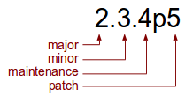

= MidPoint Versioning And Release Process
:page-nav-title: Versioning

MidPoint is an open-source project that honors almost all the experience and best practice learned on other open-source projects.
Most importantly we follow the _release early, release often_ principle.
MidPoint releases are quite frequent, there are usually two major/minor releases per year.

== Release Types

MidPoint is delivered in releases that follow quite a regular pattern.
There are four types of releases:

[cols="h,1,1"]
|===
| Release type | What it delivers | How often it happens

| Major
| New generation of midPoint.
Major releases deliver substantial changes.
They may change even some of the features that were delivered and stabilized in minor releases.
The change may not be backward compatible.
| Once every few years

| Minor
| New features.
This is the most common type of release.
It is a gradual change that is almost always backward compatible.
| Twice per year

| Maintenance
| Bugfixes, stabilization, rarely even some minor features.
The focus is on improving product quality and stabilization.
| As needed.

| Patch
| Bug "hotfixes" that needs to be delivered immediately.
Only fix critical or security bugs or bugs that affect customers with special-purpose support contracts.
| As needed

|===

Major, minor and maintenance releases are public.
They will be announced, the documentation updated, etc.
The patch releases are low-overhead releases.
These may not necessarily be publicly announced (unless they are security fixes), there will be no public release notes or documentation updates.
We need this to keep the development focused and the cost reasonable.
Patch releases are usually done with a purpose to fix specific bug or address a specific situation and strongly relate to customers covered by support agreements.
See below for more details.
If several patch releases accumulate and the minor release is still quite far away the patch releases are summarized into a maintenance release.

== Version Number

MidPoint version number reflects the type of a release that produced it:

== Development process

We try to make the development process very efficient.
That means we try to avoid duplication of work and overhead as much as possible.
We do that by keeping the process very linear.
It means that any new development goes to the development _master_ branch.
This also applies to bugfixes.
Any reported bug is first fixed in the _master_ branch (if possible).
Then it might be backported to the maintenance branch - under some circumstances.
We avoid unnecessary branching and splitting of the development.
Developing in a single master branch makes the development simple, avoids confusion and forces the developers to integrate their code immediately.
This reduces the need for explicit integration phases, and it keeps the project cost reasonable.

An example of the flow of midPoint releases is provided in the next diagram.

The development process is guided by the regular pace of minor releases.
There are usually two minor releases in a year.
There is a spring release (in April-May time frame) and autumn release (in October-November time frame).
These are the releases that bring new features.

Maintenance and patch releases are dedicated to bugfixes.
Source code for such releases is split from the _master branch_ into a _support branch_ at the point where a minor release is finished.
The goal of maintenance and patch releases are only to fix bugs.
As stated above the fix for such issues are implemented in master branch and then moved to the support branch and released.
It means that all the fixes are already in master branch, integrated and tested continually.
Therefore, the support branch code may be discarded when a new minor release is ready.
However, it means that vast majority of the work on maintenance and patch releases is essentially wasted.
Therefore we usually try to avoid these releases and just stick to minor releases.

== See Also

* https://wiki.evolveum.com/display/midPoint/midPoint+Releases[midPoint Releases]

* xref:../support/long-term-support.adoc[Long-Term Support]

* https://wiki.evolveum.com/display/midPoint/Using+Support+Branch[Using Support Branch]
