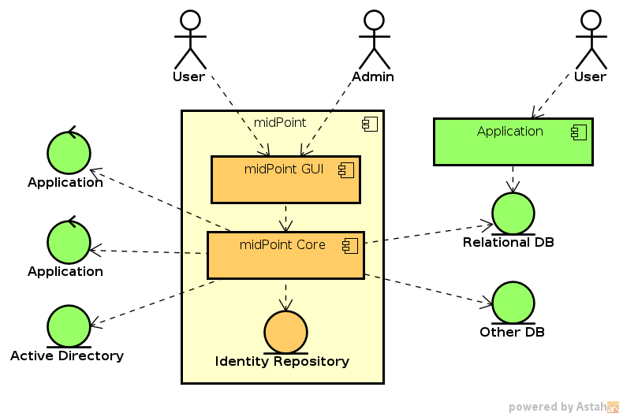
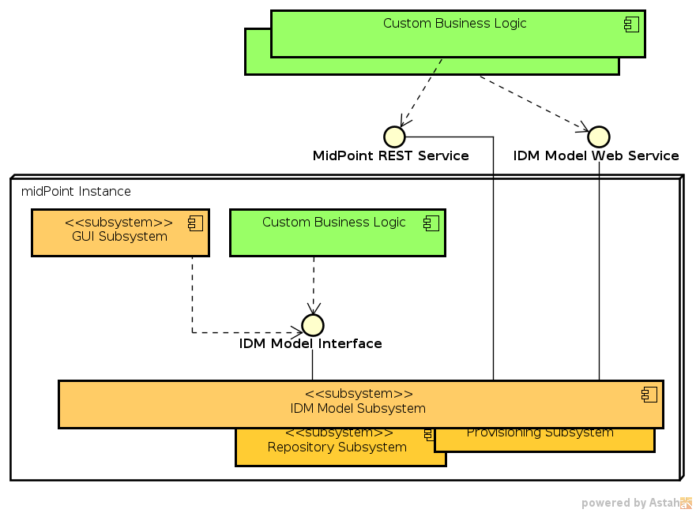
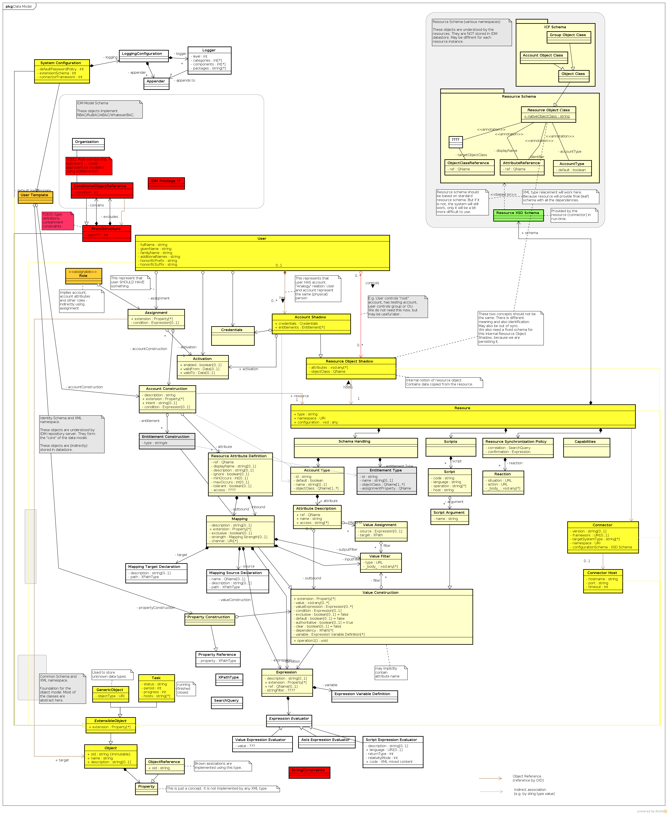

= Title
:page-toc: top
:page-nav-title: AsciiDoc Test Document
:ignore-broken-links:

== Chapter One

First chapter, blah blah blah.

=== Basic Text

Lorem ipsum dolor sit amet, consectetur adipiscing elit, sed do eiusmod tempor incididunt ut labore et dolore magna aliqua.
Ut enim ad minim veniam, quis nostrud exercitation ullamco laboris nisi ut aliquip ex ea commodo consequat.
Duis aute irure dolor in reprehenderit in voluptate velit esse cillum dolore eu fugiat nulla pariatur.
Excepteur sint occaecat cupidatat non proident, sunt in culpa qui officia deserunt mollit anim id est laborum.

This is a second paragraph. And here we go agin:
Lorem ipsum dolor sit amet, consectetur adipiscing elit, sed do eiusmod tempor incididunt ut labore et dolore magna aliqua.
Ut enim ad minim veniam, quis nostrud exercitation ullamco laboris nisi ut aliquip ex ea commodo consequat.
Duis aute irure dolor in reprehenderit in voluptate velit esse cillum dolore eu fugiat nulla pariatur.
Excepteur sint occaecat cupidatat non proident, sunt in culpa qui officia deserunt mollit anim id est laborum.

=== Lists

Let's list something:

* First bullet
* Second bullet
** Sub-bullet
** Sub-bullet again
*** Sub-sub-sub, going down, deep down.
* Back to top-level
* This is a long text in the bullet, very long, even longer.
I have no idea what to write here, therefore I'll resort to the usual lorem ipsum dolor sit amet, consectetur adipiscing elit, sed do eiusmod tempor incididunt ut labore et dolore magna aliqua.
Ut enim ad minim veniam, quis nostrud exercitation ullamco laboris nisi ut aliquip ex ea commodo consequat.
Duis aute irure dolor in reprehenderit in voluptate velit esse cillum dolore eu fugiat nulla pariatur.
Excepteur sint occaecat cupidatat non proident, sunt in culpa qui officia deserunt mollit anim id est laborum.
* This is a bullt list that has two pagagraphs.
+
This is the second paragraph of a the bullet above.
Nice, isn't it?
* Now, just another regular bullet.

And now the numbering:

. First
. Second
. Third
.. First in third
.. Second in third
. Fourth

=== Links

See link:../other/[HTML relative link].
(Prefer `xref:` for relative links that target anything inside our Docs.)

See xref:other.adoc[] with automatic title.

See xref:other.adoc[XREF link - explicit text].

See xref:../../midpoint/projects/midscale/architecture/[MidScale archtecture relative].

See xref:../../midpoint/midscale/architecture/[MidScale archtecture relative] to the original location (moved from to projects).

See xref:../../midpoint/projects/midscale/architecture.adoc[] with automatic title.

See xref:../../midpoint/projects/midscale/architecture/#repository[repository section in midScale architecture].

See xref:../../midpoint/midscale/[MidScale dir link relative].

See xref:/midpoint/projects/midprivacy/index.adoc[midPrivacy index.adoc link].

See xref:/midpoint/projects/midprivacy/[midPrivacy directory link].

This xref:broken[link is broken].

This xref:alsobroken[link is also broken].

This is xref:/about/['xref, with comma inside link text'].

Migrated autolabel wiki link: xref:/faq/[]

And xref:/faq/[migrated explicit wiki link]

=== Code

Ugly XML code block follows:

.XML code block
[source,xml]
----
<root>
    <child>text</child>
</root>
----

Three versions of the same code:

[source,xml]
----
<root>
    <child>text</child>
</root>
----

[source,json]
----
{
  "root" : {
    "child" : "text"
  }
}
----

[source,yaml]
----
root:
  child: text
----

Code block with very long lines:

[source, ruby]
----
print <<EOS
Lorem ipsum dolor sit amet, consectetur adipiscing elit, sed do eiusmod tempor incididunt ut labore et dolore magna aliqua. Ut enim ad minim veniam, quis nostrud exercitation ullamco laboris nisi ut aliquip ex ea commodo consequat.
Duis aute irure dolor in reprehenderit in voluptate velit esse cillum dolore eu fugiat nulla pariatur. Excepteur sint occaecat cupidatat non proident, sunt in culpa qui officia deserunt mollit anim id est laborum.
EOS
----

Boring pre-formatted block follows:

  First line
  Second line
      Third line, with some indent
  Fourh line

=== Tables

Default table with a simple heading follows:

|====
| Heading 1 | Heading 2 | Heading 3

| Data 1.1
| Data 1.2
| Data 1.3

This cell has two paragraps.

| Data 2.1
| Data 2.2 +
This is a multi-line cell, with "short" newline separation.
| Data 2.3
|====

Narrow table with a title:

.This is entitled table
[%autowidth]
|====
| Heading 1 | Heading 2

| Data 1.1
| Data 1.2

| Data 2.1
| Data 2.2

| Data 3.1
| Data 3.2

| Data 4.1
| Data 4.2
|====

Table, title, autowidth, header column

.This is a fancy table
[%autowidth, cols="h,1,1"]
|====
| Heading 1 | Heading 2 | Heading 3

| Heading 1.1
| Data 1.2
| Data 1.3

| Heading 2.1
| Data 2.2
| Data 2.3

| Heading 3.1
| Data 3.2 is a longer cell.
| Data 2.3

| Heading 4.1
| Data 4.2
| Data 4.3
|====

=== Datatables

With `{}` and empty line:

[.datatable-config]
{}

|===
| Option | Description | Default | Possible values

| `paging`
| Enable or disable pagination
| false
| true, false

| `page-length`
| Number of rows per page
| 10 or if `length-menu` is set or if `length-menu-auto` is set, the first value from `length-menu`
| integer
|===

With `{}` and no empty line:

[.datatable-config]
{}
|===
| Option | Description | Default | Possible values

| `paging`
| Enable or disable pagination
| false
| true, false

| `page-length`
| Number of rows per page
| 10 or if `length-menu` is set or if `length-menu-auto` is set, the first value from `length-menu`
| integer
|===

With no `{}` (empty line does not matter, class is applied to the table which may be hidden:

[.datatable-config]

|===
| Option | Description | Default | Possible values

| `paging`
| Enable or disable pagination
| false
| true, false

| `page-length`
| Number of rows per page
| 10 or if `length-menu` is set or if `length-menu-auto` is set, the first value from `length-menu`
| integer
|===

And with some non-default config:

[.datatable-config]
{
    "searchable": true,
    "orderColumn": 1,
    "orderDirection": "asc"
}

|===
| Option | Description | Default | Possible values

| `paging`
| Enable or disable pagination
| false
| true, false

| `page-length`
| Number of rows per page
| 10 or if `length-menu` is set or if `length-menu-auto` is set, the first value from `length-menu`
| integer
|===

== Chapter Two - We Go Deeper

=== Admonitions

Useful tip follows here:

.Tip title
TIP: This is useful tip.

Important note follows:

.Note title
NOTE: This is important note.

Dangerous warning follows:

.Warning title
WARNING: This is dangerous warning.

Cautious caution follwos:

.Caution title
CAUTION: Cautious caution is here.

Important whatever follows:

.Important title
IMPORTANT: Important importance here.

That is it.

=== Decorations

[quote, Me M. Myself, My memoirs]
____
I am what I am.
____

This is as nice as it gets. Or maybe nicer. Or not.

== Pictures

Small picture:

.Small picture

Centered small-ish picture:

.Let's center it

Medium picture:

.Medium picture
image::picture-mid.png[Imago medio]

Huge picture:

.Huge picture

Broken image link below:

image::nonexistent.png[]

=== Mermaid

++++

graph TD;
    A-->B;
    A-->C;
    B-->D;
    C-->D;

++++

++++

flowchart LR
Internet -->|HTTPS| WAF/Ingress -->|mTLS| AppCluster[(K8s Cluster)]
AppCluster --> DB[(PostgreSQL)]
DevLaptop -->|VPN| Bastion -->|JIT SSH| AppCluster

++++

++++

flowchart LR
Internet -->|HTTPS| WAF/Ingress -->|mTLS| AppCluster[(K8s Cluster)]
AppCluster --> DB[(PostgreSQL)]
DevLaptop -->|VPN| Bastion -->|JIT SSH| AppCluster

++++
